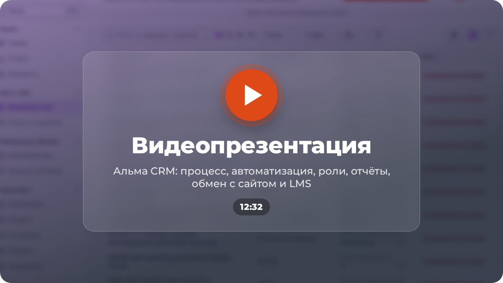

<p align="center">
  
</p>

<p align="center">
  <a href="https://alma.volkv.com"></a>
  <a href="https://alma.volkv.com/presentation.pdf"></a>
</p>

<p align="center">
  <a href="https://alma.volkv.com/api/docs">API (Swagger)</a> ·
  <a href="https://alma.volkv.com/help">Справка</a> ·
  <a href="https://alma.volkv.com/mock-cms/">Имитатор сайта</a> ·
  <a href="https://alma.volkv.com/mock-lms/">Имитатор LMS</a> ·
  <a href="docs/product.md">Подробное описание</a>
</p>

<p align="center">
  <a href="https://alma.volkv.com/video-presentation.mp4"></a>
</p>

# Альма CRM

CRM ИТ Школы Ростелекома для работы с вузами, колледжами и школами — от первого контакта с вузом до
подтверждённого результата. Весь процесс, 14 шагов, идёт по единому стандарту, на каждом этапе система
берёт рутину на себя, а в отчётах каждое число проверяемо: от него есть путь до исходной карточки.
Заявка с сайта — второй вход в тот же процесс. Обмен с сайтом и системой обучения показан на
имитаторах по опубликованному контракту.

Решение команды **Wine Coding Team** для хакатона «Лидеры цифровой трансформации 2026», задача
«Система контроля взаимодействия с учебными заведениями».

## Быстрый запуск

Нужны Docker 25+ с плагином Compose.

```bash
git clone https://github.com/volkv/alma-crm-2026.git && cd alma-crm-2026
docker compose up --build
```

Поднимаются приложение, PostgreSQL, Redis, Keycloak, Gotenberg, SeaweedFS, почтовая ловушка Mailpit и два
имитатора систем заказчика. Миграции применяются автоматически, демонстрационные данные заливаются при первом старте.

- http://localhost:3000 — приложение, http://localhost:3000/api/docs — Swagger UI;
- http://localhost:58081 — имитатор сайта, http://localhost:58082 — имитатор системы обучения;
- http://localhost:58080/admin — Keycloak, администратор каталога `admin` / `admin` (переопределяется
  `KEYCLOAK_ADMIN` и `KEYCLOAK_ADMIN_PASSWORD`);
- http://localhost:8025 — Mailpit: вся исходящая почта стенда оседает здесь.

Пустая база без демонстрационных записей: `DEMO_MODE=false docker compose up --build`.
Остановить и удалить данные: `docker compose down -v`. Запуск для разработки — в [`docs/development.md`](docs/development.md).

## Демо-стенд

- **[alma.volkv.com](https://alma.volkv.com)** — три роли: `manager`, `lead`, `admin`. На форме входа Keycloak роль
  выбирается кнопкой; там же показан общий пароль демо-учёток для ручного входа.
- [/help](https://alma.volkv.com/help) — руководства пользователя и администратора внутри системы (после входа).
- [/api/docs](https://alma.volkv.com/api/docs) — Swagger UI по OpenAPI 3.1 (после входа); сама спецификация без входа —
  [/api/openapi.json](https://alma.volkv.com/api/openapi.json).
- [/mock-cms/](https://alma.volkv.com/mock-cms/) · [/mock-lms/](https://alma.volkv.com/mock-lms/) — имитаторы сайта и системы обучения: отсюда запускается обмен.

## Ключевые возможности

- **Два направления в одной системе** — «Работа с ВУЗ» (14 стадий) и «Коммерческое обучение» (5 стадий) в своих
  пространствах `/w/b2b` и `/w/b2c`; модули пространства (договоры и лицензии, обучение, встречи, оплата) включаются переключателем.
- **Процесс без программиста** — стадии, чек-листы и нормативы меняет администратор: черновик, предпросмотр, перенос дел.
- **Обмен с сайтом и системой обучения** — заявка с сайта сама становится делом, статус её приёма уходит на сайт;
  выгрузка оплат загружается файлом. Группу в системе обучения запрашивает сотрудник кнопкой, итоговый результат группы
  сам подтверждает требование стадии.
- **Карточка дела** — что происходит, что мешает, кто должен, что можно сделать сейчас; доска по стадиям.
- **Живая карточка** — видно, кто ещё в деле и кто печатает; версия записи не даёт молча затереть чужую правку.
- **Чат дела** — обсуждение прямо в карточке, коллег зовут через «@».
- **Встречи** — приглашение в календарь письмом и файлом .ics, повестка по чек-листу стадии.
- **Документы по шаблонам** — соглашение, договор, оферта, сублицензионный договор и акты собираются из данных дела
  пакетом одним действием, с редакциями и хранением; отметка о подписании засчитывается стадией.
- **Письма вузу из карточки** — описание программ с материалами и пакет документов уходят контактным лицам фоновой
  очередью; пока доставка не включена явно, письма оседают в почтовой ловушке.
- **«Мой день»** — без ответственного, просрочено, срок скоро, помехи, зависшие, на паузе, новые заявки, лицензии;
  та же сводка утренним письмом.
- **Эскалации и колокольчик** — зависшее дело и просроченная лицензия уходят руководителю ответственного;
  упоминания и новые дела с сайта — в колокольчик и письмом.
- **Лицензии под контролем** — предупреждение за 60 дней, эскалация после срока, кнопка «Запустить продление» заводит дело.
- **Паспорт вуза** — реквизиты из ЕГРЮЛ, подразделения, руководство и программы с раздела «Сведения» сайта вуза;
  подбор программ школы по УГСН.
- **Данные об обучении** — снимок из файла или из системы обучения, проверка перед подтверждением, дашборд, рейтинг программ.
- **Отчёты XLSX и PDF** — срез и движение за период, диаграммы, переход от числа к записям.
- **Справочники и импорт таблицей** — вузы, договоры, лицензии, ответственные; поиск по всей системе на Ctrl+K.
- **Роли и вход через Keycloak** — три роли, видимость по назначениям и пространствам; второй фактор для
  администратора и руководителя у штатных учёток (у демо-учёток его нет).
- **Публичный API** — OpenAPI 3.1, ключи, лимиты, идемпотентность.
- **Безопасность** — шифрование почты и телефона в базе, согласия на обработку ПДн со сроком хранения,
  необратимое обезличивание вручную, след просмотра контактов, журнал действий; SBOM, trivy, semgrep и ZAP —
  локальными командами.
- **Работа в закрытой сети** — экран «Статус системы» показывает связи установки; прогон без интернета проверяет это скриптом.

Подробнее — в [подробном описании](docs/product.md).

## Документация

| Документ                                                 | О чём                                                                |
| -------------------------------------------------------- | -------------------------------------------------------------------- |
| [`docs/product.md`](docs/product.md)                     | подробное описание: сцены показа, роли, устройство, ограничения      |
| [`docs/requirements.md`](docs/requirements.md)           | матрица требований: где реализовано, чем проверено, чего не хватает  |
| [`docs/architecture.md`](docs/architecture.md)           | путь запроса, владельцы модулей, границы транзакций, масштабирование |
| [`docs/workflow.md`](docs/workflow.md)                   | правила процесса: стадии, переходы, редакции                         |
| [`docs/automation-map.md`](docs/automation-map.md)       | карта автоматизации: 14 шагов процесса и что делает система          |
| [`docs/access-matrix.md`](docs/access-matrix.md)         | роли, права и что видит каждая роль                                  |
| [`docs/exchange-contract.md`](docs/exchange-contract.md) | контракт обмена с сайтом и системой обучения                         |
| [`docs/reports.md`](docs/reports.md)                     | семантика отчётов, инварианты чисел, форматы выгрузки                |
| [`docs/api.md`](docs/api.md)                             | публичный API: ключи, лимиты, идемпотентность, ошибки                |
| [`docs/security.md`](docs/security.md)                   | меры защиты по 152-ФЗ и приказу № 117, сканеры, SBOM                 |
| [`docs/performance.md`](docs/performance.md)             | отклик и нагрузка: как мерили, что вышло                             |
| [`docs/deployment.md`](docs/deployment.md)               | развёртывание на сервере за обратным прокси                          |
| [`docs/development.md`](docs/development.md)             | окружение, скрипты, структура, тесты                                 |
| [`docs/data-model.md`](docs/data-model.md)               | схема базы, контракты, вызов сервисов                                |
| [`docs/why-sveltekit.md`](docs/why-sveltekit.md)         | обоснование стека                                                    |
| [`docs/libraries.md`](docs/libraries.md)                 | перечень библиотек: версии, лицензии                                 |

Остальные документы лежат рядом, в [`docs/`](docs/). Вся документация одним файлом — [PDF](https://alma.volkv.com/documentation.pdf), его собирает `pnpm run docs:pdf`.

## Стек

SvelteKit 2 · Svelte 5 · TypeScript · Tailwind CSS 4 · PostgreSQL 17 · Redis · Keycloak (OIDC) · Gotenberg · SeaweedFS · Docker Compose.

## Команда

<table>
  <tr>
    <td width="200" align="center" valign="middle">
      
    </td>
    <td valign="middle">
      <b>Wine Coding Team</b><br><br>
      <b>Павел Волков</b> — капитан, разработка<br>
      <b>Роман Науменко</b> — разработка<br><br>
      Хакатон «Лидеры цифровой трансформации 2026» · направление «Бизнес» · задача от ИТ Школы Ростелекома (ООО «РТК ИТ»).
    </td>
  </tr>
</table>

## Лицензия

[MIT](LICENSE).
