<p align="center">
  
</p>

<p align="center">
  <a href="https://alma.volkv.com"></a>
  &nbsp;
  <a href="https://alma.volkv.com/api/docs"></a>
</p>

| Куда                                                                                            | Что там                                                                                                                                           |
| ----------------------------------------------------------------------------------------------- | ------------------------------------------------------------------------------------------------------------------------------------------------- |
| **[alma.volkv.com](https://alma.volkv.com)**                                                    | рабочий стенд. Три учётные записи — `manager`, `lead`, `admin`, — пароль у всех **`lct-demo-2026`** и написан на входе                            |
| [/api/docs](https://alma.volkv.com/api/docs)                                                    | Swagger UI по OpenAPI 3.1: 43 операции — справочники, контакты, ответственные, взаимодействия, процессы и обмен; у каждой названо требуемое право |
| [/help](https://alma.volkv.com/help)                                                            | встроенные руководства пользователя и администратора: 24 статьи, в двадцати — снимки экрана                                                       |
| [/mock-cms/](https://alma.volkv.com/mock-cms/) · [/mock-lms/](https://alma.volkv.com/mock-lms/) | имитаторы сайта и системы обучения: отсюда запускается обмен — так его видно с обеих сторон                                                       |

Внутренние разделы стенда открываются после входа; имитаторы — сразу. Прежний адрес
`crm.volkv.com` переадресует сюда же.

## Маршрут проверки для эксперта

Три коротких маршрута — по одному на роль; каждый проходится минут за пять. Роли удобно держать в
разных окнах (второе — приватное): так видно, как действие одной меняет экран другой.

**Знакомство.** Первый вход на устройстве открывает приветствие «Знакомство с Альма CRM»: короткий
обход оболочки и разделов. Чтобы сразу пройти маршрут, нажмите «Позже» (или **Esc**); вернуть
знакомство можно из меню значка **«?»**, а подробности любой страницы — под компасом в шапке.

Стенд общий и сбрасывается ночью: дела, которые вы увидите, могли уже подвинуть другие зрители.

### КАМ — `manager`

1. **Вход и день.** `https://alma.volkv.com` → `manager`, пароль **`lct-demo-2026`** написан на
   странице входа. «Сводка»: «Мой день» — просрочки, сроки, помехи, ожидание, новые заявки; плитка
   счётчика ведёт к своему разделу ниже, а в список ведёт ссылка под разделом — «Все N в списке»
   (при работе в двух пространствах — по ссылке на часть каждого): список открывается ровно с тем
   числом дел, и над ним стоит метка «Мой день: …» с названием раздела.
2. **Доска.** Меню → «Работа с ВУЗ», переключатель «Доска»: дела колонками по стадиям, видно, где
   скопились и что просрочено. Открыть любое незавершённое дело.
3. **«Следующий шаг».** Блок на карточке: чек-лист стадии, под ним главная
   кнопка — доступна или заперта, и над ней перечислено, что осталось. Пункт с галочкой отмечается прямо там; пункт-факт галочки не имеет —
   его закрывают данные дела (записан результат стадии, у контакта указан канал связи, акт
   передачи отмечен «Утверждён», система обучения прислала зачисление), и рядом сказано, чего не
   хватает.
4. **Пакет документов.** Панель «Документы» на той же карточке → «Собрать пакет документов»:
   DOCX и PDF по шаблонам процесса из данных карточки. Повторная сборка даёт новую редакцию, а не
   второй документ. Рядом — «Отправить пакет документов»: окно с PDF пакета галочками,
   получателями, превью письма и тестом себе; отправка контактным лицам сама отмечает пункт «Пакет
   документов отправлен».

### Руководитель — `lead`

1. **День и портфель.** Вход `lead`. «Сводка»: «Мой день» и «Портфель» — по своей области и
   работе подчинённых.
2. **Отчёт: от числа к документу.** Меню → «Отчёты» (`/reports`). Клик по столбцу воронки сужает
   тот же отчёт до пространства и стадии: число строк таблицы ниже равно числу на столбце. Строка
   открывает карточку дела, панель «Документы» на ней — сам документ, его редакции и отметку.
3. **Переназначение.** «Организации» → вуз, который ведёт не «Менеджер Демо» → блок «Ответственные»
   → назначить «Менеджер Демо» (флажок «Передать незавершённые взаимодействия» включён по
   умолчанию). Что меняется у КАМа: после обновления страницы вуз и его незавершённые дела уже в его
   списке и на доске, в истории каждого дела — строка о смене владельца; у прежнего ответственного
   тот же адрес отвечает «не найдено». Поштучно — выбрать строки в списке дел →
   «Назначить ответственного».

### Администратор — `admin`

Из трёх демонстрационных только у неё есть права на процесс, обмен и диагностику.

1. **Вход.** `admin`, тот же пароль. Полоса демо-режима сверху называет час ночного сброса.
2. **Отчёт: от числа к карточке.** Меню → «Отчёты» (`/reports`), период на выбор. Видно: общий
   реестр по всем пространствам, воронка — своя у каждого пространства, с подписанными числами; клик
   по столбцу сужает тот же экран до пространства и стадии, число строк таблицы ниже равно числу на
   столбце — открыть любую строку и
   попасть на карточку взаимодействия, где то же самое видно ещё раз.
3. **Правка процесса.** «Процессы» (`/settings/workflows`) → «Работа с ВУЗ»
   (`/settings/workflows/b2b`). Переименовать стадию черновика или отметить одну к удалению — панель
   «Предпросмотр» сразу показывает, сколько взаимодействий стоит на ней сейчас и сколько переедет на
   выбранную соседнюю. Применять необязательно: стенд общий и сбрасывается ночью.
4. **Повтор доставки без дубля.** «Внешние системы» (`/exchange`) → в блоке «Демо: отказ и
   восстановление обмена» сделать CMS недоступным → кнопка «Вуз (b2b)»: дело заводится, а снимок
   статуса на сайт не может доставиться и встаёт в очередь повторов — строкой ниже с ошибкой доставки.
   Нажать у CMS «Вернуть сейчас» (или подождать: отказ снимается сам через пять минут, как и при
   сбросе стенда) и нажать «Повторить» у этой строки. Видно: растёт счётчик «Попытки» той же
   строки, а не появляется вторая, и в конце она «доставлено» — повтор не создаёт дубля.
5. **Доказательства.** [`docs/requirements.md`](docs/requirements.md) — 57 требований построчно:
   у каждого место в коде и чем оно проверено (у 39 — автоматический тест, у четырёх — замер или
   команда сборки, у остальных — ручной сценарий или проверки нет, и это написано в строке);
   [`docs/performance.md`](docs/performance.md) —
   как мерили отклик и нагрузку и что вышло; «Статус системы» (`/settings/health`) — с чем
   система соединяется прямо сейчас и отвечает ли это.

<p align="center">
  <a href="#маршрут-проверки-для-эксперта"><b>Маршрут для эксперта</b></a> ·
  <a href="#стенд-и-три-роли"><b>Стенд и три роли</b></a> ·
  <a href="#три-сцены"><b>Что показываем</b></a> ·
  <a href="#почему-не-таблица"><b>Почему не таблица</b></a> ·
  <a href="#требование--где-это-в-продукте"><b>Матрица требований</b></a> ·
  <a href="#архитектура"><b>Архитектура</b></a> ·
  <a href="#запуск"><b>Запуск</b></a>
</p>

<p align="center">
  
  
  
  
  
  
  
  <a href="LICENSE"></a>
</p>

# От заявки до подтверждённого результата — весь процесс под контролем

Заявка с сайта сама становится взаимодействием, взаимодействие идёт по процессу, который можно
менять на ходу, учебная группа заводится в системе обучения и возвращается оттуда числами, а в конце
периода всё это выгружается отчётом, у которого от любого числа есть путь до исходной карточки.

**Альма CRM** — от заявки вуза до подтверждённого результата. Система, в которой оператор
образовательных программ ведёт весь цикл работы с вузами, колледжами и школами: от первого контакта
до подписанного соглашения, обучения и контроля исполнения. Решение команды **Wine Coding Team** для
хакатона «Лидеры цифровой трансформации 2026», задача **«Система контроля взаимодействия с учебными
заведениями»** от ИТ Школы Ростелекома.

<p align="center">
  
</p>

| [Сводка](#сцена-2-управляемость-кто-что-решает-и-как-меняют-правила)      | [Карточка](#сцена-2-управляемость-кто-что-решает-и-как-меняют-правила) | [Отчёты](#сцена-3-доверие-к-результату-отчёт-объясняет-себя-сам) |
| ------------------------------------------------------------------------- | ---------------------------------------------------------------------- | ---------------------------------------------------------------- |
|                   |  | 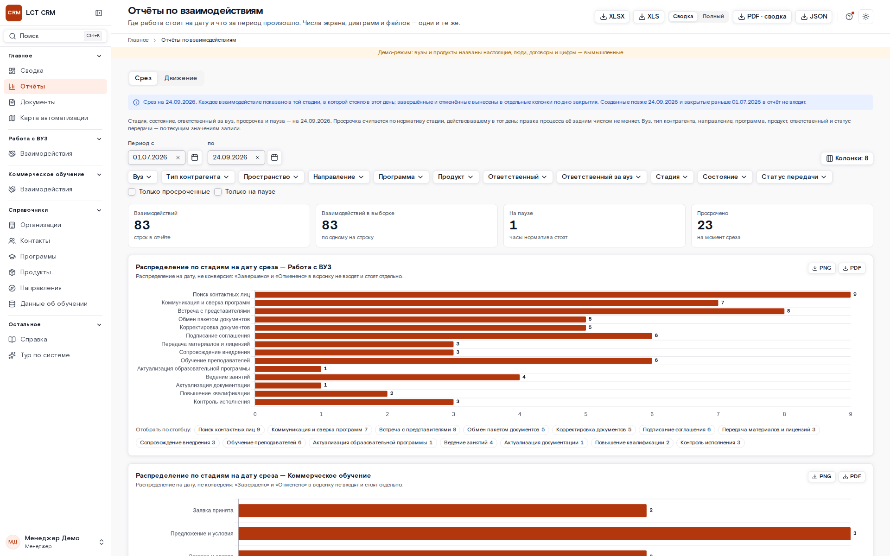      |
| что требует внимания сегодня                                              | что происходит, что мешает, кто должен, что могу                       | срез и движение, четыре формата                                  |
| **[Процесс](#сцена-2-управляемость-кто-что-решает-и-как-меняют-правила)** | **[Внешние системы](#сцена-1-сквозная-автоматизация-cms--crm--lms)**   | **[Справка](https://alma.volkv.com/help)**                       |
| 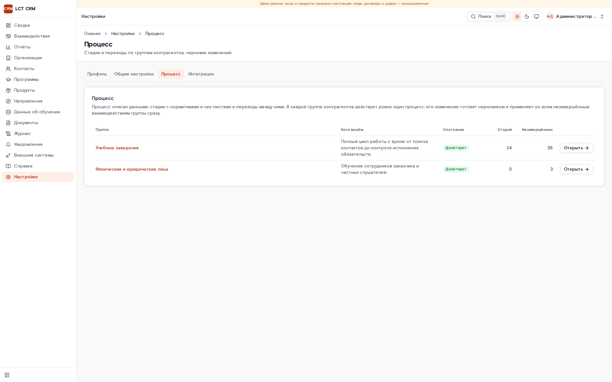     | 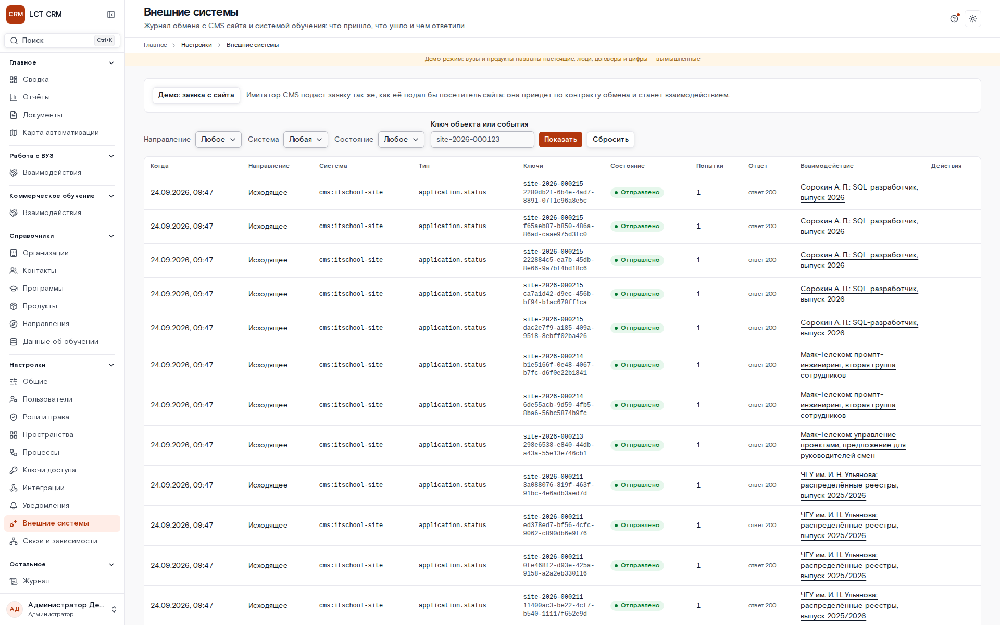  | 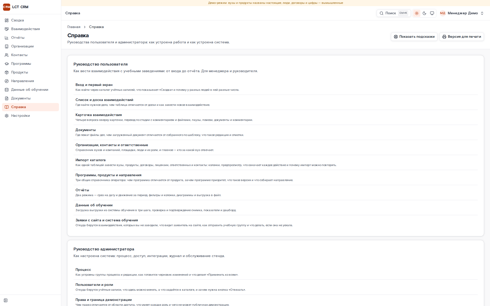        |
| действующий процесс и черновик изменений                                  | журнал обмена в обе стороны                                            | два руководства внутри системы                                   |

## Стенд и три роли

Публичный стенд — **https://alma.volkv.com** (обновляется вместе с репозиторием). Исходный набор
данных на нём демонстрационный: названия вузов и продуктов публичные, а люди, договоры и цифры
вымышленные, включая слушателя-физлицо и компанию, обучающую своих сотрудников. Локально —
`docker compose up --build` и http://localhost:3000.

На демо-стенде внешние источники реквизитов включены сидом (квота 200 обращений в сутки на
сотрудника); паспорт организации показывается на СПбПУ, МФТИ, Московском Политехе, МТУСИ и МИЭТ —
у них в сиде настоящие сайты, у остальных вузов домен вымышленный. Раздел «Сведения с сайта» этих
вузов показывает настоящих руководителей подразделений с их публичного сайта, и кандидат,
добавленный в контакты, — реальный человек; такая запись живёт до ночного сброса.

Почту и пароль спрашивает не система, а общий каталог учётных записей — **Keycloak**, realm `lct`
(OIDC Authorization Code + PKCE). Своих паролей в базе нет вовсе; система получает от каталога уже
проверенную учётную запись и роль.

<p align="center">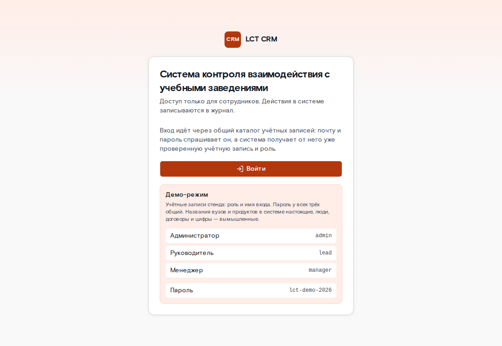</p>

| Имя входа | Роль              | Что видит и что может                                                                           |
| --------- | ----------------- | ----------------------------------------------------------------------------------------------- |
| `manager` | **КАМ**           | свои вузы: взаимодействия, переходы по процессу, документы, контакты, отчёты по своей области   |
| `lead`    | **Руководитель**  | свою область и работу подчинённых, назначает ответственных за вузы, видит журнал по своим людям |
| `admin`   | **Администратор** | всё: процесс, доступ, каталоги, интеграции, журнал обмена, настройки                            |

Первый вход на устройстве начинается со знакомства: система показывает оболочку и **сама**
проходит по разделам — пункт меню в рамке, страница раздела открыта. Первыми идут пространства
«Работа с ВУЗ» и «Коммерческое обучение» — два процесса, которые ведёт система, — затем их
настройка, взаимодействия, справочники, отчёты, документы, пользователи и роли, обмен и данные об
обучении. Подробности каждой страницы — в её собственном туре под **компасом** в шапке: на
«Взаимодействиях» он сам переключает доску и таблицу, на карточке дела проходит по стадиям,
чек-листу, закрывающим документам и модулям. Пока тур страницы не пройден, от компаса расходятся
волны. «Позже» и **Esc** убирают подсказки в любой момент; знакомство возвращается из меню «?», меню
разделов, «Справки» и профиля. Устройство подсказок — [`docs/onboarding.md`](docs/onboarding.md).

Пароль у всех трёх общий и публичный — на стенде это **`lct-demo-2026`**, и он же написан на самой
странице входа, рядом с именами, с кнопкой «Скопировать пароль» (локальный стек берёт пароль из
`SEED_DEMO_PASSWORD` вашего `.env`).
Прятать его не от кого: стенд открыт, и пароль, который надо у кого-то спрашивать, закрыл бы показ,
а не защитил его. Пароль принадлежит каталогу (`SEED_DEMO_PASSWORD`, его читает
импорт realm), сервер его не хранит и не проверяет. В базе приложения эти же люди заведены с почтами
`<имя входа>@demo.lct-crm.local`: при первом входе запись находится по подтверждённой почте, и
человек входит со своим портфелем, а не двойником.

**Стенд общий и сбрасывается каждую ночь.** Всё, что сделано на показе, живёт до сброса: дела,
документы, справочник, данные об обучении, ключи API и процессы заливаются заново, настройки
демонстрации возвращаются к эталону. Час сброса написан полосой демо-режима; администратор может
сбросить стенд и сам, кнопкой в «Настройках → Общие».

Демонстрационные записи полноценны в своих ролях, с тремя исключениями: они не меняют адреса и
секреты интеграций и периодичность фоновой работы (право `integrations.manage_endpoints`),
расписание сброса и баннер входа, а также учётные записи вне демонстрации. Отказ приходит фразой на
экране — и так же из `curl` — и пишется в журнал. Подробно — [`docs/access-matrix.md`](docs/access-matrix.md),
«Демо-учётные записи».

Право и область доступа — разные вопросы: право отвечает «можно ли вообще это действие», и матрица
«право × роль» читает его прямо из базы, тем же способом, что сервер проверяет на каждом запросе.

<p align="center">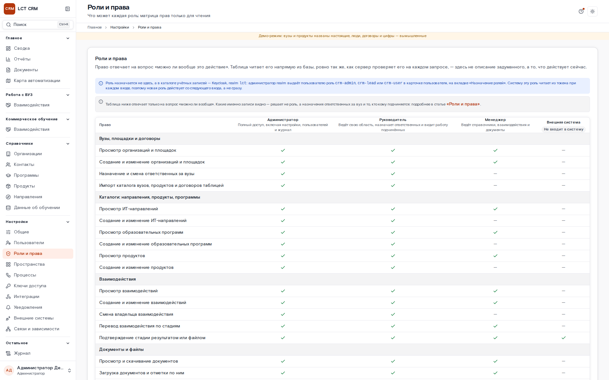</p>

Роли и область доступа целиком — [`docs/access-matrix.md`](docs/access-matrix.md), устройство
входа — [`docs/auth.md`](docs/auth.md).

## Три сцены

### Сцена 1. Сквозная автоматизация: CMS → CRM → LMS

Четыре направления обмена, все по одному объявленному контракту
([`docs/exchange-contract.md`](docs/exchange-contract.md)):

1. **заявка с сайта** приходит в `POST /api/v1/applications` и становится взаимодействием — с
   контрагентом, контактным лицом и ответственным, а не третьей сущностью рядом;
2. **снимок статуса** заявки уходит обратно в CMS, когда по заявке заведено дело и когда дело
   сменило стадию (в том числе переездом при правке процесса), встало на паузу или снялось с неё,
   сменило ответственного, завершено или отменено, — чтобы посетитель сайта видел, что с его
   обращением. Новая ревизия заявки и комментарии сотрудников снимка не ставят: комментарии на
   сайт не уходят вовсе. Карточка дела показывает КАМу то же самое — какой статус видит
   заявитель на сайте и дошёл ли он, — не открывая журнал обмена, который открыт только
   администратору;
3. **учебная группа** заводится в системе обучения кнопкой «Отправить в LMS» с карточки —
   это решение сотрудника, а не автоматический побочный эффект; к потоку загружается поимённый список
   слушателей файлом, и он уходит в систему обучения отдельной кнопкой той же заявкой — или
   выгружается книгой по шаблону загрузки пользователей LMS (заполнены ФИО, телефон и почта,
   остальное CRM не собирает и сотрудник дозаполняет);
4. **результат потока** приходит из LMS сам, подтверждает стадию «Ведение занятий» и приносит числа:
   зачислено, завершили, отчислены. Взаимодействие он при этом **не двигает** — переход остаётся за
   человеком, — но и уйти с этой стадии без него нельзя: занятия идут в системе обучения, и
   доказывает их она.

Данные сайта об оплатах приходят файлом: выгрузку оплаченных заказов (JSON или таблица) администратор
загружает диалогом «Загрузить оплаты с сайта» на экране «Внешние системы» — сначала предпросмотр по
записям с причиной у каждой ошибки, потом загрузка. Запись файла считается подтверждённой оплатой
(сумм в выгрузке нет): дело находится по номеру заявки — тому же ключу, что у заявки с сайта, — или
заводится вместе с физлицом без дублей, пункт «Оплата получена» отмечается сразу или при входе на
стадию оплаты, а стадию загрузка не двигает; повторная загрузка того же файла ничего не задваивает.

Сообщения едут в общем конверте с версией схемы и идентификатором события; исходящие подписаны
HMAC-SHA256; повторяются только временные отказы, а повтор не создаёт дубля — ни у нас, ни у
получателя. Обе стороны видны одним списком в разделе «Внешние системы»: что пришло, что ушло,
сколько было попыток и чем ответил получатель.

<p align="center">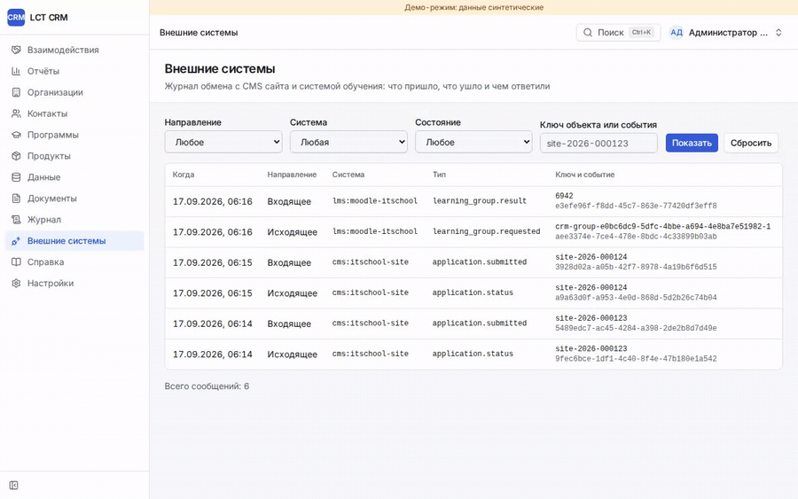</p>

Доступа к API сайта и системы обучения заказчика на хакатоне нет, поэтому рядом со стендом подняты два
**имитатора** — `mock-cms` и `mock-lms`. Они говорят ровно на объявленном контракте и умеют ломаться по
команде (отказ, задержка, обрыв связи), поэтому повторы и восстановление после сбоя показываются
вживую. Что они отвечают, **ничего не доказывает о системах заказчика**: доказывается другое — что CRM
говорит на контракте и не теряет сообщений.

Почему имитаторы устроены именно так:

- **Отдельные сервисы, а не код продукта.** Это свои контейнеры compose: в промышленной сборке нет
  маршрута-заглушки и вопроса «а не включена ли она».
- **Тот же клиент и адрес из настроек.** CRM ходит к имитатору тем же кодом, что пойдёт к настоящей
  системе; адреса и ключи задаются в настройках обмена.
- **Граница адаптера.** При подключении настоящих систем меняются имена полей чужой стороны, адреса,
  способ аутентификации и формат ошибки, протокол системы обучения и словари статусов. Канонические
  сообщения, журнал обмена, ключи дедупликации, расписание повторов, подпись, права и доменные
  сервисы процесса не меняются.
- **Управление — вне контракта.** Служебные адреса имитаторов (`__state`, `__scenario`) в обмене не
  участвуют, а триггер сцены выбирает сцену, а не сочиняет сообщение.

Подробно — [`docs/exchange-contract.md`](docs/exchange-contract.md), разделы 1 («Граница адаптера») и 9.

Сцену видно с обеих сторон: на стенде страницы имитаторов открыты по `/mock-cms/` и `/mock-lms/`, и
заявка подаётся кнопкой оттуда — как её подал бы посетитель сайта. Ту же заявку запускают кнопки
«Вуз (b2b)» и «Физлицо (b2c)» на экране «Внешние системы»: раздел обмена открыт администратору, и
жмёт их он.

Рядом живут вебхуки: подписка выбирает события журнала точными кодами или целыми разделами,
доставка идёт `POST`-ом с подписью, неудача уходит в очередь из шести повторов, и одно событие
доходит до подписки ровно один раз.

<p align="center"></p>

Подробности — [`docs/integrations.md`](docs/integrations.md).

Обмен с CMS и LMS закрывает часть шагов, а не весь процесс: полная карта автоматизации показывает
все 14 стадий «Работы с ВУЗ» — что на каждой делает система сама, где только помогает сотруднику, а
где без доказательства дальше не пройти, — с ссылкой на экран и статью справки у каждого пункта.

<p align="center">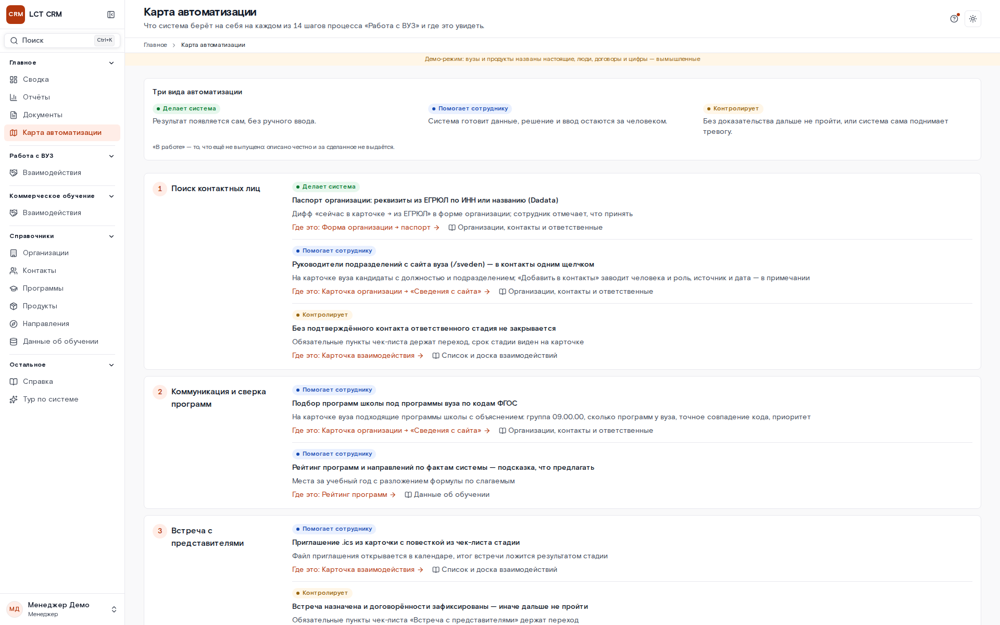</p>

Подробности — [`docs/automation-map.md`](docs/automation-map.md).

### Сцена 2. Управляемость: кто что решает и как меняют правила

**Работа.** Два направления работы — свои пространства, каждое со своим адресом (`/w/b2b/…`,
`/w/b2c/…`) и своей доской в меню: «Работа с ВУЗ» — четырнадцать стадий от поиска контактов до
контроля исполнения, «Коммерческое обучение» — короткий процесс из пяти (заявка, предложение,
договор и оплата, обучение, документ об обучении). Карточку взаимодействия тоже собирает процесс:
у вуза — договор с позициями и лицензиями, у коммерческого обучения — оплата, слушатели (числа потоков и поимённые списки) и документ
об обучении; состав панелей и шаблонов администратор отмечает в редакторе процесса без выпуска.
Место записи выбирает человек: взаимодействие
заводится внутри того пространства, где стоит на доске, а не по виду контрагента. Стороной каждого
нового дела автоматически становится оператор — сама школа: в справочнике она заведена единственной
действующей организацией с типом «Оператор». Состав дела — стороны, подразделение, программы с версиями и
продукты — правится на карточке диалогами «Стороны» и «Программы и продукты»; новый контрагент, вуз, компания или
физлицо, заводится прямо из формы нового взаимодействия, не уходя на другой экран. Подразделения и
руководство вуза с его сайта (раздел `/sveden`, прочитанный сервером заранее, в фоне) стоят в
«Составе» и в выборе контактного лица отдельным блоком «С сайта вуза» — рядом с уже заведёнными, с
кнопкой «Импортировать» ([`docs/enrichment.md`](docs/enrichment.md), «Прогрев и формы карточки дела»). На каждой стадии —
норматив по дням, чек-лист,
ответственный, результат и подтверждение; исполнение стадии подтверждается результатами, файлами,
отметками документов или данными системы обучения — подписание соглашения закрывает сама отметка
«Утверждён» на документе, а не слово исполнителя. Передачу материалов и лицензий закрывает отметка
«Утверждён» на акте передачи из пакета документов — утверждённое раньше соглашение её не закрывает, а позиции
договора из акта той же отметкой получают статус «передан». Засчитывается только акт, собранный по
шаблону, — подписанный скан считается его новой редакцией, а файл, загруженный вручную, не в счёт;
повторная сборка пакета документов тоже даёт новую редакцию, а не второй документ. Стоимость дела
хранится в «Оплате» и попадает в оферту и договор с юридическим лицом; подписанный договор с отметкой
«Утверждён» делает договор дела действующим. «Ведение занятий» подтверждает итог группы студентов
по программе взаимодействия: итог потока преподавателей виден в карточке, но стадию не закрывает. Какой документ и
какие группы засчитываются, администратор задаёт у стадии в редакторе процесса.
Пауза «ждём контрагента» останавливает часы,
помеха с причиной запрещает переход. Со стадии «Встреча с представителями» и из меню «Ещё» любой
другой карточка назначает встречу и рассылает приглашение письмом — контактам стороны и коллегам,
которые видят дело, с событием календаря (`text/calendar; method=REQUEST` и вложением .ics, которые
Gmail, Outlook, Apple и Яндекс показывают приглашением с кнопками ответа), кнопкой «Добавить в
Google Календарь», повесткой по чек-листу стадии и тестовым письмом себе; организатор —
ответственный, ответы приходят ему. Перенос встречи уходит обновлением того же события (тот же UID,
растущий SEQUENCE), отмена — `METHOD:CANCEL` тем, кого приглашали; без почты встречу можно
сохранить и скачать файлом .ics. Итог встречи записывается обычным результатом стадии. На «Коммуникации и сверке программ» описание программ уходит вузу одной кнопкой:
письмо контактным лицам стороны с программами и продуктами дела и материалами программ во
вложении, с превью и тестовым письмом себе; адреса подставляет сервер по праву на контакты, а
отправка сама закрывает пункт «Отправлено описание программ» и ложится в ленту. Карточка читается
сверху вниз: факты и полоса процесса, одно
главное действие — недоступное заперто, и под ним перечислено, что осталось сделать (чек-лист
отмечается прямо там), — остальные команды в меню «Ещё», контекст стороны, договора и документов
сбоку и единая лента событий.

<p align="center"></p>

<p align="center">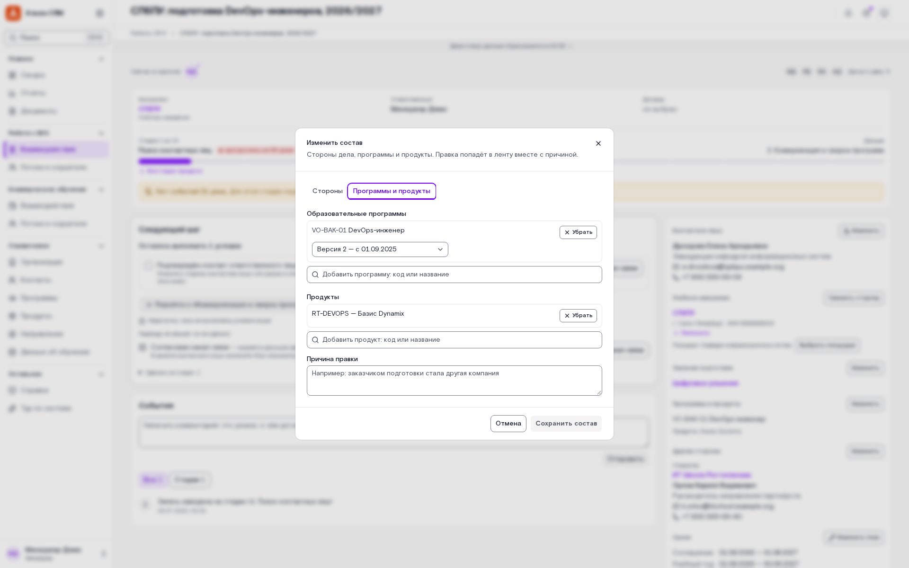</p>

Те же взаимодействия колонками по стадиям — доска: сразу видно, где скопились дела и сколько из них
просрочено. Решает при этом не доска: переход считает тот же движок, что и карточка, поэтому
невозможный отказывает словами, а карточка остаётся на месте.

<p align="center"></p>

**Роли.** Область доступа — это множество людей, а не список вузов: КАМ видит свои вузы,
руководитель — свои и своих подчинённых, администратор — всё. Считается она подзапросом по
действующим назначениям, поэтому смена ответственного меняет доступ в ту же секунду и во всех
каналах сразу: списки, карточки, скачивание файлов, выгрузки, дашборд, подсказки и публичный API.
Вуз вне области отвечает «не найдено», а не отказом: иначе перебором идентификаторов было бы видно,
что лежит за границей. Быстрый поиск по `Ctrl`/`⌘` + `K` находит разделы и страницы внутри них
(«импорт», «рейтинг»), организации — по названию, ИНН и домену сайта или почты, — людей по ФИО (без
контактов; по точной почте — только тем, кому контакты открыты), договоры по номеру, взаимодействия,
программы и продукты — той же областью доступа, что и списки этих разделов.

Числа сводки ведут в списки, из которых посчитаны: сводка общая по всем пространствам, а список живёт
в пространстве, поэтому число раскладывается по пространствам, и в списке по каждой ссылке ровно
столько дел, сколько написано рядом. Так же устроен «Мой день» на главной: список взаимодействий
понимает раздел «Моего дня» тем же фильтром, что и обычное состояние; счётчик плитки ведёт к своему
разделу, а ссылка «Все N в списке» под разделом открывает список ровно с тем числом дел.

**Правила.** Процесс — не код. Новый процесс заводят без кода: пустым — стадии описывают в редакторе
с первой, и шаг вперёд между соседними стадиями ставится сам, — или копией действующего процесса;
ключи стадий, пространств и процессов редактор предлагает из названия. Чек-лист стадии — список
пунктов с флажком обязательности, у каждого — способ закрытия (отметка человека или данные дела по
правилу из каталога); пункт-факт галочкой не закрыть, а возврат на стадию сохраняет её отметки.
Администратор берёт черновик действующего процесса, переименовывает стадию, удаляет лишнюю, правит
нормативы и переходы, смотрит предпросмотр — какие дела и в каких пространствах переедут и к кому они
относятся — и применяет ко всем. Записи с удалённой стадии переезжают на ближайшую сохранившуюся,
перенос отмечается на карточке отдельной строкой и **переходом не считается** — ни в истории, ни в
отчёте. История при этом цела: комментарии, причины и приложенные файлы остаются на своих местах.
Завершение дела штатным порядком проверяет обязательный чек-лист финальной стадии — так же, как шаг
вперёд, теми же словами отказа.

<p align="center">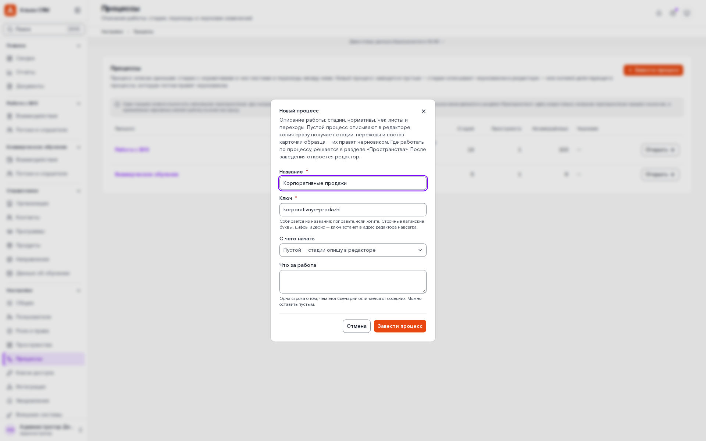</p>

<p align="center">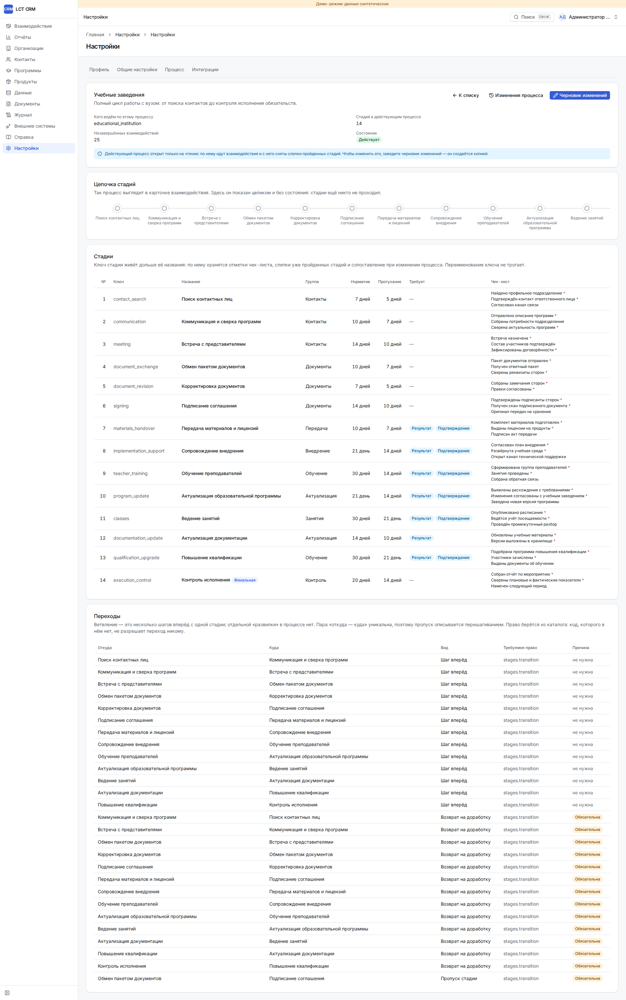</p>

**Разговор вокруг дела.** Переписка живёт там же, где работа: комментарии на карточке с автором и
моментом. Карточка живая: новый комментарий или изменение дела появляется у всех, у кого она открыта,
без перезагрузки; вверху видно, кто сейчас в карточке и у кого есть доступ к делу. Правка поверх
чужой не пропадает молча: план, договор и переход несут версию открытой формы, и попытка сохранить
поверх более свежей правки получает отказ «Запись изменил … в ЧЧ:ММ», а введённое остаётся в форме
([`docs/workflow.md`](docs/workflow.md), раздел 7.4). Поток событий
перепроверяет доступ до каждой выдачи — отозванная сессия или исключение из пространства закрывают его
сразу, а данных дела события не несут вовсе ([`docs/architecture.md`](docs/architecture.md), «Живая
карточка»). Коллегу зовут в обсуждение через «@» в комментарии: подсказка — только те, кто видит
дело, сервер перепроверяет каждого адресата при сохранении и перед письмом, письмо «Вас упомянули в
деле» — без текста комментария и названия дела, а колокольчик в шапке считает непрочитанные
упоминания ([`docs/integrations.md`](docs/integrations.md), «Упоминания»). Туда же приходит новое дело
с сайта, назначенное сотруднику, вместе с письмом без данных заявителя — одно на дело
([`docs/integrations.md`](docs/integrations.md), «Новое дело с сайта»).

<p align="center">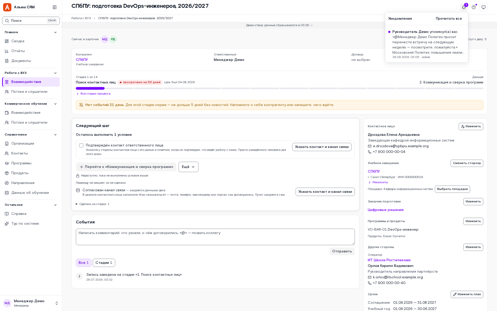</p>

Дальше — уведомление руководителю, когда запись стоит на стадии дольше порога, письмо при входе
дела на стадию, где администратор включил это в редакторе процесса (ответственному или его
руководителю; того, кто сам двигал дело, система не уведомляет), и утренняя сводка
«Мой день» каждому сотруднику: просрочки, сроки на сегодня и завтра, помехи, ожидание, новые заявки
и лицензии к продлению — тот же список, что на главной, без ФИО в письме. Письмо уходит
по-настоящему, почтой; **Telegram и MAX заведены обозначенными заглушками** — строка в журнале
доставок появляется, наружу не уходит ничего, и на экране это так и написано. Отдельного мессенджера
в системе нет.

Правила процесса — [`docs/workflow.md`](docs/workflow.md), права — [`docs/access-matrix.md`](docs/access-matrix.md).

### Сцена 3. Доверие к результату: отчёт объясняет себя сам

Отчёт общий — пункт «Отчёты» в «Главном», `/reports`: реестр по всем взаимодействиям, которые
смотрящий видит (пространство ∩ его область, администратору — всё), с фильтром пространств; по
умолчанию выбраны все доступные. У направлений разные процессы, поэтому всё, что зависит от стадий,
считается по пространству отдельно: воронка — блоком на пространство с его именем, числа стадий
разных процессов не складываются. Итоги, разрезы и динамика переходов от стадий не зависят и
считаются по выборке целиком. Прежние адреса `/w/<ключ>/reports` ведут в общий отчёт с фильтром
этого пространства.

Отчёт за период отвечает на два разных вопроса, и они не смешиваются:

- **Срез** — где работа стоит на дату: каждое взаимодействие показано в той стадии, в которой стояло
  в этот день;
- **Движение** — что за период произошло: каждая строка это один переход, с указанием, из какой
  стадии в какую; возвраты и пропуски считаются отдельно от шагов вперёд.

Фильтры (пространство, вуз, тип контрагента, направление, программа, продукт, ответственный,
стадия, состояние, статус передачи) и набор колонок живут в адресной строке — отчёт отправляют
ссылкой. Выгрузка это та же ссылка с другим расширением: **XLSX, XLS, PDF и JSON** собираются из
одного и того же готового отчёта. В XLSX, XLS и JSON едет вся выборка, и число строк в них совпадает
с числом строк отчёта по построению; PDF — на выбор сводка (условия отбора, итоги, числа диаграмм
таблицами и первые 500 строк с пометкой, сколько их всего) или полный отчёт по всей выборке до
5 000 строк, из того же снимка. Диаграммы подписаны числами и скачиваются
PNG и PDF, а клик по столбцу воронки не открывает новый экран, а сужает тот же отчёт до пространства
и стадии, не снимая остальных условий, — от числа к строкам и дальше к карточке.

Отчёт на прошлую дату не меняется после правки процесса: просрочка считается по нормативу,
действовавшему в тот день, а стадия, состояние и ответственный за вуз — на дату среза, одинаково для
фильтра и колонки. Итоги, диаграммы и строки читаются из одного снимка базы, а каждый файл несёт
идентификатор отчёта и момент сборки — по нему файл находит своё событие в журнале.

<p align="center"></p>

<p align="center">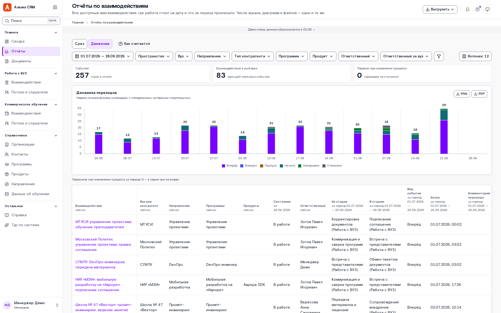</p>

Рядом — данные об обучении: снимки статистики с происхождением (источник, период, охват, режим),
показатели по программам и организациям, сборка снимка из результатов учебных групп LMS и рейтинг
программ и направлений по фактам CRM (заявки с сайта, потоки, обучающиеся, завершившие) с
формулой-предложением и настраиваемыми весами; ручной приоритет — явная поправка, и рядом с итоговым
местом видно место по одним фактам. У каждого числа дашборда подписан источник — снимки статистики
или факты CRM, — поэтому два набора чисел не читаются как противоречие. Записанный ноль
и отсутствие данных
здесь разные ответы, и это видно словами.

| Загрузка                                                                            | Показатели                                                                            | Рейтинг                                                                             |
| ----------------------------------------------------------------------------------- | ------------------------------------------------------------------------------------- | ----------------------------------------------------------------------------------- |
| 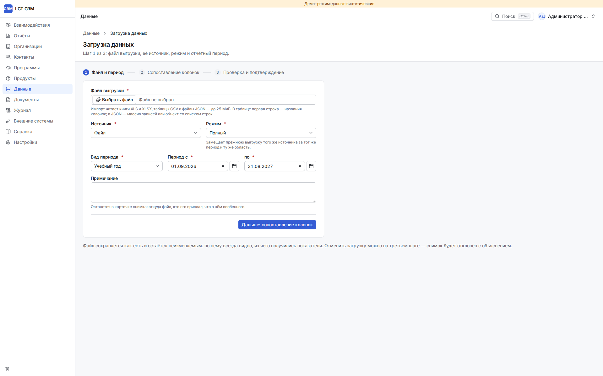 | 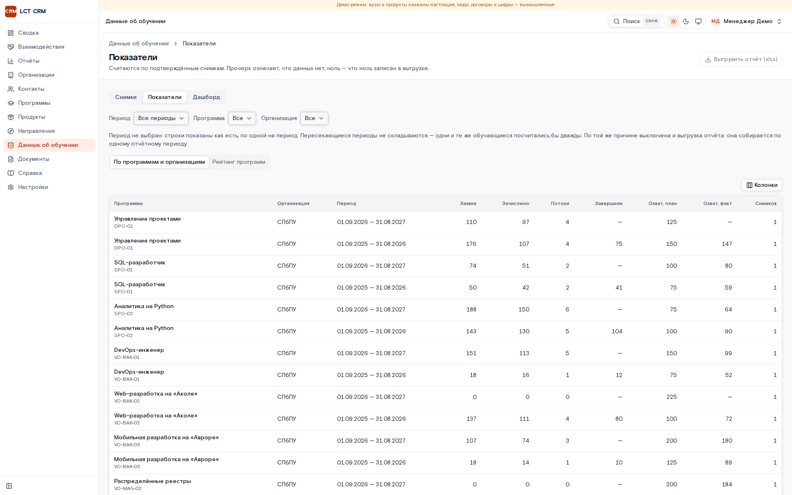 | 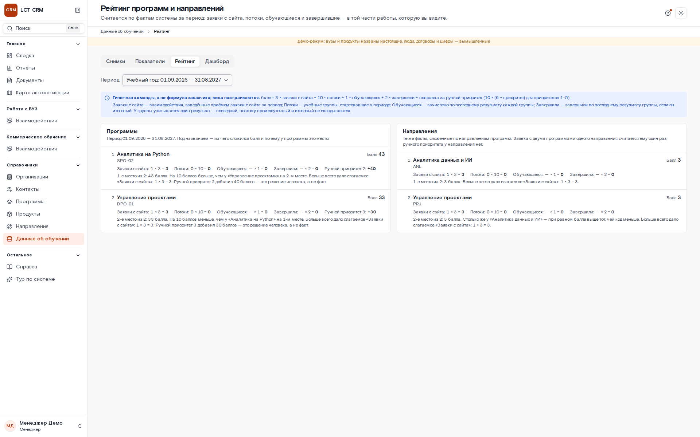 |
| XLS, XLSX, CSV и JSON с сопоставлением колонок и построчной проверкой               | считаются только по подтверждённым снимкам                                            | по фактам самой системы, а не по снимкам                                            |

Семантика отчётов — [`docs/reports.md`](docs/reports.md), данные — [`docs/stats.md`](docs/stats.md).

<details>
<summary><b>Остальные разделы одним взглядом</b></summary>
<br>

| Что                                                                                                                                                      | Экран                                                                                         |
| -------------------------------------------------------------------------------------------------------------------------------------------------------- | --------------------------------------------------------------------------------------------- |
| Список с фильтрами: состояние в адресной строке, выбор колонок, выборка на сервере                                                                       |  |
| История переходов: причины, вложения, правки плана                                                                                                       |             |
| Справочник организаций: площадки, дедупликация по ИНН, архив вместо удаления                                                                             |              |
| Документы: пакет по процессу и контрагенту (соглашение, сублицензия, акт передачи; оферта, договор с юрлицом, акт услуг) в DOCX и PDF, редакции, отметки |                       |
| Дашборд данных об обучении: плитки, топ рейтинга по фактам CRM с разложением балла, происхождение чисел                                                  |                     |
| Журнал действий: неизменяемый, с фильтрами и выгрузкой                                                                                                   |                             |
| Самодиагностика: с чем система соединяется и отвечает ли это сейчас                                                                                      | 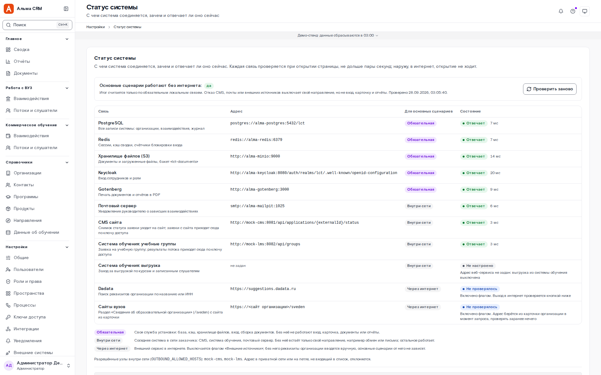                       |
| Swagger UI по OpenAPI 3.1, собранному из тех же Zod-схем, что проверяют запросы                                                                          |                               |
| Витрина компонентов и токенов темы: обе темы, ширины 390 и 1280                                                                                          |                                     |
| Тёмная тема на тех же токенах: светлая, тёмная или как в системе, выбор на устройстве                                                                    | 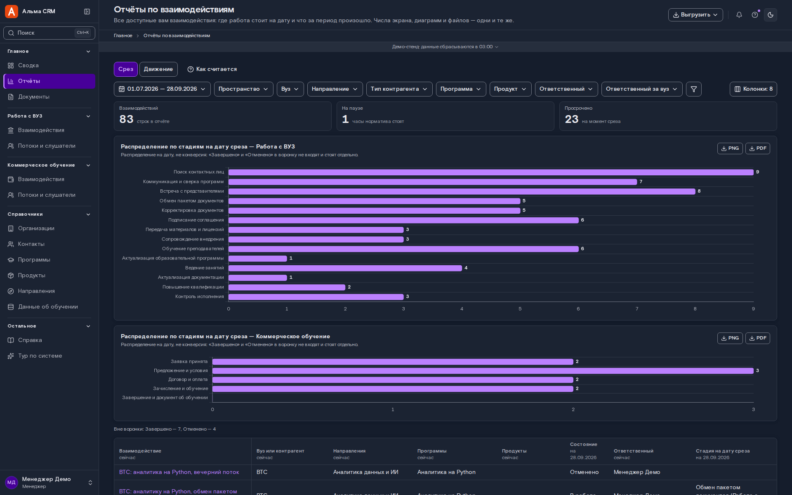                  |
| Подсказки: знакомство ведёт по разделам само, компас в шапке — тур по открытому экрану, с волнами, пока не пройден                                       | 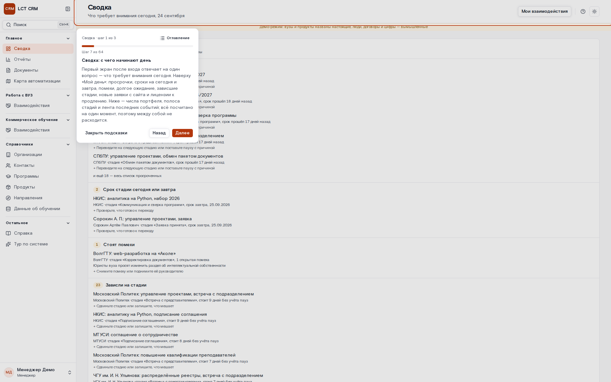                        |
| Значок «?» в шапке: тур по этому экрану, знакомство, статья справки об экране                                                                            | 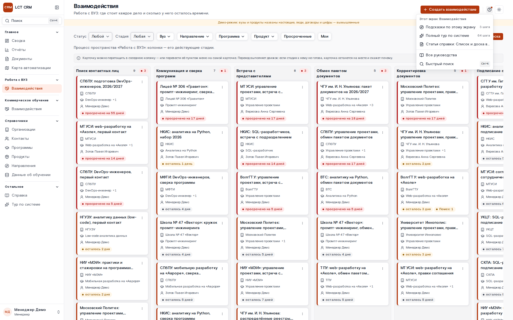               |

</details>

## Почему не таблица

Работу с вузами почти всегда ведут в общей таблице, и вопрос «зачем вместо неё система» законный.
Ответ — не в удобстве, а в трёх вещах, которых у таблицы нет по устройству.

**Таблица хранит последнее значение, а не путь.** В ячейке «Стадия» стоит то, что вписали
последним; как запись туда попала — переходом вперёд, возвратом или пропуском, кто его сделал, что
написал причиной и какой файл приложил, — не хранится нигде. В CRM это три разных события, и каждое
лежит в истории записи с автором, моментом, причиной и вложением. Отсюда и отчёт «движение»: он
считает возвраты и пропуски отдельно от шагов вперёд, потому что различие записано, а не
восстанавливается по памяти.

**У таблицы нет разницы между «не назначен» и «не заполнили».** Пустая ячейка «Ответственный»
означает и то и другое, и спросить не у кого. В системе ответственный — это запись назначения со
сроком действия: он либо есть, либо его нет, и в обоих случаях это видно, а смена ответственного
меняет и историю, и доступ к записи в ту же секунду.

**Среза на дату у таблицы не существует.** Сегодняшний файл показывает сегодняшнее состояние; каким
оно было на конец прошлого квартала, можно узнать только из копии файла, если её сохранили. Отчёт
«срез» показывает каждое взаимодействие в той стадии, в которой оно стояло в выбранный день, —
потому что стадии хранятся записями с моментами входа и выхода, а не значением в ячейке.

Всё остальное — фильтры, выгрузки, диаграммы — таблица умеет тоже. Эти три вещи она не умеет
принципиально.

## Почему без LLM

Применение искали в трёх местах: сопоставление колонок при импорте таблиц справочника и статистики,
сводка по взаимодействию для КАМа и извлечение реквизитов вуза из присланных документов. Ни разу не
нашли задачи, где модель в закрытом контуре дала бы проверяемую пользу сверх детерминированной
автоматизации, — и не поставили её ради того, чтобы она была. Сопоставление колонок импорта
(`/organizations/import`, загрузка на `/data`) сделано детерминированно: словарь синонимов поля и решение по
строке, а не угадывание, — результат воспроизводим и проверяется построчно (`docs/directory.md`,
«Допущения S4.1a»; `docs/stats.md`). Паспорт организации в форме вуза по той же причине не модель,
а прямые запросы к ЕГРЮЛ через Dadata и к размеченному разделу `/sveden` сайта из карточки, с
источником и датой у каждого значения ([`docs/enrichment.md`](docs/enrichment.md)). Задача, где модель в
закрытом контуре нужна не для видимости, а даёт проверяемый результат, который дороже получить
детерминированно, — пока не нашлась; появится — решаем её кодом с проверкой, а не догадкой модели.

<p align="center">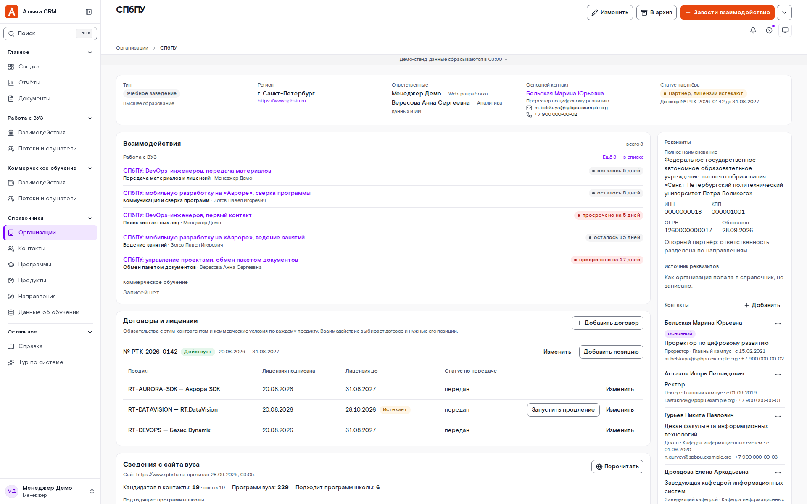</p>

## Требование → где это в продукте

Полная матрица — [`docs/requirements.md`](docs/requirements.md): 57 требований задания, у каждого
названы место в коде, чем оно проверено и ограничение: у 39 — автоматический тест, у четырёх —
замер или команда сборки, у остальных четырнадцати — ручной сценарий или проверки нет. Статусы на текущем коммите: **45 реализовано, 7
частично, 2 запланировано, 3 не проверено** (оценка интерфейса людьми). Коротко:

| Требование задания                            | Где это                                                                                                                                                                                                   |
| --------------------------------------------- | --------------------------------------------------------------------------------------------------------------------------------------------------------------------------------------------------------- |
| Управляемый процесс взаимодействия            | `/settings/workflows`, `/w/[пространство]/interactions` · `src/lib/server/stages/` · [`docs/workflow.md`](docs/workflow.md)                                                                               |
| Роли и разграничение видимости                | вход через Keycloak · матрица прав — `/settings/roles` · членство в пространствах — `/settings/workspaces` · `src/lib/server/rbac/` · [`docs/access-matrix.md`](docs/access-matrix.md)                    |
| Двусторонний обмен с CMS и LMS                | `/exchange`, `/api/v1` · `src/lib/server/integrations/exchange/` · [`docs/exchange-contract.md`](docs/exchange-contract.md)                                                                               |
| Отчёты за период с выбором колонок и форматов | `/reports`, `/reports/export` · `src/lib/server/reports/` · [`docs/reports.md`](docs/reports.md)                                                                                                          |
| Автоматизация 14 шагов процесса               | `/help/user/automation` · `src/lib/automation-map.ts` · [`docs/automation-map.md`](docs/automation-map.md)                                                                                                |
| Справочники трёх сторон и загрузка таблицей   | `/organizations` (вузы, площадки, договоры), `/people`, `/programs`, `/products`, `/directions`; загрузка — `/organizations/import` и окно загрузки на `/data` · [`docs/directory.md`](docs/directory.md) |
| Документы по шаблону и их редакции            | `/documents` · `templates/` · [`docs/documents.md`](docs/documents.md)                                                                                                                                    |
| Журнал действий и персональные данные         | `/audit` · `src/lib/server/audit/` · [`docs/admin.md`](docs/admin.md)                                                                                                                                     |
| Руководства внутри системы                    | `/help`, `/help/print` · `src/lib/help/content/` (24 статьи)                                                                                                                                              |
| Публичный API и упаковка                      | `/api/docs` · `Dockerfile`, `docker-compose.yml` · [`docs/api.md`](docs/api.md)                                                                                                                           |

## Архитектура

Модульный монолит на SvelteKit: страницы, формы и API — одно приложение, одни сервисы, один контекст
прав. Источник истины — PostgreSQL; Redis держит сессии и счётчики; Gotenberg превращает HTML и DOCX
в PDF; MinIO хранит файлы; Keycloak отвечает за вход.

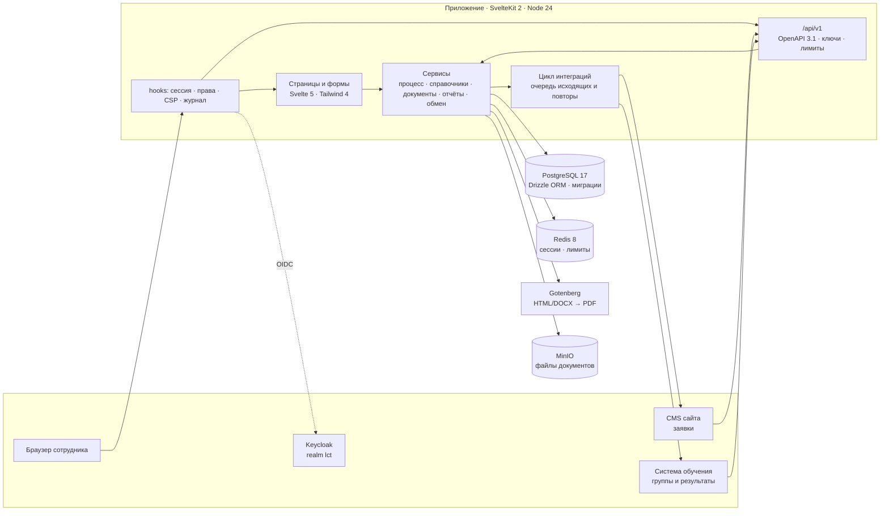
```mermaid
flowchart LR
    subgraph outside[" "]
        direction TB
        B["Браузер сотрудника"]
        CMS["CMS сайта<br/>заявки"]
        LMS["Система обучения<br/>группы и результаты"]
        KC["Keycloak<br/>realm lct"]
    end

    subgraph app["Приложение · SvelteKit 2 · Node 24"]
        direction TB
        H["hooks: сессия · права · CSP · журнал"]
        UI["Страницы и формы<br/>Svelte 5 · Tailwind 4"]
        API["/api/v1<br/>OpenAPI 3.1 · ключи · лимиты"]
        S["Сервисы<br/>процесс · справочники · документы · отчёты · обмен"]
        OB["Цикл интеграций<br/>очередь исходящих и повторы"]
        H --> UI
        H --> API
        UI --> S
        API --> S
        S --> OB
    end

    PG[("PostgreSQL 17<br/>Drizzle ORM · миграции")]
    R[("Redis 8<br/>сессии · лимиты")]
    G["Gotenberg<br/>HTML/DOCX → PDF"]
    F[("MinIO<br/>файлы документов")]

    B --> H
    CMS --> API
    H -.OIDC.-> KC
    OB --> CMS
    OB --> LMS
    LMS --> API
    S --> PG
    S --> R
    S --> G
    S --> F
```

| Слой            | Технологии                                                                                         | Зачем так                                                         |
| --------------- | -------------------------------------------------------------------------------------------------- | ----------------------------------------------------------------- |
| Интерфейс       | Svelte 5 (runes), SvelteKit 2, Tailwind CSS 4, shadcn-svelte / bits-ui, TanStack Table, superforms | один визуальный язык и общая таблица для всех разделов            |
| Сервер          | Node.js 24, TypeScript 6, Zod 4                                                                    | контракты описаны один раз и проверяют и формы, и API             |
| Данные          | PostgreSQL 17, Drizzle ORM, Drizzle Kit                                                            | SQL-first: отчёты и вью статуса стадий пишутся на SQL             |
| Вход            | Keycloak 26, OIDC + PKCE, oauth4webapi                                                             | паролей в системе нет; роль приходит из каталога при каждом входе |
| Сессии и лимиты | Redis 8                                                                                            | сессии с индексом по пользователю, блокировки, счётчики частоты   |
| Документы       | docxtemplater, Gotenberg, SheetJS, exceljs                                                         | DOCX по шаблону, PDF без офисного пакета, книги XLS и XLSX        |
| Проверки        | Vitest, testcontainers, Playwright, ESLint, Prettier, svelte-check                                 | один гейт локально: `pnpm run check:all`                          |
| Поставка        | Docker Compose                                                                                     | `docker compose up` на чистой машине даёт рабочий стенд           |

Карта модулей и границы транзакций — [`docs/architecture.md`](docs/architecture.md).

### Модули

Часть продукта — панели карточки, факты шапки, действия, пункты меню, шаблоны документов —
подключается модулями: папка `src/modules/<key>/` с манифестом и одна строка в `crm.config.ts`.
Пространство подключает и отключает модуль в своих настройках, ядро о конкретных модулях не знает.
Модуль, который нужен стадии процесса, выключить нельзя: «Обучение» — стадиям с данными LMS,
«Договоры и лицензии» — стадиям с отметкой на сублицензии или акте, «Оплата» — стадиям с пунктом
«Оплата получена». Настройки пространства показывают панели включённого модуля, которых процесс не
выбрал, и ведут к составу карточки процесса.

<p align="center">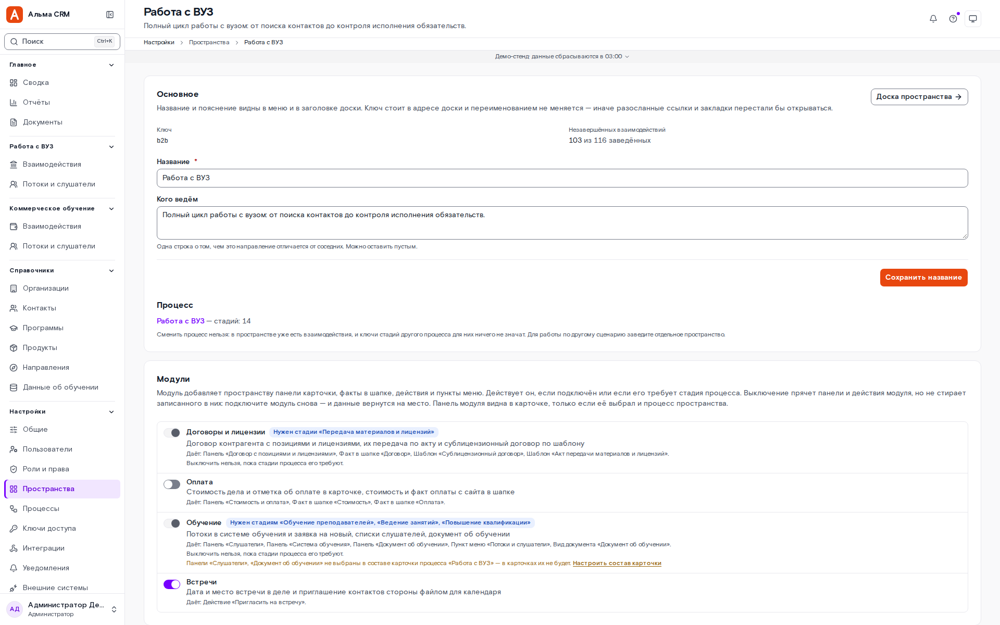</p>

Как устроен модуль и как написать свой — [`docs/modules.md`](docs/modules.md).

**Почему такой стек.** Задание называет Kotlin, Python, Node.js и React; на Q&A 2026-09-16 заказчик
разрешил другой набор при развёрнутом обосновании. Серверная платформа и база взяты из перечня —
Node.js 24 и PostgreSQL 17, — а интерфейс сделан на Svelte 5 и SvelteKit 2. Коротко: страницы,
формы и API живут одним приложением и зовут одни сервисы с одним контекстом прав, поэтому
развёртывание одно, а не два; страница приходит собранной с сервера; одна схема Zod проверяет форму,
проверяет запрос к API и **становится** описанием операции в OpenAPI, так что Swagger не может
разойтись с поведением. Полное обоснование, включая то, чем мы за это платим, и карту кода для
читателя с React — [`docs/why-sveltekit.md`](docs/why-sveltekit.md). Перечень библиотек с версиями и
лицензиями — [`docs/libraries.md`](docs/libraries.md).

**Как это растёт.** Приложение не держит состояния: сессии лежат в Redis, файлы — в объектном
хранилище, всё долговечное — в PostgreSQL. Поэтому схема роста обычная — несколько одинаковых
процессов приложения за обратным прокси и общие для них база, Redis и хранилище; фоновая работа при
этом не удваивается, потому что её проход берёт замок в Redis. На пятидесяти пользователях упор —
единственный поток JavaScript процесса, а не база: она выполняет в среднем один запрос и ждёт
приложение. Поэтому первый шаг — вторая копия приложения, дальше база на своём сервере и реплика
для чтения отчётов. Две копии
приложения за прокси сняты одним прогоном на нагрузочном стенде; развёртывание демо-стенда
(`docker-compose.prod.yml`) держит одну копию, и перевод его на две — отдельная правка: права ролей
кэшируются в памяти процесса, и правка роли на одной копии не сбрасывает кэш другой. Схема, порядок шагов и что именно не измерено —
[`docs/architecture.md`](docs/architecture.md), раздел «Масштабирование», и
[`docs/performance.md`](docs/performance.md).

**Сколько это стоит железом.** На коммите сдачи (`4e98a600`, 2026-09-28, рабочая машина 16 ядер,
одна копия): пятьдесят пользователей, включая руководителей, — p95 операций ТЗ 0,08–0,32 с, ни одного
ответа дольше секунды из 8250; десять одновременных отчётов — экран 0,30 с, XLSX 0,55 с, PDF 1,7 с
(p95). Замер ресурсов ниже снят 2026-09-24 на `e520e951`, до модулей пространства и новой карточки.
Пятьдесят одновременных пользователей — все пятьдесят, включая
руководителей с одноразовым кодом, — на VPS с четырьмя общими vCPU: одна копия приложения держит p95
0,18–0,38 с на всех операциях ТЗ (образ запускает Node с `--max-semi-space-size=32`; без флага упор в
поток JavaScript давал до 0,86 с), вторая копия за прокси — 0,16–0,52 с и 0,24 % ответов дольше
секунды. Десять одновременных годовых отчётов: экран 0,27 с, XLSX 0,37 с, PDF 3,3 с (p95). Это
**замер**; один пользователь стоит около 0,04 ядра, весь стек — около 1,2 ГБ. Дальше — **расчёт** по
формуле `2 × 0,04 × N + 1` ядер: сто — 9 ядер и три копии за прокси, триста — 25 ядер и база на
отдельном сервере, тысяча — 81 ядро: несколько серверов приложения, база и реплика для отчётов.
Что именно измерено и где упор — [`docs/performance.md`](docs/performance.md).

<details>
<summary><b>Структура репозитория</b></summary>

```
src/
  routes/(app)/        разделы: w/<пространство>/interactions, отчёты, организации, контакты,
                       программы, продукты, данные, документы, журнал, внешние системы, справка,
                       настройки (включая workspaces и workflows)
  routes/(auth)/       вход и возврат из каталога учётных записей
  routes/api/          /api/v1, openapi.json, Swagger UI, health
  lib/server/          сервисы: stages, interactions, directory, documents, stats, reports,
                       integrations/exchange, enrichment, auth, rbac, audit, api, settings; схема в
                       db/schema
  lib/contracts/       Zod-контракты команд и ответов (общие для форм и API)
  lib/help/content/    тексты встроенных руководств
  lib/components/      дизайн-система и компоненты разделов
mocks/                 имитаторы CMS и системы обучения — отдельные процессы
keycloak/              realm lct: клиент, роли, второй фактор; демонстрационные записи — отдельным файлом
drizzle/               SQL-миграции
scripts/seed/          детерминированные демонстрационные данные
scripts/docs-pdf/      сборка комплекта документации в PDF (`pnpm run docs:pdf`)
scripts/readme-media/  съёмка снимков и роликов README
templates/             DOCX-шаблоны документов
tests/unit, tests/integration, e2e/
docs/                  документация по подсистемам
```

</details>

## Запуск

Нужны Docker 25+ с плагином Compose. Для разработки — Node.js 24 (`.nvmrc`) и pnpm 10 (`corepack enable`).

```bash
git clone https://github.com/volkv/alma-crm-2026.git && cd alma-crm-2026
docker compose up --build
```

Поднимаются приложение, PostgreSQL 17, Redis 8, Keycloak, Gotenberg, MinIO и два имитатора
систем заказчика. Миграции применяются автоматически, демонстрационные данные заливаются при первом
старте.

| Адрес                          | Что там                                |
| ------------------------------ | -------------------------------------- |
| http://localhost:3000          | приложение                             |
| http://localhost:3000/api/docs | Swagger UI                             |
| http://localhost:58080/admin   | Keycloak — каталог учётных записей     |
| http://localhost:59001         | MinIO — файлы документов               |
| http://localhost:58081         | `mock-cms` — имитатор CMS сайта        |
| http://localhost:58082         | `mock-lms` — имитатор системы обучения |

Имитаторы показывают своё состояние страницей: что они приняли, что отправили и чем им ответили, —
и там же кнопка, которой сцену запускают: «Отправить заявку в CRM» у сайта, «Отправить результат в
CRM» у системы обучения. Ту же заявку подают кнопки «Вуз (b2b)» и «Физлицо (b2c)» на экране «Внешние
системы» — их жмёт администратор, потому что раздел обмена открыт по праву `integrations.manage`.
Нажатие любой из них означает то же самое, что кнопка на странице имитатора: заявку отправляет
имитатор, своим ключом обмена, по контракту, и каждое нажатие — новая заявка с новым ключом.

Адреса и секрет обмена приложение берёт из `EXCHANGE_*` (`.env.example`), а ключи доступа, которыми
имитаторы представляются CRM, задаются переменными `EXCHANGE_API_KEY_CMS` и `EXCHANGE_API_KEY_LMS` —
по ключу на подключение, разными значениями. В локальном стеке у них есть демонстрационные
умолчания, чтобы обмен работал сразу после `docker compose up`; ключами они не являются — их знает
всякий, кто открыл репозиторий, и на стенде задают свои. Сид заводит по переменным ключи обмена
(`docs/seeds.md`), имитаторы представляются теми же значениями; переменных нет — имитаторы
честно отвечают, что обмен на стенде не настроен. На публичном стенде имитаторы стоят за тем же
прокси, что и приложение, под путями `/mock-cms/` и `/mock-lms/`, и наружу открыты только страница
состояния и триггер (`docs/deployment.md`, «Имитаторы на стенде»). Снаружи триггер выбирает сцену —
набор формы и ключ заявки стенда, — а тело заявки берёт из своих фикстур: собственное сообщение
имитатор принимает только с токеном управления.

Пустая база без демонстрационных записей: `DEMO_MODE=false docker compose up --build`.
Остановить и удалить данные: `docker compose down -v`.

<details>
<summary><b>Полный доступ: управление пользователями и ключами</b></summary>

Экраны управления пользователями и ключами показывает штатный администратор — обычная учётная запись
оператора, не демонстрационная. В realm её нет: заводят её в консоли Keycloak, как и любого
настоящего сотрудника.

1. открыть http://localhost:58080/admin, realm `lct`, раздел «Users»;
2. завести запись, указать подтверждённую почту `admin@staff.lct-crm.local` и задать пароль;
3. на вкладке «Role mapping» выдать роль realm `crm-admin`.

Почта выбрана не случайно: с этим адресом набор данных уже завёл в базе приложения строку
«Администратор стенда», и первый вход свяжет её с каталогом вместо того, чтобы завести двойника.

</details>

<details>
<summary><b>Разработка без Docker-образа приложения</b></summary>

Тот же порядок одной командой — `make up` (зависимости, инфраструктура в контейнерах, миграции и
сид, Vite на хосте); шаги по отдельности:

```bash
cp .env.example .env                                   # значения совпадают с compose
docker compose up -d postgres redis gotenberg minio minio-init keycloak  # только инфраструктура
pnpm install
pnpm run db:migrate
pnpm run db:seed
pnpm dev                                               # http://localhost:5173
```

Все переменные окружения обязательны: без любой из них сервер не стартует и называет, чего не
хватает. Подробности — [`docs/development.md`](docs/development.md).

</details>

## Безопасность

Меры выбраны по методическому документу ФСТЭК о защите информации в приложениях и требованиям
152-ФЗ. **Класс защищённости системы и уровень защищённости персональных данных не установлены** —
их определяет оператор актом классификации, а оператор и схема размещения на момент разработки не
заданы; К3 и УЗ-4 у нас — гипотезы, а не вывод. Поэтому ниже не «соответствует», а то, что уже
работает и чем оно проверяется. Мера за мерой, с указанием, что остаётся контуру размещения, а не
коду, — [`docs/security.md`](docs/security.md), раздел «Меры защиты и чем они закрыты».

- **Вход — через общий каталог.** OIDC Authorization Code + PKCE (`S256`), конфиденциальный клиент:
  код на токены меняет сервер. Своих паролей в базе нет вовсе. Id-токен проверяется по ключам realm
  целиком — подпись, `iss`, `aud`, `nonce`, сроки; одноразовые значения захода живут в Redis не
  дольше десяти минут и читаются с удалением. Пароль, его политика, защита от перебора и второй
  фактор — забота каталога: штатным `crm-admin` и `crm-lead` одноразовый код обязателен,
  демонстрационные записи стенда — исключение (`docs/security.md`). Промышленная установка без
  демо — `docker-compose.production.yml`, чек-лист в `docs/deployment.md`.
- **Роль приходит из каталога.** `crm-admin` / `crm-lead` / `crm-user` отображаются на роли системы
  при каждом входе; отозвали роль — следующий вход отклонён, а учётная запись выключена вместе со
  своими сессиями. Ключи обмена выпускаются на машинного субъекта, которому вход закрыт при любых
  утверждениях токена, а доступ открыт только к эндпоинтам обмена.
- **Сессии.** Серверные, в Redis, с индексом по пользователю; бездействие 30 минут, абсолютный срок
  12 часов; смена роли, руководителя или выключение записи гасят их немедленно. «Выйти» гасит и
  сессию каталога, а не только нашу.
- **Область доступа на каждую выборку.** Считается подзапросом по действующим назначениям, поэтому
  смена ответственного меняет доступ в ту же секунду и во всех каналах сразу.
- **Права на каждый запрос.** Каталог из 38 прав, проверка на сервере в каждом загрузчике, действии
  и эндпоинте; навигация не показывает недоступное, но защита не в навигации.
- **Журнал по составу РСБ.1.** Append-only на уровне базы (триггер), без значений персональных
  данных — только идентификаторы и имена полей; отказы по правам и аномалии анонимных запросов тоже
  пишутся.
- **Персональные данные.** Основание обработки, срок хранения и обезличивание — необратимое и по
  всем копиям сразу: вместе со строкой человека уходят название контрагента, заголовки, тела
  сообщений обмена, тексты отправленных писем, прежние значения правленых полей и текст заявки с
  сайта. Единый сериализатор контактов маскирует телефон и почту по правам; показ немаскированных
  контактов — отдельное событие журнала. Почта и телефон лежат в базе зашифрованными (AES-256-GCM,
  ключ — в окружении установки, не в репозитории): без ключа их не прочитать ни из базы, ни из
  резервной копии, а дедупликация и поиск по точному контакту работают по детерминированному ключу
  сравнения.
- **Обмен.** Исходящие подписаны HMAC-SHA256 по строке «момент отправки + тело», входящие приходят
  ключом машинного субъекта, экземпляр отправителя определяется подключением, а не полем из тела.
- **API.** Ключи с хешем в базе, лимиты частоты по ключу и по адресу, идемпотентность, ошибки без
  лишних подробностей, валидация по тем же схемам, из которых собран OpenAPI.
- **HTTP и файлы.** CSP и security-заголовки, антикэш чувствительных ответов, CSRF-защита форм,
  проверка содержимого загружаемых файлов по сигнатуре первых байтов, скачивание только через
  проверку прав.
- **Проверки безопасности.** `pnpm run check:security` (semgrep по коду, Trivy по всему дереву
  зависимостей и по собранному образу, SBOM в CycloneDX — `scripts/security-scan.sh`).
  Свежеопубликованные версии пакетов выдерживаются трое суток перед установкой — так проезжают
  угнанные пакеты.
- **Чего нет.** Обязательного второго фактора для рядовых менеджеров (по желанию — штатным
  `crm-admin`/`crm-lead` он обязателен, демонстрационные записи стенда — исключение), сертифицированных
  средств защиты, криптографии по ГОСТ, WAF, антивируса файлов, аттестации контура и независимой
  оценки соответствия. Полный список границ — [`docs/security.md`](docs/security.md).

## Доказательства

```bash
pnpm run check:all
```

Один гейт локально: аудит зависимостей → lint → типы → unit → интеграционные тесты (PostgreSQL,
Redis и MinIO поднимает testcontainers, Gotenberg берётся из compose) → сборка и e2e против
собранного приложения → сборка образа. Сканеры безопасности — отдельной командой
`pnpm run check:security` (semgrep по коду, Trivy по зависимостям и по образу, SBOM в CycloneDX —
[`docs/security.md`](docs/security.md)).

Гейт запускается локально: CI в репозитории нет. Числа ниже — полный прогон `pnpm run check:all`
на коммите сдачи.

Прогон 2026-09-28 на коде `29e20ac7`: аудит зависимостей — уязвимостей уровня high нет (одна moderate), типы — 0 ошибок,
unit — 1014 тестов, интеграционные — 472 в 51 файле, e2e — 23 сценария, образ собирается.

| Уровень        | Что проверяется                                                                                       | Инструмент              |
| -------------- | ----------------------------------------------------------------------------------------------------- | ----------------------- |
| Unit           | контракты, движок процесса, разбор таблиц, права, отчётные вычисления, форматирование                 | Vitest                  |
| Интеграционные | бизнес-инварианты на настоящей базе: область доступа, публикация процесса, отчёты на дату, обмен, ПДн | Vitest + testcontainers |
| End-to-end     | вход через каталог, сквозной сценарий тремя ролями, отчёт, границы обмена, редактор процесса          | Playwright              |

Быстрый гейт для разработки — `pnpm run check:fast`.

**Сквозной сценарий** (`e2e/scenario.test.ts`) — один последовательный проход тремя ролями через
интерфейс, семь шагов: КАМ видит свои вузы → двигает стадию с комментарием и файлом → руководитель
передаёт ему вуз, и доступ меняется в ту же секунду → администратор переименовывает и удаляет стадию
действующего процесса, записи переезжают, история цела → заявка с сайта заводит взаимодействие и
получает обратно снимок статуса → учебная группа уходит в систему обучения и возвращается
результатом → отчёт за период скачивается в четырёх форматах, и в файлах лежит та самая работа.
Проверяются не переходы между экранами, а наблюдаемый результат: карточка, доска, история, журнал
обмена, состояние имитаторов и содержимое скачанных файлов. Проход идёт на своём процессе из четырёх стадий,
заведённом прямо в базе, а не на штатных четырнадцати стадиях «Работы с ВУЗ»: правка процесса
необратима, и штатный процесс общей базы прогона она бы испортила.

## Ограничения

Здесь то, чего в решении **нет**, — чтобы это не пришлось выяснять на демонстрации.

- **Имитаторы — не интеграции.** Обмен проверен против `mock-cms` и `mock-lms`, которые говорят на
  нашем же объявленном контракте. Настоящие CMS и LMS заказчика наружу не смотрят; их контракт не
  согласован, и результат на имитаторах ничего о них не доказывает.
- **Исходный набор данных синтетический.** Организации, люди, контакты, договоры и статистика,
  которыми стенд заливается при сбросе, выдуманы; ни одно имя и ни один адрес в них не принадлежат
  настоящему лицу. Названия вузов настоящие, у части из них — и адреса сайтов, поэтому «Сведения с сайта»
  показывают настоящих руководителей подразделений, и добавленный из них контакт — реальный
  человек до ночного сброса.
- **Импорт справочников не заменяет карточку.** Мастер `/organizations/import` заводит вузы, продукты,
  направления, договоры и лицензии, назначает ответственного по колонке менеджера и заводит контакты
  вуза, но уже заведённые вузы и продукты он не переименовывает, чужое назначение не заменяет, а
  примечание дописывает, не затирая. ИНН, КПП и ОГРН проверяются по устройству номера — в форме
  организации и при разборе строки файла одинаково. Допущения по колонкам — `docs/directory.md`,
  «Допущения S4.1a». Второй вид загрузки в том же мастере — вендоры: компании-правообладатели, их
  продукты и контакты по продуктам со способом связи; продукт с другим вендором загрузка не
  переписывает («Импорт вендоров» там же). У обоих видов загрузки есть скачиваемый образец XLSX.
- **Пространство — граница доступа, а справочники общие.** Сотрудник видит работу только тех
  пространств, в которые включён (состав — «Настройки → Пространства»); администратор видит все.
  Отбора организаций и контактов по пространству нет: справочники общие намеренно. Подробности —
  [`docs/workspaces.md`](docs/workspaces.md).
- **Не сделано в обмене** (полный список с причинами — [`docs/exchange-contract.md`](docs/exchange-contract.md),
  раздел 12): скачивание вложений, которые назвала чужая система; отдельный код ошибки для
  неподдерживаемой версии схемы; чистка журнала обмена по сроку; конверт у выгрузки отчёта;
  привязка экземпляра отправителя к ключу доступа.
- **Мессенджера внутри системы нет.** Переписка по делу — это комментарии на карточке
  взаимодействия и уведомления о задержках; заказчик на Q&A 2026-09-16 назвал заглушки допустимыми,
  и они обозначены как заглушки: письмо по-настоящему уходит только почтой, а **Telegram и MAX
  строку в журнале доставок пишут, но наружу не отправляют ничего** — состояние доставки так и
  называется, «Заглушка». Чата между сотрудниками, вложений в переписке и уведомлений в мессенджер
  в решении нет.
- **Людьми интерфейс не оценивали.** Самостоятельного прохода людей, не видевших продукт, и
  контрольного замера трудозатрат не было — в матрице требований такие строки стоят со статусом
  «не проверено». Что измерено по отклику и нагрузке и чего не измеряли — см.
  [`docs/performance.md`](docs/performance.md).
- **CI нет — гейт локальный.** Проверки гоняет `pnpm run check:all` на машине разработчика; числа
  прогона на коммите сдачи — в разделе «Доказательства».
- **«Сведения» защищены от приватных адресов, но не от подмены DNS между проверкой и соединением.**
  Сервер разрешает имя сайта и отказывает петле и приватным сетям, но соединение открывает отдельно,
  не закрепляя проверенный адрес; подмену DNS в этом промежутке (DNS rebinding) проверка не
  исключает. Эксплуатацию не воспроизводили.
- **Вторая копия приложения — только на нагрузочном стенде.** Две копии за прокси сняты одним
  прогоном k6 (вход, переходы, комментарии, сверка с базой); демо-стенд работает одной копией. До
  перевода установки на несколько копий нужно доделать сброс кэша прав роли между процессами
  ([`docs/performance.md`](docs/performance.md), «Путь масштабирования»).
- **Паспорт организации — отключаемая внешняя зависимость.** В форме создания и правки организации —
  поиск в ЕГРЮЛ через Dadata по ИНН или названию и чтение раздела `/sveden` сайта из карточки
  (реквизиты, кандидаты в контакты из `struct`, программы с кодами из `education/eduop`). Краткое
  наименование сайт предлагает выбором из написаний, которые встретились на нём, регион — догадкой по
  адресу; кандидата из «Сведений» можно сразу добавить в контакты, не уходя из формы правки уже
  сохранённой организации. Найденное
  показано диффом «сейчас → из источника» с источником и датой; в справочник попадает только
  отмеченное и только сохранением формы, а источник и дата принятых полей пишутся в журнал
  (`organizations.passport_applied`). Новую организацию можно завести и одним выбором строки
  ЕГРЮЛ — на странице «Добавить организацию» и в полях сторон формы взаимодействия: строки
  сверяются со справочником по ИНН, реквизиты берутся из выписки, которую сервер выдал сам, а не
  из браузера. Сайта в ЕГРЮЛ нет: он подставляется по ИНН из снимка открытого мониторинга вузов
  Минобрнауки (головные вузы), иначе догадкой по домену почты, а не нашёлся — вводится вручную;
  платный источник подключается ещё одним адаптером. Включается флагом в «Общих настройках», с суточной квотой на
  сотрудника и суточным кэшем в Redis без перепроверки по расписанию. Сервер ходит только на адрес
  Dadata и на домен сайта организации. Ключ API и адрес сервиса Dadata задаются в «Интеграциях»
  (ключ — только на запись, на экране маска; без ключа в интерфейсе действует `DADATA_API_KEY`
  окружения), а для коробочной версии Dadata в закрытом контуре указывается её внутренний адрес.
  Выключено — ручной ввод и загрузка снимка JSON того же формата с тем же диффом. Подробности — [`docs/enrichment.md`](docs/enrichment.md).

## Что сделано и чего нет

Сделано:

- Процесс как конфигурация: пространства и процессы, действующая редакция, черновик изменений,
  предпросмотр, перенос записей и сохранная история; модули пространства — договоры и лицензии,
  оплата, обучение, встречи
- Карточка «что происходит / что мешает / кто должен / что могу», доска по стадиям, чек-листы с
  пунктами, которые закрывают данные дела, нормативы, паузы и помехи
- Вход через Keycloak, три роли, область доступа по назначениям, переназначение ответственных
- Четыре направления CMS ↔ CRM ↔ LMS на имитаторах, конверт и подпись, повторы без дублей,
  журнал обмена; загрузка оплат с сайта файлом
- Отчёты «срез» и «движение» за период: фильтры и колонки в ссылке, четыре формата, диаграммы,
  переход от числа к записям
- Справочники трёх сторон и их импорт таблицей (вузы, договоры, лицензии, ответственные, вендоры),
  документы по шаблону с редакциями, данные об обучении, журнал действий, публичный API с OpenAPI
- Карточка вуза: паспорт из ЕГРЮЛ, кандидаты с сайта вуза в контакты, подбор программ по кодам ФГОС
- Уведомления: зависшие стадии, сроки лицензий, утренняя сводка «Мой день», упоминания коллег,
  новое дело с сайта; почта по-настоящему, Telegram и MAX обозначенными заглушками
- Одновременная работа с делом без потери чужой правки ([`docs/workflow.md`](docs/workflow.md),
  раздел 7.4), живая карточка, кэш повторного открытия
- Шифрование почты и телефона в базе, SBOM и сканирование кода, зависимостей и образа
  (`pnpm run check:security`)
- Замеры отклика и нагрузки на VPS 4 vCPU ([`docs/performance.md`](docs/performance.md))
- Тема по дизайн-системе заказчика, светлая и тёмная; встроенные руководства с версией для печати
  и сборкой документации файлом (`pnpm run docs:pdf`); модель ArchiMate
  ([`docs/archi/`](docs/archi/))
- Матрица «требование → экран/API → проверка → ограничение», карта автоматизации и карта модулей

Не делали и почему:

- **CI.** Workflow удалён: гейт — локальный `pnpm run check:all`, числа его прогона на коммите сдачи
  — в разделе «Доказательства».
- **Проход людей, не видевших продукт, и замер трудозатрат.** Не проведены, поэтому оценки
  «во сколько раз быстрее» здесь нет. Что можно посчитать — перечень по карте автоматизации
  (`src/lib/automation-map.ts`): на 14 шагах «Работы с ВУЗ» и сквозь весь процесс 33 пункта, из них
  в 10 результат появляется без ручного ввода, в 11 система готовит данные за человека, в 12 не
  пускает дальше без доказательства или сама поднимает тревогу. Это счёт пунктов, а не времени.
- **Настоящие интеграции заказчика.** Доступа к API сайта и системы обучения заказчика не было;
  обмен проверен на имитаторах, которые говорят на объявленном контракте.
- **Выгрузка всех диаграмм отчёта одним набором.** Диаграммы скачиваются по одной, PNG и PDF.
- **Закрепление адреса соединения у «Сведений».** Известное ограничение — см. «Ограничения».

## Документация

| Документ                                                 | О чём                                                                                                    |
| -------------------------------------------------------- | -------------------------------------------------------------------------------------------------------- |
| [`docs/requirements.md`](docs/requirements.md)           | матрица требований: где реализовано, чем проверено, чего не хватает                                      |
| [`docs/architecture.md`](docs/architecture.md)           | путь запроса, владельцы модулей, границы транзакций, масштабирование                                     |
| [`docs/why-sveltekit.md`](docs/why-sveltekit.md)         | обоснование стека, чем платим, карта кода для читателя с React                                           |
| [`docs/libraries.md`](docs/libraries.md)                 | перечень библиотек: версии, лицензии, где взять полный SBOM                                              |
| [`docs/workflow.md`](docs/workflow.md)                   | правила процесса: стадии, переходы, редакции, перенос записей                                            |
| [`docs/workspaces.md`](docs/workspaces.md)               | пространства: направления работы, адрес, меню, граница доступа и что ещё не сделано                      |
| [`docs/workspaces-plan.md`](docs/workspaces-plan.md)     | пространства: как переход был сделан по шагам, с миграциями и точками касания                            |
| [`docs/access-matrix.md`](docs/access-matrix.md)         | роли, права, область доступа и что видит каждая роль                                                     |
| [`docs/exchange-contract.md`](docs/exchange-contract.md) | контракт обмена: конверт, четыре направления, подпись, повторы, чего нет                                 |
| [`docs/reports.md`](docs/reports.md)                     | семантика отчётов, колонки, инварианты чисел, форматы выгрузки                                           |
| [`docs/integrations.md`](docs/integrations.md)           | вебхуки, обмен, имитаторы систем заказчика                                                               |
| [`docs/auth.md`](docs/auth.md)                           | вход через каталог учётных записей, роли, сессии, демонстрационный режим                                 |
| [`docs/domain.md`](docs/domain.md)                       | глоссарий и модель предметной области                                                                    |
| [`docs/data-model.md`](docs/data-model.md)               | схема базы, контракты, вызов сервисов, ошибки и права                                                    |
| [`docs/directory.md`](docs/directory.md)                 | организации, площадки, люди, программы, продукты                                                         |
| [`docs/documents.md`](docs/documents.md)                 | хранилище, шаблоны, генерация, загрузка, скачивание                                                      |
| [`docs/enrichment.md`](docs/enrichment.md)               | паспорт организации: ЕГРЮЛ, раздел `/sveden`, дифф с подтверждением, флаг, квота, снимок JSON            |
| [`docs/stats.md`](docs/stats.md)                         | снимки статистики, сопоставление колонок, сборка из результатов групп, показатели, рейтинг по фактам CRM |
| [`docs/api.md`](docs/api.md)                             | публичный API: ключи, лимиты, идемпотентность, ошибки                                                    |
| [`docs/admin.md`](docs/admin.md)                         | журнал действий и настройки                                                                              |
| [`docs/security.md`](docs/security.md)                   | меры защиты по 152-ФЗ и приказу № 117, сканеры, SBOM, границы проверок                                   |
| [`docs/performance.md`](docs/performance.md)             | отклик и нагрузка: как мерили, что вышло, чего не измеряли                                               |
| [`docs/design.md`](docs/design.md)                       | дизайн-система: токены темы, шрифты, правила вёрстки                                                     |
| [`docs/onboarding.md`](docs/onboarding.md)               | подсказки: реестр экранов, метки, два тура, образцы записей, признаки                                    |
| [`docs/automation-map.md`](docs/automation-map.md)       | карта автоматизации: 14 шагов процесса → что делает система, где это видно, что в работе                 |
| [`docs/seeds.md`](docs/seeds.md)                         | демонстрационный набор: что заливается и что в нём настоящее                                             |
| [`docs/stages.md`](docs/stages.md)                       | движок стадий: команды, готовность перехода, подтверждения                                               |
| [`docs/modules.md`](docs/modules.md)                     | модули: манифест, подключение к пространству, как написать свой                                          |
| [`docs/development.md`](docs/development.md)             | окружение, скрипты, структура, дизайн-система, тесты                                                     |
| [`docs/deployment.md`](docs/deployment.md)               | развёртывание на сервере за обратным прокси                                                              |
| [`docs/readme-media.md`](docs/readme-media.md)           | как пересобрать снимки и ролики этого README                                                             |

Двенадцать из этих документов, README и обе встроенные справки собираются одним PDF: `pnpm run
docs:pdf` печатает `dist/docs-pdf/lct-crm-documentation.pdf` (нужен только `docker compose up -d
gotenberg`; состав комплекта — `scripts/docs-pdf/documents.ts`). Остальные документы читаются в
репозитории.

## Команда

<table>
  <tr>
    <td width="200" align="center" valign="middle">
      
    </td>
    <td valign="middle">
      <b>Wine Coding Team</b><br><br>
      <b>Павел Волков</b> — капитан, разработка<br>
      <b>Роман Науменко</b> — разработка<br><br>
      Хакатон «Лидеры цифровой трансформации 2026» · направление «Бизнес» · задача от ИТ Школы Ростелекома (ООО «РТК ИТ»).
    </td>
  </tr>
</table>

## Лицензия

[MIT](LICENSE).
