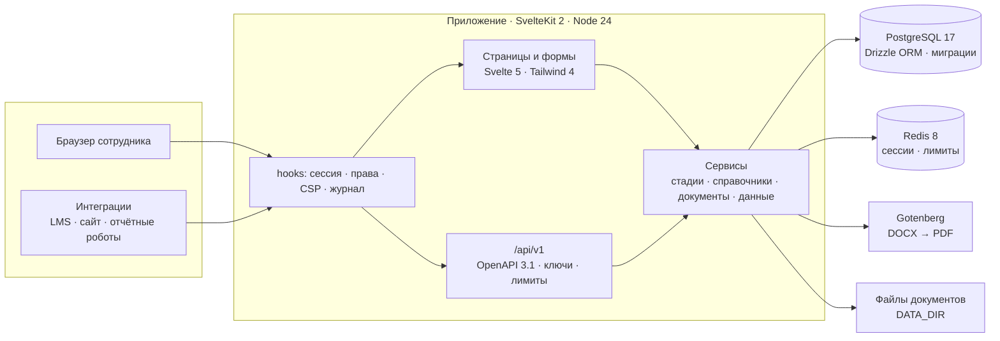

<p align="center">
  
</p>

<p align="center">
  <a href="https://crm.volkv.com"></a>
  &nbsp;
  <a href="https://crm.volkv.com/api/docs"></a>
</p>

<p align="center">
  <a href="#быстрый-старт"><b>Запуск одной командой</b></a> ·
  <a href="#демо-за-пять-минут"><b>Демо-проход</b></a> ·
  <a href="#документация"><b>Документация</b></a>
</p>

<p align="center">
  <a href="https://github.com/volkv/lct-2026/actions/workflows/ci.yml"></a>
  
  
  
  
  
  
  
  <a href="LICENSE"></a>
</p>

**LCT CRM** — система, в которой оператор образовательных программ ведёт весь цикл работы с вузами, колледжами
и школами: от первого контакта до подписанного соглашения, обучения и контроля исполнения. Каждое взаимодействие
идёт по настраиваемому маршруту стадий, и по каждому видно, **что происходит, что мешает, кто должен действовать
и что можно сделать прямо сейчас**. Рядом — данные об обучении: загрузки статистики с проверкой строк, показатели
по программам и объяснимый рейтинг востребованности.

Решение команды **Wine Coding Team** для хакатона «Лидеры цифровой трансформации 2026», задача
**«Система контроля взаимодействия с учебными заведениями»** от ИТ Школы Ростелекома.

<p align="center">
  
</p>

## Содержание

- [Идея](#идея)
- [Что умеет](#что-умеет)
- [Демо за пять минут](#демо-за-пять-минут)
- [Быстрый старт](#быстрый-старт)
- [Архитектура](#архитектура)
- [Безопасность](#безопасность)
- [Качество](#качество)
- [Документация](#документация)
- [Дорожная карта](#дорожная-карта)
- [Команда](#команда)

## Идея

Оператор федеральных образовательных проектов одновременно ведёт десятки партнёрств с учебными заведениями.
У каждого — свой этап, свои документы, свои сроки и свои люди, а данные об обучении приходят из нескольких
источников и меняются в течение года. Пока это живёт в таблицах и переписке, никто не может ответить одним
взглядом: где мы застряли, кого ждём и какие программы действительно востребованы.

LCT CRM собирает это в одну систему координат.

|                               | Что это значит                                                                                                                                                                                                                                                                                     |
| ----------------------------- | -------------------------------------------------------------------------------------------------------------------------------------------------------------------------------------------------------------------------------------------------------------------------------------------------- |
| **Три стороны**               | Учебное заведение, компания-заказчик подготовки и оператор — равноправные участники взаимодействия. У организации есть площадки (филиалы, кампусы), у людей — роли в организациях с периодом действия.                                                                                             |
| **Воронка стадий**            | Взаимодействие идёт по маршруту из 14 стадий: поиск контактов → сверка программ → встреча → документы → соглашение → передача материалов → внедрение → обучение преподавателей → занятия → контроль исполнения. Маршрут — конфигурация, а не код: версии, чек-листы, нормативы, права на переходы. |
| **Контроль каждой стадии**    | Норматив по дням, пауза «ждём контрагента», помехи с причиной, ответственный, результат и подтверждение. Просрочка вычисляется по календарю за вычетом пауз.                                                                                                                                       |
| **Данные об обучении**        | Статистика хранится снимками с происхождением: источник, период, область покрытия, режим (полный / дополнение / исправление). Показатели считаются только по подтверждённым снимкам; ноль и «нет данных» различаются.                                                                              |
| **Документы внутри процесса** | Соглашение собирается по шаблону в DOCX и PDF прямо из карточки; загруженные файлы неизменяемы, отметки «согласован / утверждён / введён в действие» хранятся отдельно.                                                                                                                            |
| **Открытость**                | REST API с OpenAPI 3.1 и Swagger UI, ключи доступа с правами человека, лимиты частоты, идемпотентность изменяющих запросов.                                                                                                                                                                        |

## Что умеет

### Сводка: что требует внимания сегодня

Счётчики портфеля, распределение активных взаимодействий по группам стадий, список «требуют действия»
(сначала просроченные, затем с помехами и с близким сроком), «ждём вуз» и лента активности.

<p align="center"></p>

### Карточка взаимодействия: четыре вопроса

Лента стадий, а под ней — **что происходит**, **что мешает**, **кто должен действовать**, **что могу сейчас**.
Кнопка перехода недоступна, пока не закрыты обязательные пункты чек-листа, не снята пауза или не записан
результат, и объясняет каждую причину словами. Правила живут в одной функции, которой пользуются и интерфейс,
и API, и сама команда перехода — поэтому они не расходятся.

<p align="center"></p>

Вкладки карточки: стадия (чек-лист, результат, подтверждение), документы, помехи, правки плана, история
переходов с причинами, комментарии.

<p align="center"></p>

### Список с фильтрами: просроченные, на паузе, с помехами

Таблицы с состоянием в адресной строке (фильтры и сортировку можно отправить ссылкой), выбором колонок,
клавиатурной навигацией и постраничной выборкой на сервере.

<p align="center"></p>

### Маршрут стадий как конфигурация

Стадии с категорией, нормативом, чек-листом и требованиями к результату; переходы вперёд, назад и с пропуском,
каждый со своим правом. Опубликованная версия неизменяема — по ней уже идут взаимодействия, — изменения
делаются новой версией.

<p align="center"></p>

### Документы: соглашение в два формата за секунды

Шаблон заполняется данными взаимодействия, DOCX собирается на сервере, PDF — через Gotenberg. Сборка,
загрузка и скачивание попадают в журнал; файлы отдаются только через проверку прав и области доступа.

<p align="center"></p>

### Данные об обучении: загрузка → проверка → показатели → рейтинг

Мастер из трёх шагов: файл XLSX или CSV с периодом и режимом, сопоставление колонок с подсказками,
построчная проверка с понятными ошибками («организация не найдена в справочнике») и подтверждение снимка.

<p align="center"></p>

Показатели считаются по программам и организациям за выбранный период. Рейтинг программ объясним:
рядом с баллом — из чего он сложился.

<p align="center"></p>

### Справочники

Организации с площадками, контакты с ролями, программы с версиями, продукты. Дедупликация юрлиц по ИНН,
архив вместо удаления, единый образец для всех разделов.

<p align="center"></p>

### Журнал действий

Неизменяемый журнал: кто, что, когда, с какого адреса и над чем. Записи защищены триггером базы от правки
и удаления, отказы по правам тоже фиксируются. Фильтры и экспорт в CSV и JSON.

<p align="center"></p>

### Публичный API

`/api/v1` с OpenAPI 3.1 из тех же Zod-схем, что проверяют запросы. Ключ действует правами и областью доступа
выпустившего его пользователя, показывается один раз, в базе хранится только хеш. Лимиты частоты в заголовках,
`Idempotency-Key` для изменяющих запросов, единый формат ошибок с `requestId`, который есть и в журнале.

<p align="center"></p>

<details>
<summary><b>Дизайн-система и витрина компонентов</b></summary>
<br>
Токены темы, единый набор контролов, таблица, лента стадий, формы и диалоги собраны на одной странице
<code>/ui-kit</code>. Интерфейс проверен на ширинах 390 и 1280 px.
<p align="center"></p>
</details>

## Демо за пять минут

Сценарий «разобраться с задержкой и довести до результата» — от просроченного взаимодействия до подписанного
соглашения. Тот же проход выполняется автоматически в `e2e/demo-pass.test.ts`.

<p align="center"></p>

1. Откройте [стенд](https://crm.volkv.com) или локальный http://localhost:3000 и нажмите **«Войти как менеджер»**.
2. В «Взаимодействиях» включите фильтр **«Просроченные»**. Откройте «СЗПУ: подготовка по прикладной
   информатике, 2026/2027» — оно стоит на первой стадии дольше норматива.
3. Карточка объясняет, что мешает: не закрыты обязательные пункты чек-листа. Кнопка перехода недоступна.
4. Закройте оба пункта на вкладке «Стадия» — кнопка «Перейти: Коммуникация и сверка программ» оживает.
   Нажмите: лента стадий и история обновятся.
5. На вкладке «Документы» заполните поля соглашения и нажмите «Сгенерировать соглашение» — DOCX и PDF готовы.
6. Войдите администратором и откройте «Журнал»: переход и сборка документа уже там, с автором и временем.

## Быстрый старт

Нужны Docker 25+ с плагином Compose. Для разработки — Node.js 24 (`.nvmrc`) и pnpm 10 (`corepack enable`).

```bash
git clone https://github.com/volkv/lct-2026.git && cd lct-2026
docker compose up --build
```

Поднимаются приложение, PostgreSQL 17, Redis 8, Gotenberg и Mailpit. Миграции применяются автоматически,
демо-данные заливаются при первом старте.

| Адрес                          | Что там                       |
| ------------------------------ | ----------------------------- |
| http://localhost:3000          | приложение                    |
| http://localhost:3000/api/docs | Swagger UI                    |
| http://localhost:8025          | Mailpit — вся исходящая почта |

Локальный стек — демонстрационный стенд: на странице входа есть кнопки «Войти как …» без пароля.
Пустая база и обычная форма входа: `DEMO_MODE=false docker compose up --build`.
Остановить и удалить данные: `docker compose down -v`.

### Демо-учётные записи

| Роль          | Почта                        | Что видит                                      |
| ------------- | ---------------------------- | ---------------------------------------------- |
| Администратор | `admin@demo.lct-crm.local`   | всё, включая журнал и настройки                |
| Менеджер      | `manager@demo.lct-crm.local` | взаимодействия, справочники, данные, документы |
| Наблюдатель   | `viewer@demo.lct-crm.local`  | только чтение                                  |

Обычной формой они входят с паролем из `SEED_DEMO_PASSWORD` (значение для локальной работы — в `.env.example`).
Демо-данные синтетические: названия организаций и людей не соответствуют реальным.

<details>
<summary><b>Разработка без Docker-образа приложения</b></summary>

```bash
cp .env.example .env                                   # значения совпадают с compose
docker compose up -d postgres redis gotenberg mailpit  # только инфраструктура
pnpm install
pnpm run db:migrate
pnpm run db:seed
pnpm dev                                               # http://localhost:5173
```

Все переменные окружения обязательны: без любой из них сервер не стартует и называет, чего не хватает.
Подробности — в [`docs/development.md`](docs/development.md).

</details>

## Архитектура

Монолит на SvelteKit: страницы, формы и API — одно приложение, одни сервисы, один контекст прав.
Источник истины — PostgreSQL; Redis держит сессии и счётчики; Gotenberg превращает DOCX в PDF.



| Слой            | Технологии                                                                                         | Зачем так                                                          |
| --------------- | -------------------------------------------------------------------------------------------------- | ------------------------------------------------------------------ |
| Интерфейс       | Svelte 5 (runes), SvelteKit 2, Tailwind CSS 4, shadcn-svelte / bits-ui, TanStack Table, superforms | один визуальный язык и общая таблица для всех разделов             |
| Сервер          | Node.js 24, TypeScript 6, Zod 4                                                                    | контракты описаны один раз и проверяют и формы, и API              |
| Данные          | PostgreSQL 17, Drizzle ORM, Drizzle Kit                                                            | SQL-first: отчёты, вью статуса стадий и рейтинг пишутся на SQL     |
| Сессии и лимиты | Redis 8                                                                                            | сессии с индексом по пользователю, блокировки, счётчики частоты    |
| Документы       | docxtemplater, Gotenberg, exceljs                                                                  | DOCX по шаблону, PDF без офисного пакета в приложении, импорт XLSX |
| Проверки        | Vitest, testcontainers, Playwright, ESLint, Prettier, svelte-check                                 | один гейт локально и в CI                                          |
| Поставка        | Docker Compose, GitHub Actions                                                                     | `docker compose up` на чистой машине даёт рабочий стенд            |

<details>
<summary><b>Структура репозитория</b></summary>

```
src/
  routes/(app)/        разделы: взаимодействия, организации, контакты, программы, продукты,
                       данные, документы, журнал, настройки
  routes/(auth)/       вход
  routes/api/          /api/v1, openapi.json, Swagger UI, health
  lib/server/          сервисы: stages, interactions, directory, documents, stats, auth, rbac,
                       audit, api, settings; схема базы в db/schema
  lib/contracts/       Zod-контракты команд и ответов (общие для форм и API)
  lib/components/      дизайн-система и компоненты разделов
drizzle/               SQL-миграции
scripts/seed/          детерминированные демо-данные
templates/             DOCX-шаблоны документов
tests/unit, tests/integration, e2e/
docs/                  документация по подсистемам
```

</details>

## Безопасность

Меры выбраны по методическому документу ФСТЭК о защите информации в приложениях и требованиям 152-ФЗ.
Класс защищённости — гипотеза до технического задания; ниже то, что уже работает.

- **Пароли и вход.** Argon2id; политика длины и классов символов настраивается администратором
  (по умолчанию 12 символов, 3 класса); блокировка после 5 неудачных попыток на 15 минут; лимит попыток
  с одного адреса; баннер при входе.
- **Сессии.** Серверные, в Redis, с индексом по пользователю; бездействие 30 минут, абсолютный срок 12 часов;
  смена пароля завершает остальные сессии.
- **Права на каждый запрос.** Каталог прав и ролей, проверка на сервере в каждом загрузчике, действии и
  эндпоинте; навигация не показывает недоступное, но защита не в навигации.
- **Журнал по составу РСБ.1.** Append-only на уровне базы (триггер), без значений персональных данных —
  только идентификаторы и имена полей; отказы по правам и аномалии анонимных запросов тоже пишутся.
- **Персональные данные.** Единый сериализатор контактов маскирует телефон и почту в списках и API
  по правам; демо-сессия не может выгрузить журнал и управлять пользователями.
- **API.** Ключи с хешем в базе, лимиты частоты по ключу и по адресу, идемпотентность, ошибки без лишних
  подробностей, валидация по тем же схемам, из которых собран OpenAPI.
- **Файлы.** Проверка содержимого загружаемых файлов, потолок размера, скачивание только через проверку прав.
- **HTTP.** CSP и security-заголовки, антикэш чувствительных ответов, CSRF-защита форм, страницы ошибок
  с `requestId`, который совпадает с записью журнала.

## Качество

```bash
pnpm run check:all
```

Один гейт локально и в CI: аудит зависимостей → lint → типы → unit-тесты → интеграционные тесты
(PostgreSQL и Redis поднимаются testcontainers) → сборка → e2e против собранного приложения → сборка образа.

| Уровень        | Что проверяется                                                                         | Инструмент              |
| -------------- | --------------------------------------------------------------------------------------- | ----------------------- |
| Unit           | контракты, движок стадий, разбор импорта, права, форматирование                         | Vitest                  |
| Интеграционные | сервисы на настоящей базе: миграции, транзакции, журнал, API, документы через Gotenberg | Vitest + testcontainers |
| End-to-end     | демо-проход, разделы, формы, доступ по ролям, лимит входа, ширины 390 и 1280            | Playwright              |

Всего более 600 автоматических тестов. Быстрый гейт для разработки — `pnpm run check:fast`.

## Документация

| Документ                                       | О чём                                                                   |
| ---------------------------------------------- | ----------------------------------------------------------------------- |
| [`docs/development.md`](docs/development.md)   | окружение, скрипты, структура, дизайн-система, тесты, CI                |
| [`docs/data-model.md`](docs/data-model.md)     | схема базы, контракты, вызов сервисов, ошибки и права                   |
| [`docs/stages.md`](docs/stages.md)             | маршруты и стадии: команды движка, готовность перехода, сводка карточки |
| [`docs/directory.md`](docs/directory.md)       | организации, площадки, люди, программы, продукты                        |
| [`docs/documents.md`](docs/documents.md)       | хранилище, шаблоны, генерация, загрузка, скачивание                     |
| [`docs/stats.md`](docs/stats.md)               | снимки статистики, сопоставление колонок, показатели, рейтинг           |
| [`docs/auth.md`](docs/auth.md)                 | пароли, сессии, защита маршрутов, блокировки, демо-режим                |
| [`docs/admin.md`](docs/admin.md)               | журнал действий и настройки                                             |
| [`docs/api.md`](docs/api.md)                   | публичный API: ключи, лимиты, идемпотентность, ошибки                   |
| [`docs/integrations.md`](docs/integrations.md) | вебхуки, обмен с системой обучения, приём заявок с сайта                |
| [`docs/seeds.md`](docs/seeds.md)               | демо-данные и учётные записи                                            |
| [`docs/deployment.md`](docs/deployment.md)     | развёртывание на сервере за обратным прокси                             |

## Дорожная карта

- [x] Маршрут стадий с версиями, чек-листами, паузами и помехами
- [x] Карточка «что происходит / что мешает / кто должен / что могу»
- [x] Справочники трёх сторон, документы по шаблону, журнал, настройки политик
- [x] Данные об обучении: снимки, импорт с сопоставлением колонок, показатели, рейтинг
- [x] Публичный API с OpenAPI, ключами, лимитами и идемпотентностью
- [ ] Версии документов, согласия на обработку персональных данных, срок хранения
- [ ] Вебхуки, приём заявок с сайта, обмен с LMS (контракт Moodle Web Services)
- [ ] Второй фактор (TOTP) по политике: привилегированным всегда, остальным по условиям доступа
- [ ] Сводка по взаимодействию и черновик письма с помощью языковой модели
- [ ] Финансовый контур приказа Минцифры № 270 и отчётные формы — после уточнения требований заказчика

## Команда

<table>
  <tr>
    <td width="200" align="center" valign="middle">
      
    </td>
    <td valign="middle">
      <b>Wine Coding Team</b> — призёры «Лидеров цифровой трансформации 2025».<br><br>
      <b>Павел Волков</b> — капитан, разработка<br>
      <b>Роман Науменко</b> — разработка<br><br>
      Хакатон «Лидеры цифровой трансформации 2026» · направление «Бизнес» · задача от ИТ Школы Ростелекома (ООО «РТК ИТ»).
    </td>
  </tr>
</table>

## Лицензия

[MIT](LICENSE).
