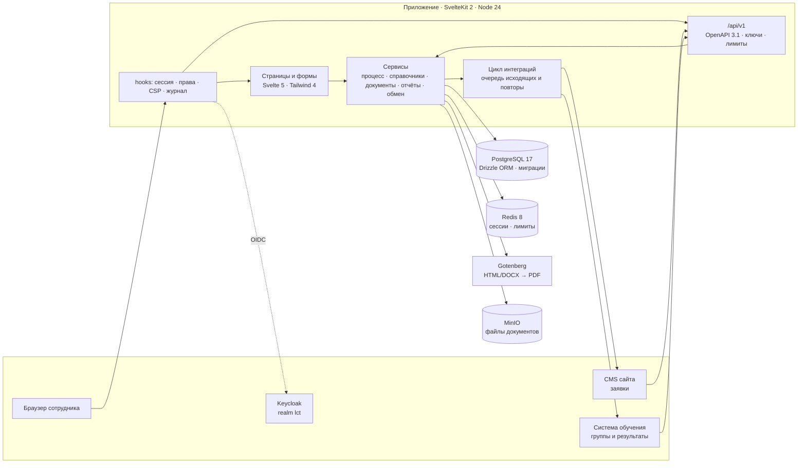

<p align="center">
  
</p>

<p align="center">
  <a href="https://crm.volkv.com"></a>
  &nbsp;
  <a href="https://crm.volkv.com/api/docs"></a>
</p>

<p align="center">
  <a href="#стенд-и-три-роли"><b>Стенд и три роли</b></a> ·
  <a href="#три-сцены"><b>Что показываем</b></a> ·
  <a href="#требование--где-это-в-продукте"><b>Матрица требований</b></a> ·
  <a href="#запуск"><b>Запуск</b></a>
</p>

<p align="center">
  <a href="https://github.com/volkv/lct-2026/actions/workflows/ci.yml"></a>
  
  
  
  
  
  
  
  <a href="LICENSE"></a>
</p>

# От заявки до подтверждённого результата — весь процесс под контролем

Заявка с сайта сама становится взаимодействием, взаимодействие идёт по процессу, который можно
менять на ходу, учебная группа заводится в системе обучения и возвращается оттуда числами, а в конце
периода всё это выгружается отчётом, у которого от любого числа есть путь до исходной карточки.

**LCT CRM** — система, в которой оператор образовательных программ ведёт весь цикл работы с вузами,
колледжами и школами: от первого контакта до подписанного соглашения, обучения и контроля
исполнения. Решение команды **Wine Coding Team** для хакатона «Лидеры цифровой трансформации 2026»,
задача **«Система контроля взаимодействия с учебными заведениями»** от ИТ Школы Ростелекома.

<p align="center">
  
</p>

| [Сводка](#сцена-2-управляемость-кто-что-решает-и-как-меняют-правила)      | [Карточка](#сцена-2-управляемость-кто-что-решает-и-как-меняют-правила) | [Отчёты](#сцена-3-доверие-к-результату-отчёт-объясняет-себя-сам) |
| ------------------------------------------------------------------------- | ---------------------------------------------------------------------- | ---------------------------------------------------------------- |
|                   |  |       |
| что требует внимания сегодня                                              | что происходит, что мешает, кто должен, что могу                       | срез и движение, четыре формата                                  |
| **[Процесс](#сцена-2-управляемость-кто-что-решает-и-как-меняют-правила)** | **[Внешние системы](#сцена-1-сквозная-автоматизация-cms--crm--lms)**   | **[Справка](#доказательства)**                                   |
|      |   |         |
| действующий процесс и черновик изменений                                  | журнал обмена в обе стороны                                            | два руководства внутри системы                                   |

## Стенд и три роли

Публичный стенд — **https://crm.volkv.com** (обновляется вместе с репозиторием, данные на нём
демонстрационные и синтетические). Локально — `docker compose up --build` и http://localhost:3000.

Почту и пароль спрашивает не система, а общий каталог учётных записей — **Keycloak**, realm `lct`
(OIDC Authorization Code + PKCE). Своих паролей в базе нет вовсе; система получает от каталога уже
проверенную учётную запись и роль.

<p align="center"></p>

| Имя входа | Роль              | Что видит и что может                                                                           |
| --------- | ----------------- | ----------------------------------------------------------------------------------------------- |
| `manager` | **КАМ**           | свои вузы: взаимодействия, переходы по процессу, документы, контакты, отчёты по своей области   |
| `lead`    | **Руководитель**  | свою область и работу подчинённых, назначает ответственных за вузы, видит журнал по своим людям |
| `admin`   | **Администратор** | всё: процесс, доступ, каталоги, интеграции, журнал обмена, настройки                            |

Пароль у всех трёх общий и публичный — на стенде это **`lct-demo-2026`**, и он же написан на самой
странице входа, рядом с именами (локальный стек берёт пароль из `SEED_DEMO_PASSWORD` вашего `.env`).
Прятать его не от кого: стенд открыт, и пароль, который надо у кого-то спрашивать, закрыл бы показ,
а не защитил его. Пароль принадлежит каталогу (`SEED_DEMO_PASSWORD`, его читает
импорт realm), сервер его не хранит и не проверяет. В базе приложения эти же люди заведены с почтами
`<имя входа>@demo.lct-crm.local`: при первом входе запись находится по подтверждённой почте, и
человек входит со своим портфелем, а не двойником.

**Стенд общий, данные сбрасываются ежедневно.** Один адрес на всех зрителей: всё, что наработали на
показе, живёт до ночного сброса — стенд возвращается к тому набору, с которым поставляется
(взаимодействия, документы, справочник, данные об обучении заливаются заново; учётные записи, роли,
описание процесса и журнал остаются). Час сброса задаётся в «Настройках → Общие» и написан полосой
демо-режима на каждой странице; администратор может сбросить стенд и кнопкой там же.

Границу демонстрации держат права, а не спрятанные кнопки: демонстрационная сессия не получает
`users.manage`, `api_keys.manage`, `integrations.manage_endpoints` и `people.anonymize`, какой бы
ролью в неё ни вошли, — и отказ приходит и из `curl` тоже. Под `integrations.manage_endpoints`
лежит всё, что уводит данные на чужой узел или переживает сессию: адрес приёмника подписки, адрес и
токен системы обучения, адреса и секреты подключений обмена, периодичность фоновой работы. Раздел
«Интеграции» при этом открыт — демонстрация видит настройки, но не редактирует их, и страница
говорит об этом прямо. Всё остальное — правка процесса, журнал обмена с повтором доставки, заход в
систему обучения, выгрузки — демонстрации доступно: иначе показывать нечего.

Роли и область доступа целиком — [`docs/access-matrix.md`](docs/access-matrix.md), устройство
входа — [`docs/auth.md`](docs/auth.md).

## Три сцены

### Сцена 1. Сквозная автоматизация: CMS → CRM → LMS

Четыре направления обмена, все по одному объявленному контракту
([`docs/exchange-contract.md`](docs/exchange-contract.md)):

1. **заявка с сайта** приходит в `POST /api/v1/applications` и становится взаимодействием — с
   контрагентом, контактным лицом и ответственным, а не третьей сущностью рядом;
2. **снимок статуса** заявки уходит обратно в CMS после каждого изменения — чтобы посетитель сайта
   видел, что с его обращением;
3. **учебная группа** заводится в системе обучения кнопкой «Отправить в LMS» с карточки —
   это решение сотрудника, а не автоматический побочный эффект;
4. **результат потока** приходит из LMS сам, подтверждает стадию «Ведение занятий» и приносит числа:
   зачислено, завершили, отчислены. Взаимодействие он при этом **не двигает** — переход остаётся за
   человеком, — но и уйти с этой стадии без него нельзя: занятия идут в системе обучения, и
   доказывает их она.

Сообщения едут в общем конверте с версией схемы и идентификатором события; исходящие подписаны
HMAC-SHA256; повторяются только временные отказы, а повтор не создаёт дубля — ни у нас, ни у
получателя. Обе стороны видны одним списком в разделе «Внешние системы»: что пришло, что ушло,
сколько было попыток и чем ответил получатель.

<p align="center"></p>

Настоящие CMS и LMS заказчика наружу не смотрят, поэтому рядом со стендом подняты два **имитатора** —
`mock-cms` и `mock-lms`. Они говорят ровно на объявленном контракте и умеют ломаться по команде
(отказ, задержка, обрыв связи), поэтому повторы и восстановление после сбоя показываются вживую. Что
они отвечают, **ничего не доказывает о системах заказчика**: доказывается другое — что CRM говорит
на контракте и не теряет сообщений.

Сцену видно с обеих сторон: на стенде страницы имитаторов открыты по `/mock-cms/` и `/mock-lms/`, и
заявка подаётся кнопкой оттуда — как её подал бы посетитель сайта. Ту же заявку запускает кнопка
«Демо: заявка с сайта» на экране «Внешние системы»: раздел обмена открыт администратору, и жмёт её
он.

Рядом живут вебхуки: подписка выбирает события журнала точными кодами или целыми разделами,
доставка идёт `POST`-ом с подписью, неудача уходит в очередь из шести повторов, и одно событие
доходит до подписки ровно один раз.

<p align="center"></p>

Подробности — [`docs/integrations.md`](docs/integrations.md).

### Сцена 2. Управляемость: кто что решает и как меняют правила

**Работа.** Взаимодействие идёт по процессу своей группы контрагентов: у учебных заведений это
четырнадцать стадий от поиска контактов до контроля исполнения. На каждой — норматив по дням,
чек-лист, ответственный, результат и подтверждение; пауза «ждём контрагента» останавливает часы,
помеха с причиной запрещает переход. Карточка отвечает на четыре вопроса — **что происходит, что
мешает, кто должен действовать, что могу сейчас** — и объясняет словами каждую недоступную кнопку.

<p align="center"></p>

Те же взаимодействия колонками по стадиям — доска: сразу видно, где скопились дела и сколько из них
просрочено. Решает при этом не доска: переход считает тот же движок, что и карточка, поэтому
невозможный отказывает словами, а карточка остаётся на месте.

<p align="center"></p>

**Роли.** Область доступа — это множество людей, а не список вузов: КАМ видит свои вузы,
руководитель — свои и своих подчинённых, администратор — всё. Считается она подзапросом по
действующим назначениям, поэтому смена ответственного меняет доступ в ту же секунду и во всех
каналах сразу: списки, карточки, скачивание файлов, выгрузки, дашборд, подсказки и публичный API.
Вуз вне области отвечает «не найдено», а не отказом: иначе перебором идентификаторов было бы видно,
что лежит за границей.

**Правила.** Процесс — не код. Администратор берёт черновик действующего процесса, переименовывает
стадию, удаляет лишнюю, правит нормативы и переходы, смотрит предпросмотр («затронуто
взаимодействий столько-то, с такой стадии переедут такие») и применяет ко всем. Записи с удалённой
стадии переезжают на ближайшую сохранившуюся, перенос отмечается на карточке отдельной строкой и
**переходом не считается** — ни в истории, ни в отчёте. История при этом цела: комментарии, причины
и приложенные файлы остаются на своих местах.

<p align="center"></p>

Правила процесса — [`docs/workflow.md`](docs/workflow.md), права — [`docs/access-matrix.md`](docs/access-matrix.md).

### Сцена 3. Доверие к результату: отчёт объясняет себя сам

Отчёт за период отвечает на два разных вопроса, и они не смешиваются:

- **Срез** — где работа стоит на дату: каждое взаимодействие показано в той стадии, в которой стояло
  в этот день;
- **Движение** — что за период произошло: каждая строка это один переход, с указанием, из какой
  стадии в какую; возвраты и пропуски считаются отдельно от шагов вперёд.

Фильтры (вуз, тип контрагента, группа процесса, направление, программа, продукт, ответственный,
стадия, состояние, статус передачи) и набор колонок живут в адресной строке — отчёт отправляют
ссылкой. Выгрузка это та же ссылка с другим расширением: **XLSX, XLS, PDF и JSON** собираются из
одного и того же готового отчёта, поэтому число строк на экране и в каждом из четырёх файлов
совпадает по построению. Диаграммы скачиваются PNG и PDF, а клик по столбцу воронки не открывает
новый экран, а сужает тот же отчёт — от числа к строкам и дальше к карточке.

<p align="center"></p>

<p align="center"></p>

Рядом — данные об обучении: снимки статистики с происхождением (источник, период, охват, режим),
показатели по программам и организациям, объяснимый рейтинг. Записанный ноль и отсутствие данных
здесь разные ответы, и это видно словами.

| Загрузка                                                                            | Показатели                                                                            |
| ----------------------------------------------------------------------------------- | ------------------------------------------------------------------------------------- |
|  |  |
| XLS, XLSX, CSV и JSON с сопоставлением колонок и построчной проверкой               | считаются только по подтверждённым снимкам                                            |

Семантика отчётов — [`docs/reports.md`](docs/reports.md), данные — [`docs/stats.md`](docs/stats.md).

<details>
<summary><b>Остальные разделы одним взглядом</b></summary>
<br>

| Что                                                                                  | Экран                                                                                         |
| ------------------------------------------------------------------------------------ | --------------------------------------------------------------------------------------------- |
| Список с фильтрами: состояние в адресной строке, выбор колонок, выборка на сервере   |  |
| История переходов: причины, вложения, правки плана                                   |             |
| Справочник организаций: площадки, дедупликация по ИНН, архив вместо удаления         |              |
| Документы: соглашение по шаблону в DOCX и PDF, редакции, отметки                     |                       |
| Дашборд данных об обучении: плитки, рейтинг с разложением балла, происхождение чисел |                     |
| Журнал действий: неизменяемый, с фильтрами и выгрузкой                               |                             |
| Swagger UI по OpenAPI 3.1, собранному из тех же Zod-схем, что проверяют запросы      |                               |
| Витрина компонентов и токенов темы: проверена на ширинах 390 и 1280                  |                                     |

</details>

## Требование → где это в продукте

Полная матрица — [`docs/requirements.md`](docs/requirements.md): 56 требований задания, у каждого
названы место в коде, проверка и ограничение. Статусы на текущем коммите: **35 реализовано, 11
частично, 4 запланировано, 6 не проверено** (замеры и оценка людьми). Коротко:

| Требование задания                            | Где это                                                                                                                     |
| --------------------------------------------- | --------------------------------------------------------------------------------------------------------------------------- |
| Управляемый процесс взаимодействия            | `/settings/process`, `/interactions` · `src/lib/server/stages/` · [`docs/workflow.md`](docs/workflow.md)                    |
| Роли и разграничение видимости                | вход через Keycloak · `src/lib/server/rbac/` · [`docs/access-matrix.md`](docs/access-matrix.md)                             |
| Двусторонний обмен с CMS и LMS                | `/exchange`, `/api/v1` · `src/lib/server/integrations/exchange/` · [`docs/exchange-contract.md`](docs/exchange-contract.md) |
| Отчёты за период с выбором колонок и форматов | `/reports`, `/reports/export` · `src/lib/server/reports/` · [`docs/reports.md`](docs/reports.md)                            |
| Справочники трёх сторон и загрузка таблицей   | `/organizations`, `/people`, `/programs`, `/products`, `/data/new` · [`docs/directory.md`](docs/directory.md)               |
| Документы по шаблону и их редакции            | `/documents` · `templates/` · [`docs/documents.md`](docs/documents.md)                                                      |
| Журнал действий и персональные данные         | `/audit` · `src/lib/server/audit/` · [`docs/admin.md`](docs/admin.md)                                                       |
| Руководства внутри системы                    | `/help`, `/help/print` · `src/lib/help/content/` (13 статей)                                                                |
| Публичный API и упаковка                      | `/api/docs` · `Dockerfile`, `docker-compose.yml` · [`docs/api.md`](docs/api.md)                                             |

## Запуск

Нужны Docker 25+ с плагином Compose. Для разработки — Node.js 24 (`.nvmrc`) и pnpm 10 (`corepack enable`).

```bash
git clone https://github.com/volkv/lct-2026.git && cd lct-2026
docker compose up --build
```

Поднимаются приложение, PostgreSQL 17, Redis 8, Keycloak, Gotenberg, MinIO и два имитатора
систем заказчика. Миграции применяются автоматически, демонстрационные данные заливаются при первом
старте.

| Адрес                          | Что там                                |
| ------------------------------ | -------------------------------------- |
| http://localhost:3000          | приложение                             |
| http://localhost:3000/api/docs | Swagger UI                             |
| http://localhost:58080/admin   | Keycloak — каталог учётных записей     |
| http://localhost:59001         | MinIO — файлы документов               |
| http://localhost:58081         | `mock-cms` — имитатор CMS сайта        |
| http://localhost:58082         | `mock-lms` — имитатор системы обучения |

Имитаторы показывают своё состояние страницей: что они приняли, что отправили и чем им ответили, —
и там же кнопка, которой сцену запускают: «Отправить заявку в CRM» у сайта, «Отправить результат в
CRM» у системы обучения. Ту же заявку подаёт кнопка «Демо: заявка с сайта» на экране «Внешние
системы» — её жмёт администратор, потому что раздел обмена открыт по праву `integrations.manage`.
Нажатие любой из двух означает одно и то же: заявку отправляет имитатор, своим ключом обмена, по
контракту.

Адреса и секрет обмена приложение берёт из `EXCHANGE_*` (`.env.example`), а ключи доступа, которыми
имитаторы представляются CRM, задаются переменными `EXCHANGE_API_KEY_CMS` и `EXCHANGE_API_KEY_LMS` —
по ключу на подключение, разными значениями. В локальном стеке у них есть демонстрационные
умолчания, чтобы обмен работал сразу после `docker compose up`; ключами они не являются — их знает
всякий, кто открыл репозиторий, и на стенде задают свои. Сид заводит по переменным ключи обмена
(`docs/seeds.md`), имитаторы представляются теми же значениями; переменных нет — имитаторы
честно отвечают, что обмен на стенде не настроен. На публичном стенде имитаторы стоят за тем же
прокси, что и приложение, под путями `/mock-cms/` и `/mock-lms/`, и наружу открыты только страница
состояния и триггер (`docs/deployment.md`, «Имитаторы на стенде»).

Пустая база без демонстрационных записей: `DEMO_MODE=false docker compose up --build`.
Остановить и удалить данные: `docker compose down -v`.

<details>
<summary><b>Полный доступ: управление пользователями и ключами</b></summary>

Экраны управления пользователями и ключами показывает штатный администратор — обычная учётная запись
оператора, не демонстрационная. В realm её нет: заводят её в консоли Keycloak, как и любого
настоящего сотрудника.

1. открыть http://localhost:58080/admin, realm `lct`, раздел «Users»;
2. завести запись, указать подтверждённую почту `admin@staff.lct-crm.local` и задать пароль;
3. на вкладке «Role mapping» выдать роль realm `crm-admin`.

Почта выбрана не случайно: с этим адресом набор данных уже завёл в базе приложения строку
«Администратор стенда», и первый вход свяжет её с каталогом вместо того, чтобы завести двойника.

</details>

<details>
<summary><b>Разработка без Docker-образа приложения</b></summary>

```bash
cp .env.example .env                                   # значения совпадают с compose
docker compose up -d postgres redis gotenberg minio minio-init keycloak  # только инфраструктура
pnpm install
pnpm run db:migrate
pnpm run db:seed
pnpm dev                                               # http://localhost:5173
```

Все переменные окружения обязательны: без любой из них сервер не стартует и называет, чего не
хватает. Подробности — [`docs/development.md`](docs/development.md).

</details>

## Архитектура

Модульный монолит на SvelteKit: страницы, формы и API — одно приложение, одни сервисы, один контекст
прав. Источник истины — PostgreSQL; Redis держит сессии и счётчики; Gotenberg превращает HTML и DOCX
в PDF; MinIO хранит файлы; Keycloak отвечает за вход.



| Слой            | Технологии                                                                                         | Зачем так                                                         |
| --------------- | -------------------------------------------------------------------------------------------------- | ----------------------------------------------------------------- |
| Интерфейс       | Svelte 5 (runes), SvelteKit 2, Tailwind CSS 4, shadcn-svelte / bits-ui, TanStack Table, superforms | один визуальный язык и общая таблица для всех разделов            |
| Сервер          | Node.js 24, TypeScript 6, Zod 4                                                                    | контракты описаны один раз и проверяют и формы, и API             |
| Данные          | PostgreSQL 17, Drizzle ORM, Drizzle Kit                                                            | SQL-first: отчёты, вью статуса стадий и рейтинг пишутся на SQL    |
| Вход            | Keycloak 26, OIDC + PKCE, oauth4webapi                                                             | паролей в системе нет; роль приходит из каталога при каждом входе |
| Сессии и лимиты | Redis 8                                                                                            | сессии с индексом по пользователю, блокировки, счётчики частоты   |
| Документы       | docxtemplater, Gotenberg, SheetJS, exceljs                                                         | DOCX по шаблону, PDF без офисного пакета, книги XLS и XLSX        |
| Проверки        | Vitest, testcontainers, Playwright, ESLint, Prettier, svelte-check                                 | один гейт локально и в CI                                         |
| Поставка        | Docker Compose, GitHub Actions                                                                     | `docker compose up` на чистой машине даёт рабочий стенд           |

Карта модулей и границы транзакций — [`docs/architecture.md`](docs/architecture.md).

<details>
<summary><b>Структура репозитория</b></summary>

```
src/
  routes/(app)/        разделы: взаимодействия, отчёты, организации, контакты, программы,
                       продукты, данные, документы, журнал, внешние системы, справка, настройки
  routes/(auth)/       вход и возврат из каталога учётных записей
  routes/api/          /api/v1, openapi.json, Swagger UI, health
  lib/server/          сервисы: stages, interactions, directory, documents, stats, reports,
                       integrations/exchange, auth, rbac, audit, api, settings; схема в db/schema
  lib/contracts/       Zod-контракты команд и ответов (общие для форм и API)
  lib/help/content/    тексты встроенных руководств
  lib/components/      дизайн-система и компоненты разделов
mocks/                 имитаторы CMS и системы обучения — отдельные процессы
keycloak/              realm lct: клиент, роли, демонстрационные записи
drizzle/               SQL-миграции
scripts/seed/          детерминированные демонстрационные данные
scripts/readme-media/  съёмка снимков и роликов README
templates/             DOCX-шаблоны документов
tests/unit, tests/integration, e2e/
docs/                  документация по подсистемам
```

</details>

## Безопасность

Меры выбраны по методическому документу ФСТЭК о защите информации в приложениях и требованиям
152-ФЗ. Класс защищённости — гипотеза до технического задания; ниже то, что уже работает.

- **Вход — через общий каталог.** OIDC Authorization Code + PKCE (`S256`), конфиденциальный клиент:
  код на токены меняет сервер. Своих паролей в базе нет вовсе. Id-токен проверяется по ключам realm
  целиком — подпись, `iss`, `aud`, `nonce`, сроки; одноразовые значения захода живут в Redis не
  дольше десяти минут и читаются с удалением. Пароль, его политика и второй фактор — забота
  каталога, включая защиту от перебора.
- **Роль приходит из каталога.** `crm-admin` / `crm-lead` / `crm-user` отображаются на роли системы
  при каждом входе; отозвали роль — следующий вход отклонён, а учётная запись выключена вместе со
  своими сессиями. Ключи обмена выпускаются на машинного субъекта, которому вход закрыт при любых
  утверждениях токена, а доступ открыт только к эндпоинтам обмена.
- **Сессии.** Серверные, в Redis, с индексом по пользователю; бездействие 30 минут, абсолютный срок
  12 часов; смена роли, руководителя или выключение записи гасят их немедленно. «Выйти» гасит и
  сессию каталога, а не только нашу.
- **Область доступа на каждую выборку.** Считается подзапросом по действующим назначениям, поэтому
  смена ответственного меняет доступ в ту же секунду и во всех каналах сразу.
- **Права на каждый запрос.** Каталог из 35 прав, проверка на сервере в каждом загрузчике, действии
  и эндпоинте; навигация не показывает недоступное, но защита не в навигации.
- **Журнал по составу РСБ.1.** Append-only на уровне базы (триггер), без значений персональных
  данных — только идентификаторы и имена полей; отказы по правам и аномалии анонимных запросов тоже
  пишутся.
- **Персональные данные.** Основание обработки, срок хранения и обезличивание; единый сериализатор
  контактов маскирует телефон и почту по правам; показ немаскированных контактов — отдельное
  событие журнала.
- **Обмен.** Исходящие подписаны HMAC-SHA256 по строке «момент отправки + тело», входящие приходят
  ключом машинного субъекта, экземпляр отправителя определяется подключением, а не полем из тела.
- **API.** Ключи с хешем в базе, лимиты частоты по ключу и по адресу, идемпотентность, ошибки без
  лишних подробностей, валидация по тем же схемам, из которых собран OpenAPI.
- **HTTP и файлы.** CSP и security-заголовки, антикэш чувствительных ответов, CSRF-защита форм,
  проверка содержимого загружаемых файлов, скачивание только через проверку прав.

## Доказательства

```bash
pnpm run check:all
```

Один гейт локально и в CI: аудит зависимостей → lint → типы → unit → интеграционные тесты
(PostgreSQL, Redis и MinIO поднимает testcontainers, Gotenberg берётся из compose) → сборка → e2e
против собранного приложения → сборка образа.

| Уровень        | Сколько | Что проверяется                                                                                           | Инструмент              |
| -------------- | ------- | --------------------------------------------------------------------------------------------------------- | ----------------------- |
| Unit           | 610     | контракты, движок процесса, разбор таблиц, права, отчётные вычисления, форматирование                     | Vitest                  |
| Интеграционные | 557     | сервисы на настоящей базе: миграции, транзакции, журнал, API, обмен, документы через Gotenberg, хранилище | Vitest + testcontainers |
| End-to-end     | 117     | разделы, формы, вход через каталог, границы области, ширины 390 и 1280 — и сквозной сценарий              | Playwright              |

Всего 1284 автоматических теста; числа — с последнего полного гейта на чистой копии. Быстрый гейт для разработки — `pnpm run check:fast`.

**Сквозной сценарий** (`e2e/scenario.test.ts`) — один последовательный проход тремя ролями через
интерфейс, семь шагов: КАМ видит свои вузы → двигает стадию с комментарием и файлом → руководитель
передаёт ему вуз, и доступ меняется в ту же секунду → администратор переименовывает и удаляет стадию
действующего процесса, записи переезжают, история цела → заявка с сайта заводит взаимодействие и
получает обратно снимок статуса → учебная группа уходит в систему обучения и возвращается
результатом → отчёт за период скачивается в четырёх форматах, и в файлах лежит та самая работа.
Проверяются не переходы между экранами, а наблюдаемый результат: карточка, доска, история, журнал
обмена, состояние имитаторов и содержимое скачанных файлов.

## Ограничения

Здесь то, чего в решении **нет**, — чтобы это не пришлось выяснять на демонстрации.

- **Имитаторы — не интеграции.** Обмен проверен против `mock-cms` и `mock-lms`, которые говорят на
  нашем же объявленном контракте. Настоящие CMS и LMS заказчика наружу не смотрят; их контракт не
  согласован, и результат на имитаторах ничего о них не доказывает.
- **Данные синтетические.** Организации, люди, контакты, договоры и статистика на стенде выдуманы;
  ни одно имя и ни один адрес не принадлежат настоящему лицу.
- **Импорт справочников не заменяет карточку.** Мастер `/organizations/import` заводит вузы, продукты,
  направления, договоры и лицензии, назначает ответственного по колонке менеджера и заводит контакты
  вуза, но уже заведённые вузы и продукты он не переименовывает, чужое назначение не заменяет, а
  примечание дописывает, не затирая. Допущения по колонкам — `docs/directory.md`, «Допущения S4.1a».
- **Не сделано в обмене** (полный список с причинами — [`docs/exchange-contract.md`](docs/exchange-contract.md),
  раздел 12): скачивание вложений, которые назвала чужая система; отдельный код ошибки для
  неподдерживаемой версии схемы; чистка журнала обмена по сроку; конверт у выгрузки отчёта;
  привязка экземпляра отправителя к ключу доступа.
- **Замеров не было.** Нагрузка (50 пользователей, 10 одновременных отчётов), контрольный замер
  трудозатрат и самостоятельный проход новых пользователей не проводились — в матрице требований
  такие строки стоят со статусом «не проверено», а не с догадкой.
- **Комплекта документации файлом нет.** Руководства встроены в систему и лежат Markdown-ом в
  `docs/`; `.doc`/`.pdf` — следующая веха.

## Дорожная карта

Сделано:

- [x] Процесс как конфигурация: группы контрагентов, действующая редакция, черновик изменений,
      предпросмотр, перенос записей и сохранная история
- [x] Карточка «что происходит / что мешает / кто должен / что могу», доска по стадиям, чек-листы,
      нормативы, паузы и помехи
- [x] Вход через Keycloak, три роли, область доступа по назначениям, переназначение ответственных
- [x] Четыре направления CMS ↔ CRM ↔ LMS на имитаторах, конверт и подпись, повторы без дублей,
      журнал обмена
- [x] Отчёты «срез» и «движение» за период: фильтры и колонки в ссылке, четыре формата, диаграммы,
      переход от числа к записям
- [x] Справочники трёх сторон, документы по шаблону с редакциями, данные об обучении, журнал
      действий, публичный API с OpenAPI
- [x] Встроенные руководства пользователя и администратора с версией для печати
- [x] Матрица «требование → экран/API → проверка → ограничение» и карта модулей

**m3 — полнота и проверяемость:**

- [ ] Дополнительные диаграммы отчёта и выгрузка их наборами
- [x] Импорт каталогов XLS/XLSX/JSON с сопоставлением полей: вузы, договоры, лицензии, ответственные
- [ ] Уведомления о задержках и приближении срока
- [ ] Замеры: 50 пользователей, 10 одновременных отчётов, контрольный замер трудозатрат
- [ ] SBOM и сканирование зависимостей в CI
- [ ] Тема по дизайн-системе заказчика

**m4 — упаковка результата:**

- [ ] Сборка документации файлом из того же текста, что и встроенные руководства
- [ ] Презентация, демонстрационное видео и заморозка состава сдачи

## Документация

| Документ                                                 | О чём                                                                    |
| -------------------------------------------------------- | ------------------------------------------------------------------------ |
| [`docs/requirements.md`](docs/requirements.md)           | матрица требований: где реализовано, чем проверено, чего не хватает      |
| [`docs/architecture.md`](docs/architecture.md)           | путь запроса, владельцы модулей, границы транзакций                      |
| [`docs/workflow.md`](docs/workflow.md)                   | правила процесса: стадии, переходы, редакции, перенос записей            |
| [`docs/access-matrix.md`](docs/access-matrix.md)         | роли, права, область доступа и что видит каждая роль                     |
| [`docs/exchange-contract.md`](docs/exchange-contract.md) | контракт обмена: конверт, четыре направления, подпись, повторы, чего нет |
| [`docs/reports.md`](docs/reports.md)                     | семантика отчётов, колонки, инварианты чисел, форматы выгрузки           |
| [`docs/integrations.md`](docs/integrations.md)           | вебхуки, обмен, имитаторы систем заказчика                               |
| [`docs/auth.md`](docs/auth.md)                           | вход через каталог учётных записей, роли, сессии, демонстрационный режим |
| [`docs/domain.md`](docs/domain.md)                       | глоссарий и модель предметной области                                    |
| [`docs/data-model.md`](docs/data-model.md)               | схема базы, контракты, вызов сервисов, ошибки и права                    |
| [`docs/directory.md`](docs/directory.md)                 | организации, площадки, люди, программы, продукты                         |
| [`docs/documents.md`](docs/documents.md)                 | хранилище, шаблоны, генерация, загрузка, скачивание                      |
| [`docs/stats.md`](docs/stats.md)                         | снимки статистики, сопоставление колонок, показатели, рейтинг            |
| [`docs/api.md`](docs/api.md)                             | публичный API: ключи, лимиты, идемпотентность, ошибки                    |
| [`docs/admin.md`](docs/admin.md)                         | журнал действий и настройки                                              |
| [`docs/development.md`](docs/development.md)             | окружение, скрипты, структура, дизайн-система, тесты, CI                 |
| [`docs/deployment.md`](docs/deployment.md)               | развёртывание на сервере за обратным прокси                              |
| [`docs/readme-media.md`](docs/readme-media.md)           | как пересобрать снимки и ролики этого README                             |

## Команда

<table>
  <tr>
    <td width="200" align="center" valign="middle">
      
    </td>
    <td valign="middle">
      <b>Wine Coding Team</b> — призёры «Лидеров цифровой трансформации 2025».<br><br>
      <b>Павел Волков</b> — капитан, разработка<br>
      <b>Роман Науменко</b> — разработка<br><br>
      Хакатон «Лидеры цифровой трансформации 2026» · направление «Бизнес» · задача от ИТ Школы Ростелекома (ООО «РТК ИТ»).
    </td>
  </tr>
</table>

## Лицензия

[MIT](LICENSE).
