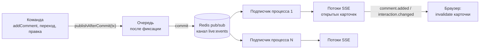
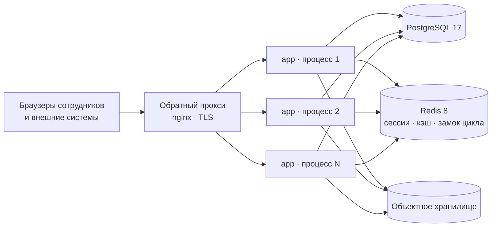

# Карта архитектуры

Документ для того, кто открыл репозиторий впервые и хочет за четверть часа понять, куда приходит
запрос, кто отвечает за каждый кусок кода и где лежит правило, которое нужно поправить. Устройство
подсистем описано отдельно (`stages.md`, `documents.md`, `stats.md`, …), команды, соглашения и
шпаргалки по Svelte 5 и Tailwind 4 — в [`development.md`](development.md). Что уже сделано и что
впереди — раздел «Дорожная карта» в `README.md`.

Продукт — модульный монолит на SvelteKit: страницы, формы и публичный API живут в одном приложении
и зовут одни и те же сервисы. Слоёв три:

- **транспорт** — хуки (`src/hooks.server.ts`, `src/lib/server/hooks/`), загрузчики и form actions
  страниц (`src/routes/(app)/**`), эндпоинты `src/routes/api/v1/**`;
- **сервисы** — `src/lib/server/*`, по модулю на предметную область;
- **данные** — PostgreSQL через Drizzle (`src/lib/server/db/`), Redis (`src/lib/server/redis.ts`),
  файлы документов в S3-совместимом хранилище (`src/lib/server/documents/storage.ts`).

Граница между транспортом и сервисом одна и та же везде: сервис принимает `(ctx: ActorContext,
input)`, не смотрит в `locals`, не читает заголовки и не строит ответ. Он бросает ошибки из
`src/lib/server/errors.ts`, а превращает их в ответ транспорт — `toPageError`/`toActionFailure`
(`src/lib/server/http.ts`) для браузера и `apiHandler` для API.

То же самое одной картинкой на слой — модель ArchiMate в [`archi/`](archi/): бизнес-роли и процесс
работы с контрагентом ([`archi/business.png`](archi/business.png)), модули и владельцы данных
([`archi/application.png`](archi/application.png)), стенд и развёртывание
([`archi/technology.png`](archi/technology.png)). Сама модель — `docs/archi/lct-crm.archimate`,
открывается в Archi; как переснять картинки одной командой — [`archi/README.md`](archi/README.md).

## Путь запроса

### Хуки: что происходит с любым запросом

`src/hooks.server.ts` собирает цепочку
`sequence(requestId, serverTiming, securityHeaders, csrf, session, guard, rateLimit)`. Порядок
значим: первый хук в списке — внешний, он видит и запрос, и уже готовый ответ.

| Хук               | Файл (`src/lib/server/hooks/`) | Что делает                                                                              |
| ----------------- | ------------------------------ | --------------------------------------------------------------------------------------- |
| `requestId`       | `request-id.ts`                | `locals.requestId` = свежий UUID; ставит `x-request-id` на ответ                        |
| `serverTiming`    | `server-timing.ts`             | `Server-Timing: db · app · total` на каждом ответе; замер покрывает всю цепочку         |
| `securityHeaders` | `security-headers.ts`          | `nosniff`, `Referrer-Policy`, `Permissions-Policy`, HSTS на https, `no-store` вошедшему |
| `csrf`            | `csrf.ts`                      | форменный POST/PUT/PATCH/DELETE только со своим `Origin`, иначе 403 по-русски           |
| `session`         | `session.ts`                   | читает куку `lct_session`, продлевает запись в Redis, кладёт `locals.user`              |
| `guard`           | `guard.ts`                     | всё под `(app)` требует сессии; без неё — на `/login?next=<куда шли>`                   |
| `rateLimit`       | `rate-limit.ts`                | POST под `(auth)` считается по адресу (`withinStartLimit`, `auth/start-limit.ts`)       |

Четыре вещи, которые стоит знать сразу:

- **`csrf` стоит перед `session`** — запрос с чужой страницы отвергается раньше, чем будет прочитана
  сессия, которую он пытается использовать.
- **Пользователь собирается заново на каждый запрос** (`loadSessionUser` в `auth/session.ts`): в
  Redis лежит только запись сессии — идентификатор пользователя, время создания и последнего
  обращения, адрес, клиент и id-токен для выхода из Keycloak, — а роль, права и активность читаются
  из базы. Снятое право действует немедленно.
- **Проверка прав в хуках не делается.** `guard` отвечает только на вопрос «есть ли тут кто-нибудь»;
  конкретное право спрашивают загрузчик и сервис — см. «Область доступа и права».
- **Встроенная в SvelteKit проверка Origin выключена** (`csrf.trustedOrigins: ['*']` в
  `vite.config.ts`) ровно потому, что то же правило живёт в хуке и отвечает по-русски.

**`Server-Timing` стоит вторым, сразу за идентификатором запроса.** Замер обязан покрывать всё, что
делает приложение, включая разбор сессии и проверку прав, иначе он отвечает не на тот вопрос,
который задаёт человек с секундомером. В заголовке три числа и ни одного больше: `db` — время, в
течение которого у запроса был хотя бы один незавершённый запрос к базе (не сумма длительностей:
загрузчик читает `Promise.all`, и сумма перевалила бы за весь запрос), `app` — остаток, `total` —
всё. Счётчик живёт в области видимости запроса (`AsyncLocalStorage`), заполняет его обёртка вокруг
клиента postgres, и ни один читатель базы о замере не знает. Перечня внутренних шагов в заголовке
нет намеренно: он уходит наружу, а карта приложения адресату этого заголовка не предназначена.
Числа и что по ним видно — [`performance.md`](performance.md).

Кроме цепочки в `hooks.server.ts` есть `init` и `handleError`.

`init` выполняется один раз при старте процесса и заводит ровно три вещи: разбор конфигурации
(`getConfig()`), таймер цикла интеграций и таймер сброса демонстрационного стенда (см. «Интеграции
и фоновые процессы»). **Миграций здесь нет:** схему приводит в порядок `scripts/migrate.ts` до
запуска процесса — иначе миграция шла бы в каждом экземпляре приложения разом и на заведомо живой
базе. Под Vitest ни один из таймеров не стартует: оба смотрят на `process.env.VITEST`.

`handleError` переводит в текст отказы, которые сочинил сам фреймворк (404, 413 от
`BODY_SIZE_LIMIT`, 415), и подставляет `requestId` на страницу ошибки. Таблица кодов для человека —
статья справки «Коды ошибок» (`src/lib/help/content/admin/09-errors.md`).

### Страница: `load` и form action

1. `src/routes/+layout.server.ts` отдаёт `requestId` — его цитирует страница ошибки.
2. `src/routes/(app)/+layout.server.ts` отдаёт `locals.user`, флаг `DEMO_MODE` и список пространств
   оболочке (`AppShell`): навигация и меню учётной записи одинаковы на всех страницах, а секции
   пространств приходят из базы и известны только во время запроса: их состав правит заказчик сам, в
   `/settings/workspaces`, а не миграция.
   Ветка `(app)/w/[workspace]/` добавляет к этому свой `+layout.server.ts`: он разбирает ключ
   пространства из пути, отвечает 404 на незнакомый и отдаёт `data.workspace` всем страницам под
   собой — разбирать ключ в каждом загрузчике значило бы повторять проверку четырежды.
3. `+page.server.ts` раздела строит `ctx = actorFromEvent(event)` и зовёт сервисы, обычно одной
   `Promise.all`. Предметная ошибка переводится в статус через `toPageError`.
4. Form action разбирает тело формы схемой из `src/lib/contracts/**`, зовёт команду сервиса и
   переводит отказ через `toActionFailure`.

Образец обоих шагов — `src/routes/(app)/w/[workspace]/interactions/[id=uuid]/+page.server.ts`:
восемь чтений в `load` и двадцать с лишним действий (`advance`, `pause`, `confirm`, `upload`,
`generate`, …), каждое из которых сводится к «разобрать схемой → позвать команду → вернуть отказ
формы».

### Публичный API: `/api/v1`

Все эндпоинты обёрнуты в `apiHandler` (`src/lib/server/api/handler.ts`). Обёртка делает по порядку:

1. лимит по адресу (`consumeRateLimit('ip:…')`, 600 запросов в минуту; адрес — `clientAddress()`,
   см. `docs/deployment.md`);
2. разбор `Authorization: Bearer lct_…` и поиск ключа по `sha256` (`api/keys.ts`);
3. лимит по ключу (120 в минуту); в заголовках ответа — `tighter()` из двух приговоров;
4. `requirePermission(ctx, config.permission)`;
5. разбор `params`/`query`/`body` схемами Zod из конфигурации эндпоинта;
6. `Idempotency-Key`, если эндпоинт объявлен `idempotent` (`api/idempotency.ts`): бронь в Redis на
   сутки вместе с отпечатком тела — повтор с тем же телом отдаёт прежний ответ и заголовок
   `Idempotency-Replay`, с другим телом — 422;
7. вызов сервиса и **проверка ответа его собственной схемой** `config.output` (не сошёлся — 500, а
   не «почти правильный» ответ наружу);
8. `finish()` — конверт JSON, `cache-control: no-store`, заголовки лимита и запись в журнал
   (`api.request`, а для безымянных отказов — сводная `api.unauthenticated_burst` раз в минуту).

Сессия браузера в API не смотрится вовсе: иначе запрос со страницы приложения выполнялся бы от лица
пользователя без ключа, то есть был бы CSRF.

Описание API собирается из тех же схем: каждый файл маршрута зовёт `registerRoute(...)`
(`api/openapi.ts`), а `src/routes/api/openapi.json/+server.ts` загружает файлы маршрутов через
`import.meta.glob` и отдаёт документ OpenAPI 3.1. Swagger UI — `src/routes/api/docs/+server.ts`
(единственная страница раздела, которая смотрит на сессию: не вошедшего она отправляет на вход).

### Что у UI и API общее

- **`ActorContext`** (`src/lib/server/actor.ts`) — единственная сигнатура действующего лица:
  `requestId`, `source` (`ui` | `api` | `system`), `user`, `apiKeyId`, `ip`, `userAgent`, `scope`.
  Страницы и формы строят его `actorFromEvent(event)`, фоновая работа — `systemActor(requestId)`,
  а `apiHandler` собирает свой: он должен уметь отвечать и записывать журнал до того, как ключ
  вообще опознан. Контекста с `source: 'system'` из обработчика запроса не появляется никогда —
  такой проходит любую проверку права (`can`).
- **Контракты** `src/lib/contracts/*.ts` — схемы Zod команд и ответов. Они не импортируют ничего из
  `$lib/server`, поэтому одна и та же схема проверяет форму в браузере, тело запроса к API и строку
  импорта из файла.
- **Ошибки** — `ValidationError`, `ForbiddenError`, `NotFoundError`, `ConflictError` и таблица
  `code → status` в `src/lib/server/errors.ts`. Её читают и страницы, и формы, и API.

## Карта модулей `src/lib/server`

| Модуль           | Зачем                                                                             | Точки входа                                                                                                    | От кого зависит                                        |
| ---------------- | --------------------------------------------------------------------------------- | -------------------------------------------------------------------------------------------------------------- | ------------------------------------------------------ |
| `actor.ts`       | контекст действующего лица                                                        | `actorFromEvent`, `systemActor`, `AccessScope`                                                                 | —                                                      |
| `config.ts`      | схема переменных окружения, без умолчаний                                         | `getConfig`, `parseConfig`                                                                                     | —                                                      |
| `errors.ts`      | предметные ошибки и статусы для них                                               | `AppError` и потомки, `statusForError`                                                                         | —                                                      |
| `http.ts`        | ошибка → отказ формы или страницы, адрес вызывающего                              | `toActionFailure`, `toPageError`, `clientAddress`                                                              | `config`, `errors`                                     |
| `db/`            | пул postgres.js, Drizzle, граница транзакции                                      | `getDb`, `withTransaction`, `schema/*`                                                                         | `config`                                               |
| `redis.ts`       | общий клиент ioredis                                                              | `getRedis`, `pingRedis`                                                                                        | `config`                                               |
| `rbac/`          | каталог прав, роли, проверка права и области                                      | `can`, `requirePermission`, `scopeFilter`, `PERMISSIONS`, `seedRolesAndPermissions`                            | `db`, `audit`                                          |
| `audit/`         | журнал действий: запись, выборка, выгрузка                                        | `recordAuditEvent`, `listAuditEvents`, `exportAuditEvents`                                                     | `db`, `rbac`, `spreadsheet`                            |
| `auth/`          | вход через Keycloak, сессии, роли из realm, пользователи                          | `authorizationUrl`, `exchangeCode`, `signInWithClaims`, `loadSessionUser`, `listUsers`                         | `db`, `redis`, `rbac`, `settings`, `audit`, `config`   |
| `api/`           | обёртка эндпоинта, ключи, лимиты, идемпотентность, OpenAPI                        | `apiHandler`, `registerRoute`, `authenticateApiKey`                                                            | `rbac`, `audit`, `redis`, `auth/session`               |
| `settings/`      | настройки приложения со значениями по умолчанию                                   | `getSetting`, `setSetting`, `SETTING_DEFAULTS`                                                                 | `db`, `rbac`, `audit`                                  |
| `directory/`     | организации, площадки, люди, роли, программы, продукты                            | `read.ts` (выборки), `write.ts` (команды)                                                                      | `db`, `rbac`, `audit`, `people`                        |
| `people/`        | персональные данные: маскирование, согласия, срок хранения, след просмотра        | `toPersonView`, `withPiiTrace`, `recordConsent`, `anonymizePerson`                                             | `db`, `rbac`, `audit`                                  |
| `stages/`        | пространства, процессы и их редакции, правила перехода, команды движка, состояние | `evaluateTransition`, `advanceStage`…, `getInteractionStatus`, `publishProcess`, `createWorkspace`…            | `db`, `rbac`, `audit`, `interactions/access`           |
| `interactions/`  | взаимодействие: создание, список, карточка, сводка, доска, сводная картина        | `createInteraction`, `listInteractions`, `getInteractionSummary`, `getWorkOverview`, `getMyDay`                | `db`, `rbac`, `audit`, `stages`, `people`              |
| `documents/`     | хранилище файлов, проверка содержимого, шаблоны, генерация, отметки               | `stageBlob`/`promoteBlob`, `uploadDocument`, `generateDocument`, `readDocumentForDownload`, `readDocumentMark` | `db`, `rbac`, `audit`, `config`, `stages/commands`     |
| `stats/`         | данные об обучении: разбор файла, сопоставление, снимки, показатели, дашборд      | `createSnapshot`, `applyMapping`, `confirmSnapshot`, `getStatsDashboard`, `buildStatsReport`                   | `db`, `rbac`, `audit`, `documents`, `spreadsheet`      |
| `integrations/`  | вебхуки, цикл доставки, обмен с CMS и LMS, приём заявок и результатов             | `runIntegrationsCycle`, `createWebhook`, `syncLms`, `receiveApplication`                                       | `audit`, `redis`, `directory`, `interactions`, `stats` |
| `reports/`       | отчёт по взаимодействиям: разбор адреса, строки, диаграммы, четыре формата        | `readReportQuery`, `buildReport`, `writers/*`                                                                  | `db`, `rbac`, `interactions/access`, `spreadsheet`     |
| `cache/`         | кэш чтений в Redis: области, поколения, ключ с областью доступа                   | `cachedDirectoryOptions`, `cachedInteractionPart`, `cachedActiveRevision`, `bumpEpoch`                         | `redis`, `rbac`, `db`                                  |
| `notifications/` | наблюдатели зависших и сроков лицензий, утренняя сводка, каналы, журнал доставок  | `runNotificationCycle`, `listNotificationDeliveries`, `retryNotificationDelivery`                              | `db`, `rbac`, `audit`, `settings`, `config`            |
| `demo/`          | сброс демонстрационного стенда к начальным данным                                 | `resetDemoData`                                                                                                | `db`, `rbac`, `redis`, `audit`, `config`               |
| `spreadsheet.ts` | обезвреживание формул в ячейках выгрузок                                          | `spreadsheetText`                                                                                              | —                                                      |
| `spreadsheet/`   | чтение и запись книг: разбор загруженного файла, сборка `.xlsx`/`.xls`            | `readSpreadsheet`, `writeXlsx`, `writeXls`                                                                     | —                                                      |

Зависимости идут в одну сторону: `integrations` знает про `directory`, `interactions` и `stats`, а
они про `integrations` — нет. Единственная пара, замкнутая друг на друга по смыслу, —
`stages` ↔ `interactions`: команды движка спрашивают `interactionScopeFilter` из
`interactions/access.ts`, а карточка взаимодействия зовёт `stages`. Разрыв сделан файлом: `access.ts`
не зависит ни от чего из `stages`.

## Владельцы данных

Схема разложена по файлам `src/lib/server/db/schema/*.ts` и собрана барелем `schema/index.ts` —
через него её видят и `drizzle()`, и drizzle-kit.

| Файл схемы            | Таблицы                                                                                                                                                                                                                                                                                                                                                                                                                | Кто пишет                                                                                                                                                                                                                                                                |
| --------------------- | ---------------------------------------------------------------------------------------------------------------------------------------------------------------------------------------------------------------------------------------------------------------------------------------------------------------------------------------------------------------------------------------------------------------------- | ------------------------------------------------------------------------------------------------------------------------------------------------------------------------------------------------------------------------------------------------------------------------ |
| `auth.ts`             | `permissions`, `roles`, `role_permissions`, `users`                                                                                                                                                                                                                                                                                                                                                                    | `rbac/seed.ts` (каталог прав), `auth/identity.ts` (учётная запись по заявлению Keycloak), `auth/users.ts`, `auth/session.ts`                                                                                                                                             |
| `api.ts`              | `api_keys`                                                                                                                                                                                                                                                                                                                                                                                                             | `api/keys.ts`                                                                                                                                                                                                                                                            |
| `audit.ts`            | `audit_events`                                                                                                                                                                                                                                                                                                                                                                                                         | только `audit/index.ts`                                                                                                                                                                                                                                                  |
| `settings.ts`         | `app_settings`                                                                                                                                                                                                                                                                                                                                                                                                         | `settings/index.ts` и `integrations/settings.ts`                                                                                                                                                                                                                         |
| `directory.ts`        | `directions`, `organizations`, `sites`, `people`, `consents`, `affiliations`, `organization_responsibles`, `programs`, `program_versions`, `products`, `product_directions`                                                                                                                                                                                                                                            | `directory/write.ts`; ответственные — `directory/responsibles.ts`; `consents` и обезличивание `people` — `people/*`; заявка с сайта — `integrations/exchange/intake.ts`                                                                                                  |
| `interactions.ts`     | `workspaces`, `workflows`, `workspace_intake_routes`, `process_stage_keys`, `process_revisions`, `stages`, `stage_transitions`, `stage_migration_rules`, `contracts`, `contract_items`, `interactions`, `interaction_parties`, `interaction_party_sites`, `interaction_programs`, `interaction_products`, `interaction_contract_items`, `interaction_changes`, `stage_entries`, `stage_pauses`, `blockers`, `comments` | процесс и его редакции — `stages/process.ts`; взаимодействие и его связи — `interactions/write.ts`; всё, что движется, — `stages/commands.ts`; договоры и их позиции — `directory/contracts.ts` (владелец справочника), выбор договора записью — `interactions/write.ts` |
| `documents.ts`        | `document_templates`, `documents`, `stage_entry_documents`                                                                                                                                                                                                                                                                                                                                                             | `documents/templates.ts`, `upload.ts`, `generate.ts`, `status.ts`; отметка файла на стадии — `stages/commands.ts`                                                                                                                                                        |
| `stats.ts`            | `stat_snapshots`, `stat_rows`                                                                                                                                                                                                                                                                                                                                                                                          | `stats/import.ts`                                                                                                                                                                                                                                                        |
| `notifications.ts`    | `notification_deliveries`                                                                                                                                                                                                                                                                                                                                                                                              | `notifications/watch.ts`, `license-watch.ts`, `digest.ts`                                                                                                                                                                                                                |
| `directory-import.ts` | `directory_imports`, `directory_import_rows`                                                                                                                                                                                                                                                                                                                                                                           | `directory/import.ts`                                                                                                                                                                                                                                                    |
| `exchange.ts`         | `exchange_messages`, `learning_groups`, `learning_group_results`                                                                                                                                                                                                                                                                                                                                                       | `integrations/exchange/*`: `intake.ts`, `outbox.ts`, `delivery.ts`, `results.ts`, `groups.ts`, `messages.ts`                                                                                                                                                             |

Писатели через границу модуля — их шесть, и каждый объяснён в коде:

- `stages/commands.ts` обновляет `interactions` (статус, владелец, `last_activity_at`) — строка
  взаимодействия и есть то, что двигают команды;
- `stages/commands.ts` и `interactions/write.ts` оба пишут `interaction_changes` — это предметная
  история изменений плана, которую показывают в карточке, а не журнал действий;
- `documents/status.ts` зовёт `stages/commands.ts::applyDocumentMark`: отметка по документу дела
  подтверждает стадию, которая её ждёт, в той же транзакции. Обратная ссылка — `stages/commands.ts`
  читает `documents/evidence.ts`; круга нет, потому что `evidence.ts` листовой и знает только базу.
- `stages/commands.ts` пишет `stage_entry_documents`: отметка «этот файл закрывает эту стадию» —
  решение команды, а не свойство документа;
- `stats/import.ts` создаёт запись в `documents`: исходный файл снимка обязан лежать в том же
  неизменяемом хранилище, что и остальные документы;
- `people/retention.ts` обновляет `people`, которой владеет `directory`: обезличивание — необратимое
  действие с собственным правом, и живёт оно рядом с согласиями, а не в общей записи справочника;
- `integrations/exchange/intake.ts` заводит контрагента, человека, его роль и согласие: заявка с
  сайта идёт через сервисы справочника (`createOrganization`, `createPerson`, `createAffiliation`,
  `createInteractionIn`), а несколько связок вставляет сама — вся заявка обязана лечь одной
  транзакцией, внутри которой сервисы своей не начинают.

**Представления и триггеры** заводятся SQL-миграциями, а в Drizzle объявлены как `.existing()` —
ORM про них знает, но ими не управляет:

- `stage_entry_status` (`drizzle/0001_…`) — срок стадии с учётом пауз: окно записи, `paused_seconds`
  как пересечение пауз с окном, `due_at`, `is_overdue`. Закрытая запись больше не «едет»;
- `stat_program_indicators` (`drizzle/0002_…`) — показатели по программе, организации и периоду:
  складываются только строки подтверждённых текущих снимков;
- триггер `audit_events_append_only` (`drizzle/0001_…`) запрещает `UPDATE` и `DELETE` в журнале на
  любой установке — не грантом, который живёт в базе, а триггером, который едет со схемой;
- уникальные индексы, которые держат инварианты: `stage_entries_one_open_per_interaction`,
  `stage_pauses_one_open_per_entry`, `process_revisions_one_draft_per_workflow`,
  `interaction_parties_one_primary`, `organization_responsibles_current_key` (один действующий
  ответственный на вуз × направление), `interactions_external_ref_key` и остальные
  `*_external_ref_key` (повтор из внешней системы), `organizations_inn_key`,
  `documents_supersedes_key`, `stat_rows_snapshot_row_key`, `users_email_lower_key`,
  `users_external_subject_key`.

**Миграции** лежат в `drizzle/` (SQL плюс журнал drizzle-kit) и применяются `scripts/migrate.ts`:
`pnpm run db:migrate` руками и `CMD` контейнера перед стартом приложения. Тот же скрипт одной
транзакцией приводит каталог прав и ролей к тому, что записано в коде
(`seedRolesAndPermissions`) — иначе выпуск, добавивший право, пришлось бы разносить по установкам
руками. Демонстрационные данные к этому отношения не имеют: их заливает `scripts/seed/`.

## Транзакционные границы и инварианты

Транзакцию открывает тот сервис, который отвечает за целостность операции целиком; вложенные вызовы
получают `tx` параметром и своей транзакции не начинают. Обёртка одна — `withTransaction(ctx, fn)`
(`db/transaction.ts`); она же кладёт `app.request_id` в настройки сессии PostgreSQL, чтобы медленный
оператор в логе базы связывался с записью журнала.

| Операция                       | Где                                               | Что внутри одной транзакции                                                                      |
| ------------------------------ | ------------------------------------------------- | ------------------------------------------------------------------------------------------------ |
| любая команда стадии           | `stages/commands.ts` (`moveStage`, `pauseStage`…) | блокировка строки, проверка, запись стадии, пауза, событие журнала                               |
| создание взаимодействия        | `interactions/write.ts` + `startInteractionIn`    | взаимодействие, стороны, программы, продукты и первая стадия                                     |
| приём заявки с сайта           | `integrations/exchange/intake.ts`                 | строка журнала обмена, контрагент, человек, роль, взаимодействие, комментарий и исходящий статус |
| согласие и срок хранения       | `people/consents.ts`, `people/retention.ts`       | запись согласия/отзыва или обезличивание вместе с событием журнала                               |
| загрузка и генерация документа | `documents/upload.ts`, `generate.ts`              | запись `documents` после того, как файл уже лежит в хранилище                                    |
| импорт данных об обучении      | `stats/import.ts`                                 | документ-исходник, снимок и его строки; подтверждение — своим шагом                              |

Вне транзакции — намеренно:

- **отказы и неудачи журнала.** `recordAuditEvent` пишет в `tx` только исход `success`; `failure` и
  `denied` уходят отдельным соединением, потому что транзакция вокруг них обычно откатывается, а
  знать о попытке нужно именно тогда (`audit/index.ts`, `rbac/index.ts::denyWithRecord`);
- **след просмотра ПДн у упавшего чтения.** `withPiiTrace` пишет событие в `tx`, только если чтение
  прошло: после ошибки базы транзакция уже в состоянии `25P02`, и вставка в неё подменила бы
  исходную ошибку — на которую, например, смотрит приём заявки, различая гонку на уникальности;
- **конвертация DOCX → PDF.** Gotenberg ходит по сети и отвечает секунды; транзакция открывается
  после рендера и конвертации, а не вокруг них.

Из-за первых двух пунктов пул соединений (`POOL_MAX = 24` в `db/index.ts`) заведомо больше числа
одновременных транзакций: внутри открытой транзакции коду иногда нужно второе соединение.

**Блокировки и идемпотентность.** Каждая команда движка начинается с `lockInteraction` —
`SELECT … FOR UPDATE` по строке взаимодействия с проверкой области доступа тем же запросом. Без неё
две одновременные команды прочитали бы одно состояние и обе сочли бы себя правыми. `setResponsible`
блокирует несколько записей в одном порядке, чтобы встречные команды не встали во взаимный замок.
Повтор перехода из API гасит `Idempotency-Key`; повтор заявки с сайта — частичный уникальный индекс
по `external_source`/`external_id`, а проигравший гонку откатывается целиком и отвечает прежней
записью и `created: false`.

**Правило перехода — одно на продукт.** `evaluateTransition(ctx, state, transition, intent)` в
`stages/transitions.ts` — чистая функция: ни базы, ни HTTP. Она проверяет право перехода (код берётся
из описания перехода в действующей редакции процесса и обязан быть в каталоге прав, иначе строка в базе стала бы обходом
проверки), совпадение текущей стадии, открытые помехи, а для шага вперёд — паузу, обязательные
пункты чек-листа, результат и подтверждение. Причина требуется, когда её требует переход. Эту же
функцию зовут три места: карточка (`interactions/summary.ts`), доска (`interactions/board.ts`) и сама
команда под блокировкой строки (`stages/commands.ts::moveStage`).

**Четыре вопроса карточки** — `getInteractionSummary` в `interactions/summary.ts`: что происходит,
что мешает, кто должен действовать и что я могу сделать прямо сейчас. Ответ собирается целиком на
сервере, потому что три вопроса из четырёх — это правила, а не данные, и интерфейс не имеет права
выводить доступность действия заново.

## Вход

Своих паролей у продукта нет: кто перед системой, решает Keycloak (realm `lct`). `POST /login`
заводит `state`, `nonce` и проверочный код PKCE (`auth/flow.ts`), браузер уходит на адрес
авторизации realm, возврат приходит на `GET /login/callback` — там код меняется на токены, а
id-токен проверяется по ключам realm (`auth/oidc.ts::exchangeCode`). Роли realm приводятся к нашей
роли (`auth/roles.ts`), учётная запись находится или заводится по `sub` (`auth/identity.ts`), и
только после этого открывается своя серверная сессия в Redis (`auth/session.ts`). Выход гасит обе:
и её, и сессию каталога (`endSessionUrl`).

Два адреса каталога разведены намеренно: `OIDC_PUBLIC_URL` — тот, по которому идёт браузер и
которым каталог подписывается в `iss`, `OIDC_INTERNAL_URL` — тот, по которому к нему ходит сервер
внутри сети стека. Частота нажатий «Войти» ограничена по адресу (`auth/start-limit.ts`): каждое
кладёт запись в Redis, и без потолка анонимный поток нажатий заполнил бы его, ни разу не назвавшись.
Подробно — [`auth.md`](auth.md), права роли — [`access-matrix.md`](access-matrix.md).

## Область доступа и права

Актор собирается один раз за запрос (`actorFromEvent`), а область доступа приезжает в нём из сессии
(`AccessScope`: `{ kind: 'all' }` либо список организаций; у анонимного — пустой список). Решается
она в `loadSessionUser` — в одном месте, а не в выборках.

Вопросов всегда два, и отвечают на них разные функции `src/lib/server/rbac/index.ts`:

- **право** — «можно ли вообще делать это действие»: `can(ctx, key)` и `requirePermission`. Каталог
  прав — `rbac/permissions.ts` (38 кодов и роли по умолчанию `admin`/`lead`/`manager` плюс
  служебная `service` для входящего обмена); он же
  типизирует `PermissionKey`, сидируется в таблицы и синхронизируется миграцией. Право роли
  кэшируется на процесс, кэш сбрасывает `invalidateRoleCache()`. У `requirePermission` есть вторая,
  асинхронная форма — с описанием события: попытка сделать то, на что нет права, записывается в
  журнал отдельным соединением и только потом становится ошибкой;
- **область** — «какие строки видно»: `scopeFilter(ctx, column)` отдаёт SQL, пригодный для `and(...)`
  (`true` при полном доступе, `false` при пустой области — не `in ()`). Для взаимодействия область
  считается через стороны процесса: `interactionScopeFilter` в `interactions/access.ts` — это
  `exists(...)` по `interaction_parties`, а `assertInteractionVisible` отдаёт `NotFoundError`, а не
  403, чтобы перебором идентификаторов нельзя было узнать, что существует за границей области.
  Документы наследуют ту же проверку (`documents/read.ts::assertInteractionAccessible`).

**Граница демонстрации** проходит по правам, а не по интерфейсу. `demoSessionPermissions` вычитает
из набора роли один код — `integrations.manage_endpoints`, единственное, чего не отменяет суточный
сброс стенда: адреса и токены подключений лежат в `app_settings`, а её сброс не чистит. Вычет виден
всем:
загрузчикам, сервисам и API, — потому что спрятанной кнопки хватает ровно настолько, насколько её
хватает от `curl`. Признак поднимает не столбец `users.is_demo` сам по себе, а он вместе с `DEMO_MODE`.

**Маскирование ПДн — в одном сериализаторе.** `toPersonView` (`people/serialize.ts`) — единственный
способ отдать человека наружу: без права `people.read_pii` почта и телефон уходят замаскированными
(`i***@vuz.ru`, `+7 *** *** 45 67`) и поднимается флаг `contactsMasked`. Там же, и только там,
отмечается факт раскрытия: `notePiiView` копит идентификаторы в области сбора `withPiiTrace`, и на
выходе из последней области в журнал уходит одно событие `people.pii_viewed` со списком — вместо
двадцати пяти событий на страницу справочника. Области сбора открывают чтения и записи людей в
`directory/read.ts`, `directory/write.ts`, `interactions/read.ts`, `people/retention.ts` и
`integrations/exchange/intake.ts`.

**Шифрование контактов — в одном модуле.** Почта и телефон человека лежат в базе шифртекстом, и
единственная точка входа к ним — `people/pii.ts`: он шифрует при записи (AES-256-GCM, свой вектор
на значение, ключи выведены HKDF из `PII_ENCRYPTION_KEY`), считает детерминированные ключи
сравнения (`people.email_hash`, `people.phone_hash` — HMAC-SHA256 по нормализованному значению) и
расшифровывает при чтении. Расшифрованное значение выходит наружу только через `people/serialize.ts`,
где его тут же маскируют по правам, — так одна мера не обходит другую. Дедупликация заявки с сайта,
дедупликация импорта каталога и поиск по точному контакту идут по ключу сравнения, а поиска по
части адреса нет и быть не может. Старые записи переводит идемпотентный шаг `scripts/migrate.ts`.
Подробности, границы и доказательства — [`security.md`](security.md), «Шифрование персональных
данных».

## Кэш чтений

Кэш здесь — ускорение повторного открытия, а не второй источник правды, и механика у всех областей
одна (`src/lib/server/cache/region.ts`). Три правила, которым подчиняется каждая:

1. **право и область доступа проверяются до кэша.** Запись в Redis не имеет права стать обходом
   проверки: сначала сервис отвечает «можно ли этому человеку», и только потом смотрит, собрано ли
   уже то, что он просит;
2. **область доступа входит в ключ** — и сама область (`scopeKey`), и отпечаток действующих
   назначений (`assignmentsKey`): передача вуза множество людей не меняет, а видимое им меняет;
3. **обесценивание — сменой ключа, а не перебором.** В ключе стоит поколение: счётчик, который
   `INCR` обесценивает разом, или величина, которую и так двигает запись.

| Область             | Что лежит                                                                       | Поколение                                                                                                          | Срок |
| ------------------- | ------------------------------------------------------------------------------- | ------------------------------------------------------------------------------------------------------------------ | ---- |
| `directory-options` | подбор из справочника для форм и фильтров                                       | счётчик, `bumpEpoch` после любой записи в справочник                                                               | 30 с |
| `interaction-card`  | части карточки взаимодействия                                                   | `interactions.last_activity_at` записи **плюс** версия состава (`INTERACTION_CARD_SHAPE`) **плюс** счётчик области | 60 с |
| `process-revision`  | действующая редакция процесса и списки из неё; ключуется процессом, а не местом | счётчик, `invalidateProcessRevisions()` после фиксации публикации                                                  | 60 с |

Три оговорки, каждая из которых стоила отдельного решения:

- **Версия состава** в ключе карточки поднимается тем же изменением, что меняет форму кэшируемой
  части. Иначе минуту после выката читатели получали бы то, что положил прежний код.
- **Счётчик области карточки** нужен ровно одному случаю — уничтожению персональных данных.
  Обезличивание переписывает названия и заголовки, но моментом последнего события по взаимодействию
  не двигает: работы по записи не было, и подделывать активность ради сброса кэша нельзя.
- **Контактов людей в кэше нет вовсе.** `toPersonView` маскирует их по правам **и** оставляет след
  просмотра; ответ, отданный из Redis, этот след потерял бы. Стороны карточки читаются из базы
  каждый раз.

Что кэш даёт в числах и чего не даёт — [`performance.md`](performance.md), раздел `F13`.

## Живая карточка

Открытая карточка взаимодействия видит, кто сейчас в ней, у кого есть доступ к делу, и получает
новые комментарии и изменения без перезагрузки. Код — `src/lib/server/live/`, маршрут потока —
`/w/[workspace]/interactions/[id]/live`, браузерная сторона — `interaction-card/live.svelte.ts`.

- **Шина — Redis pub/sub** (`live/bus.ts`), один канал на приложение. Подписчик — отдельное
  соединение на процесс (`createRedisSubscriber`): после `SUBSCRIBE` соединение принимает только
  команды подписки, и общий `getRedis()`, на котором сессии и кэш, перестал бы отвечать. Процесс
  раздаёт пришедшее своим открытым потокам по делу; число соединений с Redis от числа вкладок не
  зависит. Несколько процессов за прокси получают все события — шина общая.
- **Публикация — только после фиксации.** `publishAfterCommit(tx, interactionId, event)` ставит
  сообщение в очередь транзакции (`afterCommit` в `db/transaction.ts`); очередь выполняет
  `withTransaction` после `commit`, при откате очередь выбрасывается. Команда, которая принимает
  чужую транзакцию (`addComment` при приёме заявки), ставит своё в очередь внешней операции.
  Отказ публикации после фиксации пишется в лог и в ответ не уходит: запись уже сделана.
- **Событие не несёт данных дела**: `comment.added {commentId}`, `interaction.changed`,
  `presence`. Карточка перечитывает себя своим обычным загрузчиком (`depends` по ключу
  `interactionCardDependency`) — с правами того, кто смотрит. Одно сообщение с данными, собранное
  для автора изменения, раздало бы каждому зрителю его права на персональные данные. События
  собираются в пачку в окне 1 с; если открыт диалог, вместо перечитывания поднимается полоса
  «Карточка изменилась» — начатый черновик не сносится.
- **Доступ проверяется на протяжении всего потока**, а не при подключении: перед каждой выдачей и
  раз в 30 с пользователь собирается из сессии заново (`peekSession` + `loadSessionUser`) и
  спрашивается то же условие, что у карточки (`interactions.read` и `interactionScopeFilter`),
  вместе с пространством из адреса. Сессия отозвана или истекла, сотрудника исключили из
  пространства, вуз передали другому — поток отправляет `bye` и закрывается. Поток **не
  продлевает** сессию (`peekSession` вместо `touchSession`): забытая вкладка — не работа человека.
  Транзакций поток не держит.
- **Присутствие — запись на вкладку** (`live/presence.ts`): идентификатор вкладки придумывает
  сервер, с учётной записью её связывает поток, открытый по сессии; браузер не может ни назваться
  чужим именем, ни продлить чужую запись. Срок записи 40 с, поток продлевает её пингом раз в 25 с;
  вкладка упавшего процесса исчезает по сроку. Наружу — имя сотрудника из справочника
  пользователей; вкладки одной учётной записи собраны в одну аватарку с числом, «вы» узнаётся по
  своей вкладке, а не по учётной записи — демонстрационной учёткой пользуются несколько человек.
- **Кто видит дело** (`live/viewers.ts`, `listInteractionViewers`) — перебор действующих
  сотрудников, которые могут работать в пространстве дела, с проверкой того же условия видимости для
  каждого, как на его собственном запросе. Отдельного обратного правила нет: оно разошлось бы с
  прямым. Список помнится 30 с на процесс и сбрасывается событием `interaction.changed`.
  `canUserSeeInteraction` — та же проверка для одного адресата.
- **Пределы**: 6 потоков на сессию, 500 на процесс; пинг-комментарий раз в 25 с держит соединение
  живым за nginx с тайм-аутом 120 с. Закрытие с любой стороны освобождает таймеры, подписку на шину,
  запись присутствия и место в лимитах. Pub/sub не хранит истории, поэтому после переподключения
  потока или подписчика карточка перечитывает себя (`resync`), а не ждёт пропущенного.
- **Обезличивание** после фиксации шлёт `interaction.changed` всем открытым карточкам: заголовки
  переписываются у многих дел разом.

## Интеграции и фоновые процессы

Отдельного фонового процесса в системе нет: `init` в `src/hooks.server.ts` заводит **два таймера**.

Первый — цикл интеграций (`startIntegrationsTimer` в `integrations/pump.ts`): цепочка `setTimeout`,
а не `setInterval`, потому что период лежит в настройках и меняется из интерфейса. Второй — сброс
демонстрационного стенда (`startDemoResetTimer` в `demo/schedule.ts`), смотрит на часы раз в минуту.
Разнесены они намеренно: сброс — это `TRUNCATE` и полная заливка сида, то есть минуты, и под общим
замком цикла он остановил бы на это время весь обмен. У сброса свой ключ в Redis и своя отметка о
выполненных сутках; вне `DEMO_MODE` он не делает ничего. Под Vitest не стартует ни один из таймеров.

Один проход цикла (`runIntegrationsCycle`) берёт замок `lct:integrations:pump:lock` в Redis на пять
минут — приложение может работать в нескольких процессах, а событие должно уйти получателю один
раз — и делает **четыре дела**: доставляет вебхуки, разбирает очередь исходящих сообщений обмена,
смотрит, не зависло ли взаимодействие на одной стадии, и, если пришёл срок, ходит за выгрузкой в
систему обучения. Пока проход идёт, замок продлевается третью срока: без продления он истекал бы
посреди долгого прохода, соседний процесс начал бы второй по той же очереди, и одно событие уехало
бы дважды.

**Доставка вебхуков.** Подписки живут в Redis (`integrations/subscriptions.ts`, ключи —
`redis-keys.ts`), а источник событий — журнал действий: только исход `success` и без собственных
записей о доставке, иначе цикл кормил бы сам себя. Курсор подписки идёт по паре «момент, id» и
намеренно отстаёт от настоящего времени на `JOURNAL_LAG_SECONDS = 30`: `occurred_at` — это время
начала транзакции, и без отставания событие из чуть более долгой транзакции появилось бы уже позади
курсора. Вторую отправку гасит отметка `SET NX` (`claimEvent`). Подпись — в `delivery.ts`:
`signPayload(secret, timestamp, body)` даёт `sha256=<HMAC-SHA256(секрет, "<timestamp>.<тело>")>` и
едет в заголовках `X-Webhook-Id`, `X-Webhook-Timestamp`, `X-Webhook-Signature`; timestamp в подписи
нужен, чтобы перехваченный запрос нельзя было повторить через сутки. Повторы — по списку
`RETRY_DELAYS_SECONDS` (15 с … 2 ч), за перенаправлением запрос не идёт.

**Наблюдатель зависших взаимодействий** — `notifications/watch.ts`. Правило одно: запись стоит на
одной стадии дольше порога из настроек. Часы берутся из представления `stage_entry_status`, а не
считаются заново — второе вычисление того же срока однажды разойдётся с первым; запись на открытой
паузе не эскалируется вовсе. Получатель — руководитель ответственного (`users.manager_user_id`), и
иерархия та же, на которой держится область доступа руководителя: двух иерархий в системе нет.
Каналы закрыты типом (`Record<NotificationChannel, …>`): по-настоящему отправляет только почта
(`SMTP_URL`, `SMTP_FROM`, `nodemailer`, таймаут 5 с), Telegram и MAX — **обозначенные заглушки** с
собственным исходом `stub`, чтобы строка журнала отличала доставленное от изображённого. Каждая
попытка ложится строкой в `notification_deliveries` — включая «получатель не определён» и «не
отправлено» с причиной словами; экран — `/notifications`.

**Наблюдатель сроков лицензий** — `notifications/license-watch.ts`, тем же проходом
`runNotificationCycle`. Позиция договора, у которой `license_until` в окне `license_warning_days` или
прошёл, даёт одно уведомление ответственному за вуз по направлению продукта на срок и канал, истёкшая —
ещё эскалацию его руководителю. Предмет строки журнала — позиция со сроком, а не запись стадии.
Кнопка «Запустить продление» на карточке организации заводит взаимодействие обычным
`createInteraction` (`directory/license-renewal.ts`); подробности — `docs/integrations.md`, «Сроки
лицензий».

**Утренняя сводка** — `notifications/digest.ts`, тем же проходом `runNotificationCycle`. Раз в
сутки, в час `daily_digest` по Москве или позже, каждому сотруднику с непустым «Моим днём»
(`interactions/my-day.ts`, тот же список, что на главной, в области получателя) — одна сводка на
день и канал; предмет строки журнала — получатель и день (`digest_day`). Подробности —
`docs/integrations.md`, «Утренняя сводка».

**Обмен с системой обучения.** `integrations/lms/moodle.ts` — клиент веб-сервиса Moodle REST
(`wsfunction`, ошибка приходит с кодом 200 и телом-исключением, поэтому тело разбирается всегда).
`lms/sync.ts` собирает из курсов и записанных слушателей обычную таблицу и кладёт её в тот же сервис
снимков, каким пользуется человек, загрузивший файл руками, — и останавливается на состоянии
«проверен»: подтверждение снимка вводит числа в показатели, а это решение человека.

**Имитаторы систем заказчика** живут отдельными сервисами стенда (`mocks/mock-cms`,
`mocks/mock-lms`), а не внутри продукта: заглушка в промышленной сборке — это лишний маршрут и
постоянный вопрос «а не включена ли она». Клиент к имитатору ходит тот же самый, что пойдёт в
настоящую LMS: адрес берётся из настроек интеграций.

На стенде они стоят за тем же прокси, что и приложение, под путями `/mock-cms/` и `/mock-lms/`, и
наружу отдают ровно две вещи: страницу состояния и триггер, которым запускают сцену; управляющие
адреса закрыты и прокси, и токеном самого имитатора. Сцену «заявка с сайта» умеет начать и
приложение — кнопка «Демо: заявка с сайта» на экране «Внешние системы» жмёт тот же триггер имитатора
по адресу из `DEMO_CMS_TRIGGER_URL` (только при `DEMO_MODE`, право `integrations.manage`). Своей
дороги в обход контракта у неё нет: заявку по-прежнему подаёт имитатор и принимает её обычный
`POST /api/v1/applications` (`docs/exchange-contract.md`, раздел 9).

**Обмен** — `integrations/exchange/`: приём заявки (`POST /api/v1/applications`), приём результата
учебной группы, очередь исходящих сообщений со своей таблицей `exchange_messages`, журнал обмена на
экране «Внешние системы». Заявка не заводит третьей сущности: она сразу становится контрагентом,
контактным лицом и взаимодействием на первой стадии процесса, назначенного её пространству, через
обычные сервисы справочника и взаимодействий (`docs/exchange-contract.md`). Пространство ей называет
таблица маршрутов приёма по виду заявителя (`workspace_intake_routes`, `resolveIntakeWorkspace`) —
единственное место, где место работы выводится из данных: у заявки нет человека, который выбрал бы,
а форма заведения берёт ключ из своего адреса. Первичный ключ таблицы по виду заявителя — это и
есть требование однозначности адресата: два маршрута на один вид означали бы, что одна и та же
заявка попадает то в одно место, то в другое.

## Файлы и документы

Файлы лежат объектами в S3-совместимом хранилище (в поставке — MinIO) под ключом `files/<uuid>`
без расширения — всё, что о файле известно, записано в базе. Имя, под которым файл прислали, в ключ
не попадает. Файл неизменяем: новая редакция документа — это новая запись и новый объект со ссылкой
`supersedes_id`, а не правка старого. Наружу хранилище не смотрит: подписанных ссылок приложение не
выдаёт, единственный путь к файлу — маршрут скачивания с проверкой права и области доступа.

Запись разведена на три шага, потому что хранилище и база не фиксируются вместе
(`documents/storage.ts`): `stageBlob` проверяет содержимое и кладёт объект под временным ключом
`tmp/<uuid>` → `promoteBlob` переносит его на `files/<uuid>` внутри бакета → запись в `documents`
делает вызывающий сервис в транзакции. Тело файла уходит по сети на первом шаге, до транзакции;
внутри неё идут только команды. Если два последних шага не удались, вызывающий обязан позвать
`discardStaged`. Обратного порядка быть не может: запись ссылалась бы на файл, которого ещё нет.
Ключ из базы — данные, а не код, поэтому `storedObjectKey` сверяет его с формой, а отказ хранилища
приходит как `DocumentStorageError` с кодом (`NoSuchKey`, `NoSuchBucket`, `AccessDenied`).
Подробно — [`documents.md`](documents.md).

**Проверка содержимого** — `documents/mime.ts`: тип определяется по сигнатуре первых байтов, а для
форматов Office ещё и по составу zip-архива, и должен совпасть с заявленным. Список допустимых типов
и потолок размера (25 МиБ) живут в контрактах, то есть одни и те же на форме, в API и здесь.

**Выдача** — `src/routes/(app)/documents/[id=uuid]/download/+server.ts`: маршрут внутри оболочки
приложения, а не в `/api`, потому что сюда приходят с сессионной кукой и ошибку надо показывать
страницей. Право и область проверяет `readDocumentForDownload`, файл отдаётся потоком с диска,
ответ — `no-store` и `nosniff`.

**Генерация** — `documents/generate.ts`: DOCX собирается docxtemplater'ом в памяти по шаблону из
`templates/`, PDF получается из того же DOCX конвертацией в Gotenberg (`GOTENBERG_URL`, потолок
ожидания 30 с). Своего рендерера PDF нет намеренно: документ обязан выглядеть одинаково в обоих
форматах. Сам шаблон при первом обращении переносится в хранилище файлов
(`documents/templates.ts`), чтобы уже сгенерированный документ можно было объяснить.

## Клиент

- `src/routes/(app)/**` — разделы приложения: взаимодействия, организации, контакты, программы,
  продукты, данные, документы, отчёты, обмен, журнал, справка, настройки; `src/routes/(auth)/**` —
  вход: страница со ссылкой в Keycloak и возврат с кодом (`login/callback`).
  Оболочка — `(app)/+layout.svelte` → `AppShell` (`components/app-shell/`): боковая навигация
  с поиском, нижняя панель телефона, палитра поиска, место для всплывающих уведомлений.
  Своей верхней полосы у неё нет: шапку рисует сама страница (`components/header.svelte`).
- **Пространства заводит заказчик** — `(app)/settings/workspaces`: список, заведение,
  переименование, порядок секций в меню и назначение процесса, под правом `stages.configure`. Ключ
  пространства переименованием не меняется: он стоит сегментом адреса, а адрес уже разослан.
- **Процессы описываются отдельно от мест** — `(app)/settings/workflows`: список с заведением и
  редактор `[key]`, открытый **ключом процесса**. Раньше редактор открывался ключом пространства;
  после того как одно описание работы стало назначаться нескольким местам, адрес места перестал
  называть процесс однозначно. Редактор показывает список назначенных пространств: публикация
  меняет работу во всех сразу.
- **Процессные разделы стоят под `(app)/w/[workspace]/`** — сегодня это взаимодействия целиком:
  список, доска, карточка, форма заведения и подсказка организаций (`lookup`). Ключ пространства —
  сегмент пути, а не параметр запроса: список в этом продукте есть ссылка, и ссылка на доску без
  указания места открывалась у разных людей по-разному. Справочники и сквозные разделы остаются
  наверху. Прежние адреса `/interactions` и `/interactions/[id]` живут
  обработчиками-перенаправлениями (`+server.ts` без страницы) — ради разосланных ссылок и закладок.
- `src/lib/components/ui/**` — примитивы shadcn-svelte/bits-ui, завендоренные в репозиторий;
  `src/lib/components/<раздел>/**` — составные компоненты продукта (`interactions/`, `directory/`,
  `stats/`, `home/`, `form/`, `data-table/`).
- **Контролы:** у каждой задачи ввода ровно один контрол, и он наш, а не браузерный —
  `FieldSelect`/`FilterSelect`, `FieldDate`/`DateField`, `FileInput`, `FieldInput`, `FieldTextarea`.
  Нативных `<select>`, `<input type="date">` и `<input type="file">` в разметке быть не должно;
  проверка на весь продукт и причина — в [`development.md`](development.md), раздел «Один контрол на
  задачу».
- **Состояние списков живёт в адресе.** `page`, `size`, `sort`, `q` собирает
  `components/data-table/query.ts`; фильтры раздела — `components/directory/query.ts` и
  `routes/(app)/w/[workspace]/interactions/filters.ts`. Имена параметров знает один модуль, а
  читают обе стороны: загрузчик разбирает строку запроса, таблица её пишет. Значит, список — это
  ссылка.
- **Всплывающие слои** (диалоги, меню, поповеры, панели) ломаются тихо: заголовок группы только
  внутри `Group`, портал уже внутри `Content`, анимацию держат два импорта в `src/app.css`, а
  открывает слой только ожившая страница. Все четыре правила и приёмы для проверок — в
  [`development.md`](development.md), раздел «Всплывающие слои».
- **Подсказки первого входа** — `src/lib/onboarding/**` и
  `components/onboarding/onboarding-tour.svelte`: три-пять шагов на роль, рамка вокруг элемента с
  меткой `data-tour`, ссылка на нужный экран, если элемент живёт в другом разделе. Тур принадлежит
  оболочке и переживает переход между экранами; признак «показаны» лежит в `localStorage` браузера,
  а не в базе — на общем демонстрационном стенде учётная запись одна на всех, и признак на стороне
  сервера израсходовал бы первый же посетитель. Повтор — кнопкой в справке и в профиле.
- Клиентские модули иногда импортируют из `$lib/server` — но только типы (`SessionUser`,
  `PermissionKey`): такой импорт стирается при сборке и в браузер не попадает.

## Как найти

| Вопрос                                         | Файл                                                                                           | Что смотреть                                                      |
| ---------------------------------------------- | ---------------------------------------------------------------------------------------------- | ----------------------------------------------------------------- |
| правило перехода между стадиями                | `src/lib/server/stages/transitions.ts`                                                         | `evaluateTransition`, `transitionPermission`                      |
| выполнение перехода, блокировки                | `src/lib/server/stages/commands.ts`                                                            | `moveStage`, `lockInteraction`                                    |
| заведение пространства, порядок, назначение    | `src/lib/server/stages/process.ts`                                                             | `createWorkspace`, `reorderWorkspaces`, `assignWorkspaceWorkflow` |
| проверка права                                 | `src/lib/server/rbac/index.ts`                                                                 | `can`, `requirePermission`                                        |
| каталог прав и роли по умолчанию               | `src/lib/server/rbac/permissions.ts`                                                           | `PERMISSIONS`, `DEFAULT_ROLES`                                    |
| сужение выборки по области доступа             | `src/lib/server/rbac/index.ts`                                                                 | `scopeFilter`                                                     |
| то же для взаимодействий и документов          | `src/lib/server/interactions/access.ts`                                                        | `interactionScopeFilter`, `assertInteractionVisible`              |
| адаптер LMS                                    | `src/lib/server/integrations/lms/moodle.ts`                                                    | `createMoodleClient`, `MoodleError`                               |
| что адаптер делает с ответами                  | `src/lib/server/integrations/lms/sync.ts`                                                      | `collectRows`, `syncLms`                                          |
| подпись вебхука                                | `src/lib/server/integrations/delivery.ts`                                                      | `signPayload`, `verifySignature`, `postWebhook`                   |
| журнал: запись и выгрузка                      | `src/lib/server/audit/index.ts`                                                                | `recordAuditEvent`, `exportAuditEvents`                           |
| журнал: словарь событий и правила подробностей | `src/lib/contracts/audit.ts`                                                                   | `AUDIT_EVENT_TYPES`, `validateAuditDetails`                       |
| отчёт: адрес, строки, форматы                  | `src/lib/server/reports/query.ts`                                                              | `readReportQuery`, `buildReport`, `writers/`                      |
| приём заявки с сайта                           | `src/lib/server/integrations/exchange/intake.ts`                                               | `receiveApplication`                                              |
| справка: статьи и их порядок                   | `src/lib/help/index.ts`                                                                        | `helpPages`, `findHelpPage`                                       |
| подсказки: реестр экранов и туры по ролям      | `src/lib/onboarding/screens.ts`, `tours.ts`                                                    | `TOUR_SCREENS`, `fullTourFor`, `screenTourFor`, `isScreenPath`    |
| кэш чтений: механика и поколения               | `src/lib/server/cache/region.ts`                                                               | `cached`, `bumpEpoch`, `scopeKey`                                 |
| наблюдатель зависших взаимодействий            | `src/lib/server/notifications/watch.ts`                                                        | `runNotificationCycle`, `readStuckEntry`                          |
| наблюдатель сроков лицензий и продление        | `src/lib/server/notifications/license-watch.ts`, `src/lib/server/directory/license-renewal.ts` | `runLicenseWatch`, `startLicenseRenewal`, `licenseResponsible`    |
| шифрование контактов                           | `src/lib/server/people/pii.ts`                                                                 | `contactColumns`, запись и чтение шифртекста                      |
| замер времени ответа                           | `src/lib/server/hooks/server-timing.ts`                                                        | `serverTiming`, `trackDatabaseQuery`                              |
| вход: обмен кода на токены                     | `src/lib/server/auth/oidc.ts`                                                                  | `authorizationUrl`, `exchangeCode`                                |
| маскирование персональных данных               | `src/lib/server/people/serialize.ts`                                                           | `toPersonView`                                                    |
| след просмотра персональных данных             | `src/lib/server/people/pii-trace.ts`                                                           | `withPiiTrace`, `notePiiView`                                     |
| обёртка эндпоинта API                          | `src/lib/server/api/handler.ts`                                                                | `apiHandler`                                                      |
| граница транзакции                             | `src/lib/server/db/transaction.ts`                                                             | `withTransaction`                                                 |

## Масштабирование

Приложение **не держит состояния**, и это не декларация, а следствие трёх решений, каждое из
которых видно в коде:

- **сессия живёт в Redis**, а не в памяти процесса (`auth/session.ts`): в записи лежат
  идентификатор пользователя, моменты создания и последнего обращения, адрес, клиент и id-токен для
  выхода из каталога, а роль, права и активность читаются из базы на каждый запрос;
- **файлы лежат в объектном хранилище** (`documents/storage.ts`), а не на диске контейнера: у
  процесса нет тома, который пришлось бы разделить между экземплярами;
- **всё долговечное — в PostgreSQL**, и запись идёт через `withTransaction` с блокировкой строки
  (`lockInteraction`), то есть одновременность разбирает база, а не процесс.

Отсюда схема роста: обратный прокси распределяет запросы между несколькими одинаковыми процессами
приложения, а PostgreSQL, Redis и хранилище файлов у них общие.

Фоновая работа второй экземпляр не удваивает: проход цикла интеграций и сброс демонстрационных
данных берут замок в Redis, и второй процесс уходит ни с чем, — поэтому одно событие доходит до
подписки один раз, сколько бы процессов ни стояло за прокси.

**Это возможность архитектуры, а не проверенное свойство стенда.** Замер 2026-09-18 шёл на **одном**
процессе Node, и несколько экземпляров рядом не мерили — на одной машине такая проверка ничего не
показывает ([`performance.md`](performance.md), «Чего не измеряли и почему»). `docker-compose.prod.yml`
поднимает один процесс приложения.

**Где упрётся раньше всего — в базу.** В любом измеренном ответе ожидание базы занимает от 70 до
95 % времени, а Node простаивает: добавление процессов приложения снимет нагрузку с процессора, но
не ускорит сам запрос. Что делать, если пользователей станет втрое больше, чем в требовании `N6`,
— по порядку убывания эффекта:

1. **индексы и планы запросов отчёта** — самая дорогая операция системы;
2. **кэш чтений**, который уже есть, расширить на списки фильтров отчёта: области и поколения для
   этого заведены;
3. **пул соединений**: у процесса `POOL_MAX = 24` (`db/index.ts`), и общее число соединений — это
   произведение на число экземпляров; больше десятка процессов на одну базу потребуют пулера
   (PgBouncer) между ними;
4. **реплика для чтения** отчётов и дашборда: их выборки ничего не пишут, и это первое, что можно
   унести с основного узла. В коде такого разделения сейчас **нет** — `getDb()` один на всё.

## Окружение запуска

`docker-compose.yml` — локальный стек и он же демонстрационный стенд: `postgres:17-alpine` (на хосте
`55432`), `redis:8-alpine` (`56379`), `keycloak` (`58080`), `gotenberg:8` (`3001`), `minio`
(`59000`/`59001`), имитаторы систем заказчика `mock-cms` (`58081`) и `mock-lms` (`58082`) и `app`
(`3000`). Порты на хосте сдвинуты, чтобы стек не спорил с уже запущенными на машине службами.
`docker-compose.prod.yml` — наложение поверх базового файла: наружу смотрит только приложение и
только на петлевом интерфейсе, у каждой службы перезапуск и потолок памяти, конфигурация приходит из
`.env`. Адрес клиента за обратным прокси разбирает само приложение — `clientAddress()` в
`src/lib/server/http.ts` по флагу `TRUST_PROXY`, — а не adapter-node: с его `ADDRESS_HEADER`
запрос без `X-Forwarded-For` превращается в 500, а изнутри сети развёртывания такие запросы
обычные (`docs/deployment.md`, «Адрес клиента за прокси»).

Переменные окружения проверяются схемой Zod в `src/lib/server/config.ts` без умолчаний: недостающая
или неверная останавливает процесс при старте, а не всплывает страницей позже. Шаблон —
`.env.example`.

| Группа    | Переменные                                                                                           | Комментарий                                                                                                                                                                                           |
| --------- | ---------------------------------------------------------------------------------------------------- | ----------------------------------------------------------------------------------------------------------------------------------------------------------------------------------------------------- |
| Среда     | `NODE_ENV`, `ORIGIN`                                                                                 | `ORIGIN` сверяет хук `csrf`, по нему же решается `secure` у куки и собирается адрес возврата                                                                                                          |
| Данные    | `DATABASE_URL`, `REDIS_URL`, `S3_*`                                                                  | база, Redis, хранилище файлов документов (шесть переменных)                                                                                                                                           |
| Вход      | `OIDC_*`                                                                                             | realm, публичное и внутреннее основание каталога, клиент и его секрет (пять переменных)                                                                                                               |
| Службы    | `GOTENBERG_URL`, `SMTP_URL`, `SMTP_FROM`                                                             | конвертация DOCX → PDF; почтовый узел и обратный адрес уведомлений — пустая строка равна «канал не отправляет и говорит об этом в журнале доставок»                                                   |
| Режимы    | `DEMO_MODE`, `TRUST_PROXY`                                                                           | ровно `true`/`false`; `TRUST_PROXY` — только за обратным прокси                                                                                                                                       |
| Исходящие | `OUTBOUND_ALLOWED_HOSTS`                                                                             | узлы на петле и в приватных сетях, куда сервер ходит сам: имена, адреса, сети CIDR через запятую; пусто — только публичные адреса                                                                     |
| Ключи     | `PII_ENCRYPTION_KEY`                                                                                 | 32 байта (64 знака hex или 44 base64): им зашифрованы почта и телефон людей. Умолчания нет, потеря необратима                                                                                         |
| Демо      | `DEMO_PASSWORD_HINT`, `DEMO_CMS_TRIGGER_URL`                                                         | пароль на карточке входа и триггер имитатора для кнопки «Демо: заявка с сайта»; оба работают только при `DEMO_MODE`                                                                                   |
| Обмен     | `EXCHANGE_*`                                                                                         | адреса подключений, их имена и секрет подписи; пустая строка — направление выключено                                                                                                                  |
| Вне схемы | `BODY_SIZE_LIMIT`, `SEED_DEMO_PASSWORD`, `POSTGRES_PASSWORD`, `REDIS_PASSWORD`, `MOCK_CONTROL_TOKEN` | первую читает adapter-node, остальные — Compose: пароли СУБД (из них же он собирает `DATABASE_URL` и `REDIS_URL` развёртывания), пароль демонстрационных записей realm и токен управления имитаторами |

`Dockerfile` — пять стадий (`base` → `deps` → `prod-deps` → `build` → `runtime`). В образ
кроме `build/` кладутся `drizzle/`, `src/lib`, `templates/` и то из `scripts/`, что запускают в
контейнере (`migrate.ts`, `seed/`, `load/fixture.ts`): миграции, сид и чтение
шаблонов выполняет обычный процесс Node, которому нужны исходники, а не бандл. Остальное из
`scripts/` — инструменты репозитория, и в рантайме им делать нечего; файл окружения нагрузочного
стенда не попадает даже в контекст сборки (`.dockerignore`). `HEALTHCHECK` стучится
в `/api/health` — этот эндпоинт отвечает 200, только когда откликнулись база, Redis и хранилище.

Старт контейнера — одна команда из трёх шагов: `node scripts/migrate.ts` (миграции плюс синхронизация
каталога прав) → `node scripts/seed/index.ts --if-demo` (демонстрационные данные, и только при
`DEMO_MODE=true`) → `exec node build/index.js`. Сбой на любом шаге останавливает контейнер, а не
запускает приложение на наполовину подготовленной базе.
